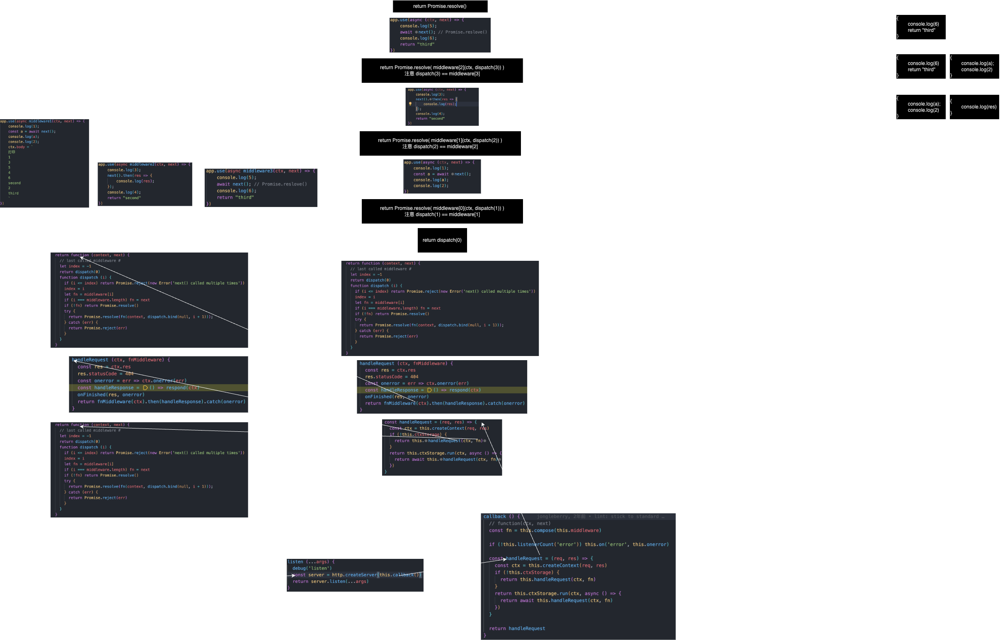
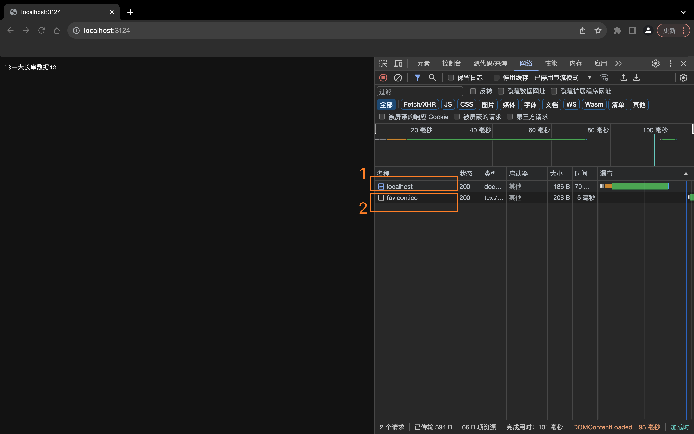

# Express2Koa
怎么让`Express`拥有和`Koa`一样的洋葱模型

# 项目代码调试
在`ide`的代码搜索栏里面输入"`/** 断点 */`"，在这些位置打上断点就可以看到调试效果了\
先安装`node`然后打上断点，然后\
如果想要单目调试则找到`src文件夹`下的`koa1.js`，对`koa1项目`开启调试模式，跟着下面的描述一步一步对照观看；如果想要执行`koa1项目`，命令行键入`npm run start:koa1`，启动`koa1项目`\
如果想要单目调试则找到`src文件夹`下的`koa2.js`，对`koa2项目`开启调试模式，跟着下面的描述一步一步对照观看；命令行键入`npm run start:koa2`，启动`koa2项目`\
如果想要单目调试则找到`src文件夹`下的`express.js`，对`express项目`开启调试模式，跟着下面的描述一步一步对照观看；命令行键入`npm run start:express`，启动`express项目`\
如果想要看`express2koa`的执行结果或者如果想要单目调试`express2koa`这个项目的话，就需要在`ide`的代码搜索栏里面输入`express2koa`，在`node_modules`的`express`相关的代码中，把`express2koa`之前注释的代码“打开”，也就是把注释变成可执行代码就可以了，然后命令行键入`npm run start:express2koa`就可以启动`express2koa项目`了；如果想要单目调试则找到`src文件夹`下的`express2koa.js`，对`express2koa项目`开启调试模式\
> 注意：每次启动一个新的项目的时候都要把上一个项目使用`control + C`终止掉

# Koa源码分析
## 第一个koa项目
项目源代码1
```js
// ./src/index-koa1.js
const Koa = require('koa')

const app = new Koa();

app.use(async middleware1(ctx, next) => {
    console.log(1);
    const a = await next();
    console.log(a);
    console.log(2);
    ctx.body = `
    打印
    1
    3
    5
    4
    6
    second
    2
    third
    `
})

app.use(async middleware2(ctx, next) => {
    console.log(3);
    next().then(res => {
        console.log(res);
    });
    console.log(4);
    return "second"
})

app.use(async middleware3(ctx, next) => {
    console.log(5);
    await next(); // Promise.reslove()
    console.log(6);
    return "third"
})

app.listen('3124', () => {
    console.log('run in 3124');
})
```
写在前面：1. 我为使用`app.use`创建的三个中间件起名为`middleware1, middleware2, middleware3`；2. `koa`是没有路由的概念的，不论客户端是通过什么样的路由发来请求，不管客户端是`get`还是`post`发来请求，都会运行`middleware1, middleware2, middleware3`三个中间件来处理这个请求\
0. `require('koa')`的时候会做什么
    在我们的项目`require('koa')`的时候，就`koa`这个库内已经开始初始化一些东西了，比如为`reponse对象`设置`代理对象ctx`，这个时候使用库就是`delegate`，这个代理方式不是通过`proxy`，而是通过在我们为`ctx的属性`赋值时会触发`ctx对象`上这个属性的`setter`，然后在这个`setter`里面再对`response对象`上的这个属性赋值，从而实现代理，设置代理的代码如下
    ```js
    // proto为ctx
    delegate(proto, 'response')
    ```
    设置了代理之后的效果是什么呢？就是在为`ctx.body属性`赋值的时候实际上是为`response.body`赋值，但是最后一定要反映到对`node`的`http模块`原生的`res对象`的操作上，这个是怎么实现的呢？实际在为`response.body`赋值的时候会触发`respose`这个`对象body`的`setter`，在这个`setter`里面，`koa`会对`node`的`http模块`原生的`res对象`进行操作(后面会有详细的内容对这个进行介绍——在执行到`ctx.body = ...`的时候)\
    详细说`ctx中属性的setter函数`长什么样子呢？比如`ctx`里常用的`属性body`，这个`body属性`的`setter`就是在require('koa')时由`delegate这个库`通过`Delegator.prototype.setter`这个函数把`setter函数`挂在到`ctx的body属性`上的
    就以`body属性`为例，看看`Delegator.prototype.setter`这个函数做了什么
    ```js
    Delegator.prototype.setter = function(name){
      // name === "body"

      // proto === ctx对象
      var proto = this.proto;

      // target === response对象
      var target = this.target;

      this.setters.push(name);

      // 为ctx的body属性设置setter函数
      proto.__defineSetter__(name, function(val){
        // 当我们为ctx.body赋值的时候会执行这个函数里面的内容
        // 比如 我们设置ctx.body = "1111"
        // 执行这个setter函数的时候就是在执行
        // response.body = "1111"
        return this[target][name] = val;
      });

      return this;
    };
    ```
    `koa`内部首先使用`delegates这个库`为`response`设置代理，代理对象就是`ctx`，实现的方式是为`ctx`的属性设置`setter函数`\
    同时`require('koa')`的时候还会使用`库delegates`为`request对象`设置代理，代理对象还是`ctx`
    ```js
    delegate(proto, 'request')
    ```
    把`resquest`和`response`对象的`代理对象ctx`设置好之后就可以开始执行`new Koa()`的操作了\
1. `new Koa()`在干什么
    ```js
    constructor(options) {
      // `Koa`是`node`中的事件类的子类
      super();

      // 对当前服务器app，进行一些基础的配置，用户如果有想法可以通过传入options对这些基础配置进行更改
      /** 基础配置开始 */
      // options = {}
      options = options || {};
      // app.proxy = false
      this.proxy = options.proxy || false;
      // app.subdomainOffset = 2
      this.subdomainOffset = options.subdomainOffset || 2;
      // app.proxyIpHeader = "X-Forwarded-For", 这个是http的一个请求或者相应头信息
      this.proxyIpHeader = options.proxyIpHeader || "X-Forwarded-For";
      // app.maxIpsCount = 0
      // 后面的就不一一翻译了
      this.maxIpsCount = options.maxIpsCount || 0;
      // process.env.NODE_ENV，当当前我们写的koa服务器使用webpack或者rollup打包的时候可以配置process.env.NODE_ENV，
      // 表明当前代码打包出来之后是用来开发调试还是上线
      this.env = options.env || process.env.NODE_ENV || "development";
      // compose函数可以用户自己定义，后面会说到这个compose函数
      // 这里简答描述一下，koa提供的compose是用来执行我们自己写的中间件的
      // compose会调度执行我们的中间件，并且返回我们中间件的值，让我们可以通过const nextMiddlewareReturnValue = next()拿到下一个中间件的返回值
      // 有返回值是koa洋葱模型的核心
      this.compose = options.compose || compose;
      // if (options.keys) this.keys = options.keys;
      // 上面这行代码是koa的源代码，但是不够统一，这里统一一下，但是我也注意到了options.keys可能是false，无所谓了就这样写吧
      // 这里还想说一个void 0 === void(0)
      // void()是一个函数，这个()可以不写，这个函数不管调用什么都会返回undefined
      // 使用void 0而不是用undefined的原因是，防止有人把undefined的值给改了，如：undefined = 1
      // void()，js引擎会执行()中的表达式内容，如：void(a = 1), js引擎就会执行a = 1这个表达式
      // void()还有一个使用场景是在<a></a>标签中
      this.keys = options.keys || void 0;
      /** 基础配置结束 */
      
      // 这里用来存放我们写的中间件❕❕❕❕❕
      this.middleware = [];

      // this.context.__proto__ === context
      this.context = Object.create(context);
      this.request = Object.create(request);
      this.response = Object.create(response);

      // util是一个node的内置库
      // util.inspect.custom的值是一个Symbol
      // this.inspect是后面的一个函数function inspect() {return this.toJSON();}
      // util.inspect.custom support for node 6+
      /* istanbul ignore else */
      if (util.inspect.custom) {
        this[util.inspect.custom] = this.inspect;
      }

      // 我们没有在options中传入asyncLocalStorage，那么这里this.ctxStorage的值就是undefined，后面在handleRequest函数里面会用到这个值
      if (options.asyncLocalStorage) {
        const { AsyncLocalStorage } = require("async_hooks");
        assert(
          AsyncLocalStorage,
          "Requires node 12.17.0 or higher to enable asyncLocalStorage"
        );
        this.ctxStorage = new AsyncLocalStorage();
      }
    }
    ```
    `constructor`是`Koa`这个类的构造函数\
    `constructor`内部调用了`super`说明`Koa`是一个子类\
    从代码中可以看出 对当前服务器app，进行一些基础的配置\
    关键点在于，`Koa`创建的服务器中`middleware`数组是空的，也就是说`koa`后面的代码调用`this.middleware.push`的都是我们自己的写的中间件`(middleware1, middleware2, middleware3)`\
    不同于`express`, `express`里面会天生存在两个`express`自己提供的中间件，然后才是我们自己写的中间件，后面会提到
    ```js
    const Emitter = require("events");
    class Application extends Emitter
    ```
    `Koa`是`node`中的事件类的子类\
    然后`constructor`内部
2. `app.use()`在干什么
    ```js
    use(fn) {
      if (typeof fn !== "function")
        throw new TypeError("middleware must be a function!");
      debug("use %s", fn._name || fn.name || "-");
      // 加入中间件
      this.middleware.push(fn);
      return this;
    }
    ```
    `this`的指向就是`app`，通过`this.middleware.push(fn)`把我们写的中间件`async (ctx, next) => {}`，添加到一个数组中保存起来，且就像我们前面所说的\
    保存完毕`this.middleware`中只保存我们写的中间件，不同于`express`, `express`里面会天生存在两个`express`自己提供的中间件\
    添加完所有的中间件的结果应该是`[middleware1，middleware2，middleware3]`
3. `app.listen()`在干什么
    ```js
    listen(...args) {
      debug("listen");
      // this.callback()会被执行，然后返回一个函数: (req, res) => {}
      // 这个函数(req, res) => {}的写法是http模块的createServer方法规定的写法
      const server = http.createServer(this.callback());
      return server.listen(...args);
    }
    ```
    执行`this.callback()`
    ```js  
    callback() {
      // function fn(ctx, next) {
      //   内部执行某些逻辑来运行我们写的中间件middleware1，middleware2，middleware3 
      // }
      const fn = this.compose(this.middleware);

      if (!this.listenerCount("error")) this.on("error", this.onerror);

      // 这个就是要传入http.createServer()的函数
      // 这个函数会在每次用户向连接套接字(区别于连接套接字，连接套接字监听连接请求，连接请求到来之后建立请求套接字)发送请求的时候被调用
      const handleRequest = (req, res) => {
        const ctx = this.createContext(req, res);
        if (!this.ctxStorage) {
          return this.handleRequest(ctx, fn);
        }
        return this.ctxStorage.run(ctx, async () => {
          return await this.handleRequest(ctx, fn);
        });
      };

      return handleRequest;
    }
    ```
    首先在`callback`中会调用`compose`函数，并把我们写的中间件组成的数组`[middleware1，middleware2，middleware3]`作为参数传进去\
    让我们看看`compose`函数内部对我们的三个中间件做了什么，然后返回什么了
    ```js
    function compose (middleware) {
      // 基本判断，判断传入的是不是数组
      if (!Array.isArray(middleware)) throw new TypeError('Middleware stack must be an array!')
      // 判断数组里面是不是都是函数
      for (const fn of middleware) {
        if (typeof fn !== 'function') throw new TypeError('Middleware must be composed of functions!')
      }
      /**
       * @param {Object} context
       * @return {Promise}
       * @api public
       */
      // 返回一个函数
      return function fnMiddleware(context, next) {
        // last called middleware #
        let index = -1
        return dispatch(0)
        function dispatch (i) {
          if (i <= index) return Promise.reject(new Error('next() called multiple times'))
          index = i
          let fn = middleware[i]
          if (i === middleware.length) fn = next
          if (!fn) return Promise.resolve()
          try {
            return Promise.resolve(fn(context, dispatch.bind(null, i + 1)));
          } catch (err) {
            return Promise.reject(err)
          }
        }
      }
    }
    ```
    `compose`这个函数在执行的时候没有对我们的中间件做任何操作，只是校验了一下中间的是不是函数，然后就返回了一个函数，这里我管返回的这个函数叫作`fnMiddleware`，目的是统一标识符，一会儿就可以看到了，然后`compose`就返回了\
    `callback`这个函数使用`fnMiddleware`这个标识符接受这个函数，然后`callback`这个函数返回函数指针`handleRequest`，函数指针`handleRequest`作为参数传入`http.createServer()`中，这个函数会在每次用户向连接套接字(区别于连接套接字，连接套接字监听连接请求，连接请求到来之后建立请求套接字)发送请求的时候被调用\
    `callback()`(也就是`this.callback()`)调用完毕返回`handleRequest`之后，`listen()`(也就是`app.listen()`)也会在调用完毕`server.listen(...args)`之后返回`server`这个对象\
    仅仅通过看`handleRequest`这个函数是不能看到什么时候以及怎么调用我们创建的中间件的，接下来看当有请求到来的时候会做什么
4. 当有一个请求到来会发生什么
    当有一个请求到来的时候函数`handleRequest`会被执行\
    让我们再看看函数`handleRequest`是什么样子的
    ```js
    const handleRequest = (req, res) => {
      // 通过req和res塑造koa的ctx对象
      const ctx = this.createContext(req, res);
      // this.ctxStorage是在new Koa()的时候初始化的一个值
      if (!this.ctxStorage) {
        return this.handleRequest(ctx, fn);
      }
      return this.ctxStorage.run(ctx, async () => {
        return await this.handleRequest(ctx, fn);
      });
    };
    ```
    首先通过使用`node的http模块处`理好的`req和res对象`去塑造`koa的ctx对象`\
    `createContext函数`的代码如下
    ```js
    createContext(req, res) {
      /** @type {Context} */
      // this.context在new Koa()的时候被创建
      // context.__proto__ === this.context
      // this.context.__proto__ === /** 不是这里的context，是new Koa()里面的context */ context
      const context = Object.create(this.context);
      /** @type {KoaRequest} */
      // this.request在new Koa()的时候被创建
      // request.__proto__ === this.request
      // 把requset这个对象挂载到context对象上
      const request = (context.request = Object.create(this.request));
      /** @type {KoaResponse} */
      const response = (context.response = Object.create(this.response));

      // 让当前函数createContext中创建的context，request，respond三个对象上都挂载上app，req，res
      // 注意这里的req和res是http模块对每个客户端的请求建立的原生对象
      context.app = request.app = response.app = this;
      context.req = request.req = response.req = req;
      context.res = request.res = response.res = res;
      // 并且context，request，respond，app四个对象实现相互引用，能方便的相互访问
      request.ctx = response.ctx = context;
      request.response = response;
      response.request = request;

      // 把常用的属性放到context的"一级目录"下面，方便用户访问
      context.originalUrl = request.originalUrl = req.url;
      context.state = {};

      // 返回contexnt对象，这个context对象就是我们平常在中间件中使用的ctx对象
      return context;
    }
    ```
    在函数`createContext`中创建在我们中间件中使用的`ctx`对象`const ctx = this.createContext(req, res);`，`ctx -> context`\ 
    然后判断`this.ctxStorage`是否为`false`，如果是`false`就执行`this.handleRequest`函数\ 
    这个函数内部又做了什么呢
    ```js
    handleRequest(ctx, fnMiddleware) {
      // 参数fnMiddleware就是之前在koa项目启动的时候，compose函数返回的函数fnMiddleware
    
      // ctx.res是node的http模块提供的原生的res
      // 从上面createContext函数中我们可以得知，koa会把http模块提供的res封装成respond供给我们程序员使用
      // 我们可以通过ctx.respond找到这个对象，也可以通过ctx.res找到http模块提供的原生res对象
      const res = ctx.res;
      // 设置响应码为404，后面如果能正常返回再改成200
      res.statusCode = 404;

      // 设置错误处理函数
      const onerror = (err) => ctx.onerror(err);
      const handleResponse = () => respond(ctx);
      onFinished(res, onerror);
      return fnMiddleware(ctx).then(handleResponse).catch(onerror);
    }
    ```
    先是设置基本的响应码，然后创建一些函数\
    之后就执行`onFinished`这个函数了
    ```js
    function onFinished (msg, listener) {
      // msg 是 http模块提供的原生的res对象
      // listener是错误处理函数
      if (isFinished(msg) !== false) {
        defer(listener, null, msg)
        return msg
      }

      // attach the listener to the message
      attachListener(msg, wrap(listener))

      return msg
    }
    ```
    注意`onFinished`这个函数参数的名字很奇怪，应该是为了适配其他地方使用这个函数时的语义\
    进入`onFinished`这个函数后首先就是执行函数`isFinished`
    ```js
    function isFinished (msg) {
      // msg 是 http模块提供的原生的res对象
      var socket = msg.socket

      if (typeof msg.finished === 'boolean') {
        // 说明是一个服务器向客户端返回的消息❓❓❓❓❓
        // OutgoingMessage
        return Boolean(msg.finished || (socket && !socket.writable))
      }

      if (typeof msg.complete === 'boolean') {
        // 说明是一个客户端发送到服务器的消息❓❓❓❓❓
        // IncomingMessage
        return Boolean(msg.upgrade || !socket || !socket.readable || (msg.complete && !msg.readable))
      }

      // don't know
      return undefined
    }
    ```
    `isFinished`这个函数具体在做什么不太清楚\
    这次调用会进入到`typeof msg.finished === 'boolean'`这里面, 最后返回`false`\
    `isFinished`返回`false`之后，`onFinished`这个函数内部继续执行函数`wrap(listener)`
    ```js
    function wrap (fn) {
      // fn是在handleRequest中创建的函数const onerror = (err) => ctx.onerror(err);

      var res

      // create anonymous resource
      if (asyncHooks.AsyncResource) {
        res = new asyncHooks.AsyncResource(fn.name || 'bound-anonymous-fn')
      }

      // incompatible node.js
      if (!res || !res.runInAsyncScope) {
        return fn
      }

      // return bound function
      return res.runInAsyncScope.bind(res, fn, null)
    }
    ```
    `asyncHooks`是哪里来的呢？\
    这是node基本库提供的一个对象，相当于`var asyncHooks = require('async_hooks')`\
    这里做的工作猜测是，如果当前启动服务器的`node`环境(`node`版本)支持`async_hooks`这库，就是用这个库对传入的`fn`, 也就是错误处理函数`const onerror = (err) => ctx.onerror(err);`进行包装，包装成一个异步执行的函数返回；如果不支持`async_hooks`那么就直接返回作为参数传入这个函数的错误处理函数`onerror`\
    `wrap`函数的返回值回作为参数被`attachListener`函数使用
    ```js
    function attachListener (msg, listener) {
      // msg 是 http模块提供的原生的res对象
      // listener是异步处理过后的错误处理函数

      // 对于我们第一次从客户端向这个koa服务器发起请求，attached的值是undefined
      var attached = msg.__onFinished

      // create a private single listener with queue
      if (!attached || !attached.queue) {
        attached = msg.__onFinished = createListener(msg)
        attachFinishedListener(msg, attached)
      }

      attached.queue.push(listener)
    }
    ```
    对于我们第一次从客户端向这个`koa`服务器发起请求的时候，`attached`的值是`undefined`\
    所以会执行`createListener`这个函数
    ```js
    function createListener (msg) {
      function listener (err) {
        if (msg.__onFinished === listener) msg.__onFinished = null
        if (!listener.queue) return

        var queue = listener.queue
        listener.queue = null

        for (var i = 0; i < queue.length; i++) {
          queue[i](err, msg)
        }
      }

      listener.queue = []

      return listener
    }
    ```
    `createListener`函数内部会创建一个`listener`函数，并在为这个函数对象添加`queue`属性，然后返回这个函数对象`listener`\
    这个函数对象返回的时候会被赋值给`attachListener`里面创建的`attached`变量
    然后执行`attachFinishedListener`这个函数
    ```js
    function attachFinishedListener (msg, callback) {
      // msg 是 http模块提供的原生的res对象
      // callback是刚刚createListener返回的listener函数
      
      var eeMsg
      var eeSocket
      var finished = false

      function onFinish (error) {
        eeMsg.cancel()
        eeSocket.cancel()

        finished = true
        callback(error)
      }

      // finished on first message event
      eeMsg = eeSocket = first([[msg, 'end', 'finish']], onFinish)

      function onSocket (socket) {
        // remove listener
        msg.removeListener('socket', onSocket)

        if (finished) return
        if (eeMsg !== eeSocket) return

        // finished on first socket event
        eeSocket = first([[socket, 'error', 'close']], onFinish)
      }

      if (msg.socket) {
        // socket already assigned
        onSocket(msg.socket)
        return
      }

      // wait for socket to be assigned
      msg.on('socket', onSocket)

      if (msg.socket === undefined) {
        // istanbul ignore next: node.js 0.8 patch
        patchAssignSocket(msg, onSocket)
      }
    }
    ```
    进入这个函数首先定义几个变量，定义一个函数
    然后立马执行下一个函数`first`
    ```js
    function first(stuff, done) {
      // stuff是[[msg, 'end', 'finish']]，msg是http模块提供的原生的res对象
      // done是调用first的函数attachFinishedListener中创建的onFinish函数

      if (!Array.isArray(stuff))
        throw new TypeError('arg must be an array of [ee, events...] arrays')

      var cleanups = []

      // 这个传参方式，外层for循环只会执行一次
      for (var i = 0; i < stuff.length; i++) {
        // 外层for循环只会执行一次，这一次时arr为[msg, 'end', 'finish']
        var arr = stuff[i]

        if (!Array.isArray(arr) || arr.length < 2)
          throw new TypeError('each array member must be [ee, events...]')

        // ee === msg === http模块提供的原生的res对象
        var ee = arr[0]

        // 对[msg, 'end', 'finish']这个数组中的后两个值也就是'end', 'finish'进行处理
        for (var j = 1; j < arr.length; j++) {
          var event = arr[j]
          var fn = listener(event, callback)

          // listen to the event
          ee.on(event, fn)
          // push this listener to the list of cleanups
          cleanups.push({
            ee: ee,
            event: event,
            fn: fn,
          })
        }
      }

      function callback() {
        cleanup()
        done.apply(null, arguments)
      }

      function cleanup() {
        var x
        for (var i = 0; i < cleanups.length; i++) {
          x = cleanups[i]
          x.ee.removeListener(x.event, x.fn)
        }
      }

      function thunk(fn) {
        done = fn
      }

      thunk.cancel = cleanup

      return thunk
    }
    ```
    函数`attachFinishedListener`调用`first`函数时，`stuff`是`[[msg, 'end', 'finish']]`，`msg`是`http`模块提供的原生的`res`对象\
    这种形式的传递参数导致`first`函数内部的双层`for`循环的外层`for`循环只会执行一次\
    内层`for`循环会调用函数`listener`, 在内层`for`循环的第一次执行时的调用方式是`listener('end', 调用first的函数attachFinishedListener中创建的onFinish函数)`
    ```js
    function listener(event, done) {
      return function onevent(arg1) {
        var args = new Array(arguments.length)
        var ee = this
        var err = event === 'error'
          ? arg1
          : null

        // copy args to prevent arguments escaping scope
        for (var i = 0; i < args.length; i++) {
          args[i] = arguments[i]
        }

        done(err, ee, event, args)
      }
    }
    ```
    执行`listener`函数会返回一个函数\
    然后`first`函数会让`http`模块提供的原生的`res`对象对`‘end’`这个事件进行监听\
    然后first的双层循环的内部`for`循环会执行`j=2`的值，然后再次执行`listener('finish', 调用first的函数attachFinishedListener中创建的onFinish函数)`\
    和上面的过程一样，执行`listener函数`会返回一个函数\
    然后`first函数`会让http模块提供的原生的`res对象`对`‘finish’`这个事件进行监听\
    做完上面这些事儿之后，`first`会在创造一些函数，并把创造的函数`thunk`返回\
    执行权重新回到`attachFinishedListener函数`里，这个调用栈有点深，我们把`attachFinishedListener函数`再写一遍
    ```js
    function attachFinishedListener (msg, callback) {
      // msg 是 http模块提供的原生的res对象
      // callback是刚刚createListener返回的listener函数
      
      var eeMsg
      var eeSocket
      var finished = false

      function onFinish (error) {
        eeMsg.cancel()
        eeSocket.cancel()

        finished = true
        callback(error)
      }

      // finished on first message event
      eeMsg = eeSocket = first([[msg, 'end', 'finish']], onFinish)

      // ⭕️⭕️⭕️⭕️⭕️⭕️⭕️
      // 执行到这里了

      function onSocket (socket) {
        // remove listener
        // 先从msg也就是http模块提供的原生的res对象监听的事件中，把‘socket’事件列表里面的onSocket函数去掉，不知道为啥
        msg.removeListener('socket', onSocket)

        if (finished) return
        if (eeMsg !== eeSocket) return

        // finished on first socket event
        eeSocket = first([[socket, 'error', 'close']], onFinish)
      }

      if (msg.socket) {
        // socket already assigned
        onSocket(msg.socket)
        return
      }

      // wait for socket to be assigned
      msg.on('socket', onSocket)

      if (msg.socket === undefined) {
        // istanbul ignore next: node.js 0.8 patch
        patchAssignSocket(msg, onSocket)
      }
    }
    ```
    `first函数`返回的在`first函数`内部创建的`thunk函数`被`attachFinishedListener函数`内部创建的`eeMsg， eeSocket两个对象`"捕获"，注意这时`eeMsg === eeSocket`, 一会儿会用到\
    然后创建了一个`onSocket函数`\
    之后判读`msg.socket`是不是空，发现不是空\
    执行`onSocket(msg.socket)`，`msg`是`http`模块提供的原生的`res对象`\
    先从`msg`也就是`http`模块提供的原生的`res对象`监听的事件中，把`‘socket’`从事件列表里面的`onSocket函数`去掉，\
    向`req`的`socket对象`上加两个叫`'error'`和`'close'`的事件监听\
    然后就`first函数`再次返回`thunk函数`\
    之后`onSocket`返回了`undefined`\
    然后就回到了`函数attachListener`的调用里面
    ```js
    function attachListener (msg, listener) {
      // listener是异步处理过后的错误处理函数
      var attached = msg.__onFinished

      // create a private single listener with queue
      if (!attached || !attached.queue) {
        attached = msg.__onFinished = createListener(msg)
        attachFinishedListener(msg, attached)
      }

      // ⭕️⭕️⭕️⭕️⭕️⭕️⭕️
      // 执行到这里了
      
      attached.queue.push(listener)
    }
    ```
    还记得吗？\
    `createListener函数`内部会创建一个`listener函数`，并在为这个函数对象添加`queue属性`，然后返回这个`函数对象listener`\
    `attached`就是这个返回的`函数listener`\
    但是在`attachListener函数`内部的`参数listener`是异步处理过后的错误处理函数\
    所以`attached.queue.push(listener)`就是把异步处理过后的错误处理函数加到`attached函数`的`queue属性`中\
    然后返回到`onFinished函数`中去执行
    ```js
    function onFinished (msg, listener) {
      if (isFinished(msg) !== false) {
        defer(listener, null, msg)
        return msg
      }

      // attach the listener to the message
      attachListener(msg, wrap(listener))

      // ⭕️⭕️⭕️⭕️⭕️⭕️⭕️
      // 执行到这里了
      return msg
    }
    ```
    `onFinished函数`返回处理过后的`http`模块提供的原生的`res对象`\
    然后回到`函数handleRequest`中继续执行
    ```js
    handleRequest(ctx, fnMiddleware) {
      // 参数fnMiddleware就是之前在koa项目启动的时候，compose函数返回的函数fnMiddleware，注意fnMiddleware不是我们写的中间件函数！！！
      const res = ctx.res;
      res.statusCode = 404;
      const onerror = (err) => ctx.onerror(err);
      const handleResponse = () => respond(ctx);
      console.log(ctx.onerror);
      onFinished(res, onerror);

      // ⭕️⭕️⭕️⭕️⭕️⭕️⭕️
      // 执行到这里了
      return fnMiddleware(ctx).then(handleResponse).catch(onerror);
    }
    ```
    之后就是把之前构造好的`参数ctx`传入`函数fnMiddleware`中进行执行了\
    注意再次强调`fnMiddleware`就是之前在`koa`项目启动的时候，`compose函数`返回的`函数fnMiddleware`❕❕❕❕❕\
    到这里为止都没有开始执行我们的中间件`middleware1, middleware2, middleware3`，到目前为止都是在做一些初始化设置，做完这些设置之后，就要开始执行`fnMiddleware函数`然后执行我们的中间件了\
    但是在讲解执行`fnMiddleware函数`之前，我们先通过`fnMiddleware(ctx).then(handleResponse).catch(onerror)`对函数fnMiddleware做一个简单的分析\
    通过then和catch我们可以相信`fnMiddleware`会返回一个`promise`或者`fnMiddleware`是一个`async`函数，然后在没有错误发生的时候使用`handleResponse`处理，发生错误的时候使用`onerror`处理\
    现在让我们进入`fnMiddleware`，看看他是怎么执行我们的中间件的，为什么能实现洋葱模型\
    提示：从现在起我们要关注返回值了，这个非常重要
    ```js
    function fnMiddleware(context, next) {
      // 当有一个请求到来的时候，会第一次执行这个fnMiddleware函数，就是我们前面说的fnMiddleware(ctx)
      // 第一次执行fnMiddleware的时候next是undefined

      // last called middleware #
      let index = -1
      return dispatch(0)
      function dispatch (i) {
        if (i <= index) return Promise.reject(new Error('next() called multiple times'))
        index = i
        let fn = middleware[i]
        if (i === middleware.length) fn = next
        if (!fn) return Promise.resolve()
        try {
          return Promise.resolve(fn(context, dispatch.bind(null, i + 1)));
        } catch (err) {
          return Promise.reject(err)
        }
      }
    }
    ```
    首先第一步定义一个`变量index`，值为`-1`，`koa`将使用这个变量作为一个判断条件来遍历`middleware数组`的，`index`用来防止你在一个中间件中调用`next`大于`1`次，`middleware`这个数组是在我们使用`app.listen`时，`koa`内部会执行`compose(this.middleware)`的时候通过参数传入的，`this.middleware`这个数组里面存的就是我们写的三个中间件`middleware1, middleware2, middleware3`\
    然后马上就执行`dispatch(0)`，并且返回，`dispatch函数`是什么呢，就写在`fnMiddleware函数`内部\
    所以`fnMiddleware函数`的返回值就是`dispatch(0)`的执行结果，`dispatch函数`在参数为`0`的时候的返回值就是`fnMiddleware函数`的返回值，我们可以直观的看到`dispatch函数`的返回值是一个`Promise`, 所以`fnMiddleware函数`的返回值就是一个`Promise`, 和我们之前分析的一致\
    现在就让我们开始执行`dispatch(0)`
    ```js
    function dispatch (i) {
      // 现在我们分析的是i = 0的情况

      /**
       * i === 0
       * index === -1
       */
      if (i <= index) return Promise.reject(new Error('next() called multiple times'))

      /**
       * i === 0
       * index === -1
       */
      index = i

      /**
       * i === 0
       * index === 0
       */
      // 取出我们创建的第一个中间件middleware1赋值给fn
      let fn = middleware[i]

      /**
       * i === 0
       * index === 0
       */
      // 我们middleware数组中有三个middleware,[middleware1,middleware2,middleware3]
      // 所以middleware.length就是3
      // i是从0开始去中间件，如果i === 3，那是什么情况呢
      // i === 2的时候上一条let fn = middleware[i]取出的是我们的middleware3
      // 当i === 3的时候，fn会等于undefined
      // 这个时候要把fnMiddleware(context, next)的第二个参数传给fn
      // 但是koa内部调用的时候是在handleRequest函数中通过return fnMiddleware(ctx).then(handleResponse).catch(onerror)方式调用的fnMiddleware函数，这个next永远是undefined
      // 注意这里的next不是我们在中间件中调用的next
      // 我们在中间件中调用next的的时候是为了调用下一个中间件对吧，下一个中间件肯定要从middleware中去取啊
      // 我们在中间件中调用的next肯定是koa通过某种方式在执行上一个中间件的时候作为参数给我们传递进来的，类似于fn[n-1](ctx，fn[n])这种
      // 怎么执行上一个中间件以及如何把下一个中间件作为参数传递到下一个中间件我们马上就能看到
      // 但是一定要记住，在dispatch中的变量next一定是undefined，不是我们在中间件中用的next
      if (i === middleware.length) fn = next

      /**
       * i === 0
       * index === 0
       */
      // 如果fn没有取到值，就是没有中间件要执行了，就返回一个fulfill的Promise
      if (!fn) return Promise.resolve()

      try {
      /**
       * i === 0
       * index === 0
       */
        // 重点来了，看看koa怎么把下一个中间件作为参数传递进去到上一个中间中去执行
        // 首先看fn(context, dispatch.bind(null, i + 1))
        // 这次是在执行dispatch(0)的过程中执行的，所以我们还能简化并明确一下各个参数的值
        // middleware1(ctx, dispatch.bind(null, 1))
        // koa是通过dispatch.bind(null, n + 1)的方式把下一个中间作为参数传递到上一个中间件中去的
        // 注意.bind只会绑定参数，而不会立即执行，所以下面会执行的是middleware1这个函数，这个中间件，而不是执行dispatch.bind(null, n + 1)这个函数
        // fn(context, dispatch.bind(null, i + 1))执行完，就是middleware1(ctx, dispatch.bind(null, 1))执行完，会返回我们中间件middleware1中的返回值，而不是next的返回值，这里很容易弄乱
        return Promise.resolve(fn(context, dispatch.bind(null, i + 1)));
      } catch (err) {
        return Promise.reject(err)
      }
    }
    ```
    从注释中我们讲到了执行middleware1
    ```js
    async middleware1(ctx, next) => {
        // next 就是 dispatch.bind(null, 1)

        console.log(1);

        // next()等于是执行dispatch.bind(null, 1)()
        const a = await next();
        console.log(a);
        console.log(2);
        ctx.body = `
        打印
        1
        3
        5
        4
        6
        second
        2
        third
        `
    }
    ```
    先在服务端打印1，然后执行`next`了，就是在执行`dispatch.bind(null, 1)()`
    ```js
    function dispatch (i) {
      // 现在我们分析的是i = 1的情况
      // 上一次的dispatch(0)，已经把index的值改为了0

      /**
       * i === 1
       * index === 0
       */
      if (i <= index) return Promise.reject(new Error('next() called multiple times'))

      /**
       * i === 1
       * index === 0
       */
      index = i

      /**
       * i === 1
       * index === 1
       */
      // 取出我们创建的第二个中间件middleware2赋值给fn
      let fn = middleware[i]

      /**
       * i === 1
       * index === 1
       */
      if (i === middleware.length) fn = next

      /**
       * i === 1
       * index === 1
       */
      if (!fn) return Promise.resolve()

      try {
      /**
       * i === 1
       * index === 1
       */
        // middleware2(ctx, dispatch.bind(null, 2))
        // 从在我们的middleware1中调用next开始一直到这了才开始执行第二个中间件middleware2
        // 我们可以看到虽然之前在middleware1(ctx, dispatch.bind(null, 1))执行的时候，koa传入的参数不是middleware2
        // 但是koa会使用i这个参数来取出middleware2，然后在这里执行
        return Promise.resolve(fn(context, dispatch.bind(null, i + 1)));
      } catch (err) {
        return Promise.reject(err)
      }
    }
    ```
    下面我们要执行`middleware2`了
    ```js
    async middleware2(ctx, next) => {
        // next 就是 dispatch.bind(null, 2)

        console.log(3);

        // next()等于是执行dispatch.bind(null, 2)()
        next().then(res => {
            console.log(res);
        });
        console.log(4);
        return "second"
    }
    ```
    打印3，然后执行`next()`，就是在执行`dispatch.bind(null, 2)()`
    ```js
    function dispatch (i) {
      // 现在我们分析的是i = 2的情况
      // 上一次的dispatch(1)，已经把index的值改为了1

      /**
       * i === 2
       * index === 1
       */
      if (i <= index) return Promise.reject(new Error('next() called multiple times'))

      /**
       * i === 2
       * index === 1
       */
      index = i

      /**
       * i === 2
       * index === 2
       */
      // 取出我们创建的第三个中间件middleware3赋值给fn
      let fn = middleware[i]

      /**
       * i === 2
       * index === 2
       */
      if (i === middleware.length) fn = next

      /**
       * i === 2
       * index === 2
       */
      if (!fn) return Promise.resolve()

      try {
      /**
       * i === 2
       * index === 2
       */
        // middleware3(ctx, dispatch.bind(null, 3))
        // 从在我们的middleware2中调用next开始一直到这了才开始执行第三个中间件middleware3
        // 我们可以看到虽然之前在middleware1(ctx, dispatch.bind(null, 3))执行的时候，koa传入的参数不是middleware3
        // 但是koa会使用i这个参数来取出middleware3，然后在这里执行
        return Promise.resolve(fn(context, dispatch.bind(null, i + 1)));
      } catch (err) {
        return Promise.reject(err)
      }
    }
    ```
    下面我们要执行middleware3了
    ```js
    async middleware3(ctx, next) => {
        // next 就是 dispatch.bind(null, 3)

        console.log(5);

        // next()等于是执行dispatch.bind(null, 3)()
        await next(); // Promise.reslove()
        console.log(6);
        return "third"
    }
    ```
    打印5，然后执行`next()`，就是在执行`dispatch.bind(null, 3)()`
    ```js
    function dispatch (i) {
      // 现在我们分析的是i = 3的情况
      // 上一次的dispatch(2)，已经把index的值改为了2

      /**
       * i === 3
       * index === 2
       */
      if (i <= index) return Promise.reject(new Error('next() called multiple times'))

      /**
       * i === 3
       * index === 2
       */
      index = i

      /**
       * i === 3
       * index === 3
       */
      // 这次取到的fn就是undefined了
      let fn = middleware[i]

      /**
       * i === 3
       * index === 3
       */
      // 这个判断在这次通过了，fn = next被执行，但是fn还是undefined
      // 因为koa内部调用的时候是在handleRequest函数中通过return fnMiddleware(ctx).then(handleResponse).catch(onerror)方式调用的fnMiddleware函数，这个next永远是undefined
      if (i === middleware.length) fn = next

      /**
       * i === 3
       * index === 3
       */
      // 这个判断在这次通过了，直接返回Promise.resolve()
      // 洋葱模型要开始了❕❕❕❕❕
      if (!fn) return Promise.resolve()

      // 后面不会执行了！！！
      try {
        return Promise.resolve(fn(context, dispatch.bind(null, i + 1)));
      } catch (err) {
        return Promise.reject(err)
      }
    }
    ```
    从`dispatch函数`开始返回`Promise.resolve()`的时候洋葱模型就开始了\
    首先我们卖个关子，我在这里放一张现在的调用栈的图片，便于观察每个函数返回时都是返回到哪里了\
    \
    ❕❕❕❕❕`dispatch`返回会返回到哪里？\
    ❕❕❕❕❕这个问题非常关键\
    看看我们的执行过程，就知道了，这个函数返回不是返回到上一个`dispatch`\
    比如我们现在调用的不是`dispatch(3)`嘛，他返回不是返回到`dispatch(2)`, 这一点非常关键❕❕❕❕❕，不要乱\
    `dispatch(3)`返回是返回到我们的第三个中间件`middleware3`中`next()`执行的位置
    ```js
    async middleware3(ctx, next) => {
        console.log(5);

        // dispatch(3)返回就是next()返回了
        await /** ⭕️⭕️⭕️⭕️⭕️⭕️⭕️ 执行到这里了 */ next(); 
        console.log(6);
        return "third"
    }
    ```
    这样的结果不直观我们再写的更直观一点
    ```js
    async middleware3(ctx, next) => {
        console.log(5);

        // dispatch(3)返回就是next()返回了
        await /** ⭕️⭕️⭕️⭕️⭕️⭕️⭕️ 执行到这里了 */ Promise.resoled(); 
        console.log(6);
        return "third"
    }
    ```
    现在遇到了`await`了，`await`会干什么，这个也很关键，这个是大家经常搞乱`koa`怎么实现洋葱模型的关键\
    `await`是什么的变形，再说清楚点，`async-await`是什么的语法糖？\
    是`Promise和generate`的语法糖！！！\
    `await`对标的是`generate`里面的什么？\
    `await`对标的是`generate里面的yeild`\
    在一个`generate函数`执行遇到`yeild`的时候会干什么？\
    这个`generator函数`会返回，返回值是什么，是`yeild`后面跟的值\
    那对于`await`来说呢，当一个函数执行到`await`的时候`await`也会返回，返回值和`yeild`是不同的，`await`永远会放回一个`pending状态的Promise`，这么说可能不太好理解，我们把`await`会返回的东西写一下
    ```js
    async middleware3(ctx, next) => {
        console.log(5);

        // dispatch(3)返回就是next()返回了
        return Promise.resoled() /** 这个是要返回的东西 */.then(res => {
          console.log(6);
          return "third"
        })
    }
    ```
    上面这段代码中由于`.then中的回调函数`还没有被执行(因为`Promise.resoled()`虽然是`fulfill`的，但这个`fulfill`状态的`promise`只会把`.then中的回调函数`放入到微任务队列中，但是这个回调函数还没有被执行)，由于`.then中的回调函数`还没有被执行，所以`.then创建的Promise`是`pending状态`的。这里有个小问题，如果`next函数`返回的不是`promise对象`怎么办？一会儿我们解答\
    那什么时候`generate函数`继续执行呢？在`generate函数`的`generator`调用`next`的时候继续执行，然后把`next`里面传入的参数传递到`generate`里面去(比如`const res = yeild 1`，`next`中传入的值会被`res`接受)\
    那么`await`什么时候把值传回来让`middleware3`继续执行呢？在`await`后面直接跟随的`Promise`(在这里就是`dispatch(3)`返回的`Promise.resolve()`)变成`fulfilled`之后并且这个`fulfilled`的`Promise`在微任务队列里面被执行的时候，作为`await`之后的代码就继续执行了(比如`const res = await Promise.resolve(1)`，当`Promise.resolve(1)`在微任务队列中就绪的时候，`1`就会给到`res`，然后代码继续执行)\
    这里就引出了一个问题，也是刚刚想说的小问题如果`await`后面跟的不是`Promise`不就不能使用上面的规范了嘛？\
    没关系，`await`会判断后面的值是否是`Promise`，如果不是就使用`Promise.resolve()`包装一下\
    前面做了这么多解释，接下来就要继续执行代码了\
    `await`会直接让`middleware3`这个函数返回，返回值是一个`pending的Promise`，就是我们刚刚说的`.then创建的promise`\
    在`await`返回的同时，由于有一个`pending状态的Promise`产生了————就是`next()`返回的`<pending> Promise`同时也是`dispatch(3)`返回的`<pending> Promise`，微任务队列会加上一个微任务`(microTasks:\[middleware3继续从await返回执行\])`，并且在执行微任务的时候会导致返回到`middleware3`继续执行\
    注意区分：`middleware3`通过`await`返回的是一个`.then创建的pending状态的Promise对象`，由于`Promise.resolve()`的执行，会向微任务队列中添加`.then里面的回调函数`，是这样的一个关系。把`await`后面的代码改造成一个`.then包裹的回调函数`，然后把这个`.then函数创建的Promise`返回，这些都是`await`这个关键字的作用；然而把`.then里面的回调`放入微任务队列的原因是`Promise.resolve()`是一个`fulfilled状态的promise`\
    现在我们再说网上大部分帖子搞乱的是什么————他们都说因为`koa`在调用中间件的代码中`return Promise.resolve(fn(context, dispatch.bind(null, i + 1)));` 返回了`Promise.resolve()`包装的值，所以能实现洋葱模型，这样的话就会让人产生误解————"`koa`是因为调用中间件之后对中间件的返回值进行了`Promise.resolve()`包装才实现了洋葱模型"，其实不是的，难道`express`不支持洋葱模型的原因是`express`调用中间件之后，对中间件的返回值没有使用`Promise.resolve()`进行包装吗？不是的！`express`没能实现洋葱模型的原因是`express`调用中间件之后没有返回中间件的返回值！！！`koa`使用`Promise.resolve()`对返回值进行包裹的原因是————对于`node`版本较低的时候，`node`是不支持`async-await`的，这个时候`koa`可以使用`next().then()`的方式实现`async-await`的效果，但是现在的`node`中支持了`async-await`，`async`和`await`都会对后面跟着的`非Promise值`使用`Promise.resolve()`包装，所以现在就算`koa`在返回"中间件调用的返回值"时不使用`Promise.resolve()`包装也是可以实现洋葱模型的，就是改成`return fn(context, dispatch.bind(null, i + 1));` 也是可以支持洋葱模型的，同理只要`express`会把中间件调用的结果返回到上一个`next()`, 那么`express`也是能实现洋葱模型的！！！后面我们会基于这个想法对`express`进行改造，使其实现洋葱模型，改造过程可以说是非常简单\
    `middleware3`返回会返回到哪个函数呢？就是`middleware3`这个函数在函数调用栈中的上一个函数是什么？那个函数调用的`middleware3`这个函数？\
    是`fn(ctx, dipatch.bind(null, 2))`
    ```js
    function dispatch (i) {
      // 现在我们分析的是i = 2的情况
      // 上一次的dispatch(1)，已经把index的值改为了1

      if (i <= index) return Promise.reject(new Error('next() called multiple times'))
      index = i
      let fn = middleware[i]
      if (i === middleware.length) fn = next
      if (!fn) return Promise.resolve()

      try {
      /**
       * i === 2
       * index === 2
       */
        return Promise.resolve( /** ⭕️⭕️⭕️⭕️⭕️⭕️⭕️ 执行到这里了 */ fn(context, dispatch.bind(null, i + 1)));
      } catch (err) {
        return Promise.reject(err)
      }
    }
    ```
    `fn(context, dispatch.bind(null, i + 1))`返回，返回值就是刚刚说的`middleware3`内部执行到`await`时的返回值，`一个pending状态的Promise`\
    然后`dispatch(2)`就要返回了，返回值是`Promise.resolve(<pending> Promise)`, 由于`Promise.resolve()`具有幂等性，所以相当于是返回了`<pending> Promise`\
    这里不需要向微任务队列中添加微任务，原因是这个`Promise.resolve(fn(context, dispatch.bind(null, i + 1)))`没有调用`.then`并且在前面也没有`await`\
    这里补充一下，加入微任务队列的不是`Promise对象`，而是`Promise对象`后面的`.then`的任务，当一个`Promise`就绪的时候会把`.then里面的任务`加入到微任务队列中\
    注：有的时候会把一个`Promise`的执行过程加入到微任务队列中，这个是`V8`做的事情，有一道经典的面试题是这个过程\
    `dispatch(2)`要返回`<pending> Promise`到哪里呢？其实就是在问哪里调用的`dispatch(2)`？\
    是在我们的中间件`middleware2`中，调用`next()`的时候调用的`dispatch(2)`，所以要把`<pending> Promise`作为`middleware2`中`next()的返回值`
    ```js
    async middleware2(ctx, next) => {
        // next 就是 dispatch.bind(null, 2)

        console.log(3);

        // next()等于是执行dispatch.bind(null, 2)()
        next()/** ⭕️⭕️⭕️⭕️⭕️⭕️⭕️ 执行到这里了 */.then(res => {
            console.log(res);
        });
        console.log(4);
        return "second"
    }
    ```
    还是改写一下，让结果变得更清楚
    ```js
    async middleware2(ctx, next) => {
        // next 就是 dispatch.bind(null, 2)

        console.log(3);

        // next()等于是执行dispatch.bind(null, 2)()
        "<pending> Promise"/** ⭕️⭕️⭕️⭕️⭕️⭕️⭕️ 执行到这里了 */.then(res => {
            console.log(res);
        });
        console.log(4);
        return "second"
    }
    ```
    这里调用了`.then`，会发生什么？\
    就像我们前面说的，调用了`.then`，就会等调用`.then`的那个`Promise在状态变成fulfilled`的时候把`.then中的回调函数`加入到微任务队列中\
    由于`<pending> Promise不是fulfilled状态的`，所以微任务队列不会加微任务\
    然后就继续执行`middleware2的next()`之后的内容了\
    打印`4`，返回`"second"`这个字符串，注意这里返回的是字符串\
    但是这是个`async函数`，`async函数`在返回返回值的时候会做和`await`相同的处理，会把不是`Promise的返回值`包装一下！！！！！所以这里真实的返回值是`Promise.resolve("second")`\
    `middleware2`返回了会返回到哪里呢？还是这个老生常谈的问题\
    会返回到`fn(ctx, dispacth(null, 1))`
    ```js
    async middleware1(ctx, next) => {
        // next 就是 dispatch.bind(null, 1)

        console.log(1);

        // next()等于是执行dispatch.bind(null, 1)()
        const a = await next();
        console.log(a);
        console.log(2);
        ctx.body = `
        打印
        1
        3
        5
        4
        6
        second
        2
        third
        `
    }
    ```
    先在服务端打印`1`，然后执行`next`了，就是在执行`dispatch.bind(null, 1)()`
    ```js
    function dispatch (i) {
      // 现在我们分析的是i = 1的情况
      // 上一次的dispatch(0)，已经把index的值改为了0

      if (i <= index) return Promise.reject(new Error('next() called multiple times'))
      index = i
      let fn = middleware[i]
      if (i === middleware.length) fn = next
      if (!fn) return Promise.resolve()

      try {
      /**
       * i === 1
       * index === 1
       */
        return Promise.resolve( /** ⭕️⭕️⭕️⭕️⭕️⭕️⭕️ 执行到这里了 */ fn(context, dispatch.bind(null, i + 1)));
      } catch (err) {
        return Promise.reject(err)
      }
    }
    ```
    `fn(context, dispatch.bind(null, i + 1))`要返回了，返回值就是刚刚说的`middleware2的返回值`(注意这里不是通过`await`返回的，是`middleware2`通过`return`返回的)`Promise.resolve("second")`\
    然后`dispatch(1)`就要返回了，返回值是`Promise.resolve(Promise.resolve("second"))`, 由于`Promise.resolve()`具有幂等性，所以相当于是返回了`Promise.resolve("second")`\
    这里不需要向微任务队列中添加微任务，原因是这个`Promise.resolve(fn(context, dispatch.bind(null, i + 1)))`没有调用`.then`并且在前面也没有`await`\
    `dispatch(1)`要返回`Promise.resolve("second")`到哪里呢？其实就是在问哪里调用的`dispatch(1)`？\
    是在我们的`中间件middleware1`中，调用`next()`的时候调用的`dispatch(1)`，所以要把`Promise.resolve("second")`作为`middleware1中next()的返回值`
    ```js
    async middleware1(ctx, next) => {
        // next 就是 dispatch.bind(null, 1)

        console.log(1);

        // next()等于是执行dispatch.bind(null, 1)()
        const a = await /** ⭕️⭕️⭕️⭕️⭕️⭕️⭕️ 执行到这里了 */ next();
        console.log(a);
        console.log(2);
        ctx.body = `
        打印
        1
        3
        5
        4
        6
        second
        2
        third
        `
    }
    ```
    还是像之前一样在这里做个更明确的展示
    ```js
    async middleware1(ctx, next) => {
        // next 就是 dispatch.bind(null, 1)

        console.log(1);

        // next()等于是执行dispatch.bind(null, 1)()
        const a = await /** ⭕️⭕️⭕️⭕️⭕️⭕️⭕️ 执行到这里了 */ Promise.resolve("second");
        console.log(a);
        console.log(2);
        ctx.body = `
        打印
        1
        3
        5
        4
        6
        second
        2
        third
        `
    }
    ```
    `await`会直接让`middleware1这个函数`返回，返回值又是一个由`.then创建的pending状态的Promise`，什么样子呢？我们再写一下
    ```js
    async middleware1(ctx, next) => {
        // next 就是 dispatch.bind(null, 1)

        console.log(1);

        // next()等于是执行dispatch.bind(null, 1)()
        return Promise.resolve("second") /** 这后面就是要返回的Promise对象 */.then(a => {
          console.log(a);
          console.log(2)
          ctx.body = `
          打印
          1
          3
          5
          4
          6
          second
          2
          third
          `
        })
    }
    ```
    `await`返回这个`pending的Promise`的同时，由于有一个`fulfilled状态的Promise`产生了，微任务队列会加上一个微任务`(microTasks:\[middleware3继续从await返回执行，middleware1继续从await返回执行\])`，并且在执行微任务的时候会导致返回到`middleware1`的上下文中继续执行\
    然后`middleware1`就要返回了，`middleware1`返回会返回到哪个函数呢？就是`middleware1这个函数`在函数调用栈中的上一个函数是什么？那个函数调用的`middleware1这个函数`？\
    是`dispatch(0)`
    ```js
        function dispatch (i) {
      // 现在我们分析的是i = 0的情况

      if (i <= index) return Promise.reject(new Error('next() called multiple times'))
      index = i
      let fn = middleware[i]
      if (i === middleware.length) fn = next
      if (!fn) return Promise.resolve()

      try {
      /**
       * i === 0
       * index === 0
       */
        return Promise.resolve( /** ⭕️⭕️⭕️⭕️⭕️⭕️⭕️ 执行到这里了 */ fn(context, dispatch.bind(null, i + 1)));
      } catch (err) {
        return Promise.reject(err)
      }
    }
    ```
    `fn(context, dispatch.bind(null, i + 1))`要返回了，返回值就是刚刚说的`middleware1的返回值`(注意这里不是通过`await`返回的，是`middleware1通过return返回的`)`<pending> Promise`\
    然后`dispatch(0)`就要返回了，返回值是`Promise.resolve(<pending> Promise)`, 由于`Promise.resolve()`具有幂等性，所以相当于是返回了`<pending> Promise`\
    这里不需要向微任务队列中添加微任务，原因是这个`Promise.resolve(fn(context, dispatch.bind(null, i + 1)))`没有调用`.then`并且在前面也没有`await`\
    `dispatch(0)`要返回`<pending> Promise`到哪里呢？其实就是在问哪里调用的`dispatch(0)`？\
    是在`koa`的`fnMiddleware函数`，终于出来了，`fnMiddleware`这个函数是什么来着？
    ```js
    function fnMiddleware(context, next) {
      // 当有一个请求到来的时候，会第一次执行这个fnMiddleware函数，就是我们前面说的fnMiddleware(ctx)
      // 第一次执行fnMiddleware的时候next是undefined

      // last called middleware #
      let index = -1
      return /** ⭕️⭕️⭕️⭕️⭕️⭕️⭕️ 执行到这里了 */ dispatch(0)
      function dispatch (i) {
        if (i <= index) return Promise.reject(new Error('next() called multiple times'))
        index = i
        let fn = middleware[i]
        if (i === middleware.length) fn = next
        if (!fn) return Promise.resolve()
        try {
          return Promise.resolve(fn(context, dispatch.bind(null, i + 1)));
        } catch (err) {
          return Promise.reject(err)
        }
      }
    }
    ```
    `fnMiddleware`直接返回了`dispatch(0)`，所以`fnMiddleware的返回值`是`<pending> Promise`\
   ` 函数fnMiddleware`会返回到哪里呢？是`handleRequest`
    ```js
    handleRequest(ctx, fnMiddleware) {
      const res = ctx.res;
      res.statusCode = 404;
      const onerror = (err) => ctx.onerror(err);
      const handleResponse = () => respond(ctx);
      console.log(ctx.onerror);
      onFinished(res, onerror);
      return fnMiddleware(ctx) /** ⭕️⭕️⭕️⭕️⭕️⭕️⭕️ 执行到这里了 */ .then(handleResponse).catch(onerror);
    }
    ```
    这里调用了`.then`，会发生什么？\
    就像我们前面说的，调用了`.then`，就会等`调用.then的那个Promise`在`状态变成fulfilled`的时候把`.then中的回调函数`加入到微任务队列中\
    由于`fnMiddleware`返回的`<pending> Promise`就`不是fulfilled状态的`，所以微任务队列会不加上微任务\
    然后`handleRequest`也要返回了，返回什么呢？\
    这是就要说到`.then()`会返回什么的问题了\
    `.then()的返回值`是`.then里面函数的返回值`，如果`.then里面的函数`返回的`不是Promise`，同样会用`Promise.resolve()`包裹一下，在返回出来\
    但是现在`.then里面的函数`没有执行，怎么知道返回值呢？\
    那么返回值就是`pending状态的Promise`\
    然后`handleRequest`就要`返回pending状态的Promise`了，返回到哪里呢？
    ```js
    const handleRequest = (req, res) => {
      const ctx = this.createContext(req, res);
      if (!this.ctxStorage) {
        return /** ⭕️⭕️⭕️⭕️⭕️⭕️⭕️ 执行到这里了 */ this.handleRequest(ctx, fn);
      }
      return this.ctxStorage.run(ctx, async () => {
        return await this.handleRequest(ctx, fn);
      });
    };
    ```
    首先`handleRequest(ctx, fn)`返回一个`pending状态的Promise`，然后`return pending状态的Promise`就会直接把这个`Promise对象`返回了，返回到哪里呢？\
    这里补充一下，不管是什么状态的`Promise`，他们==都不是状态==，而是`Promise对象`，任何的状态都是`Promise的属性`，状态是依附于`Promise这个对象`存在的
    ```js
    listen(...args) {
      debug("listen");
      const server = http.createServer(this.callback());
      return server.listen(...args);
    }
    ```
    这里就是`node`的`http模块`在接受到一个请求之后，执行执行`handleRequest = (req, res) => {}`回调函数的地方了\
    然后`node`就会发现时间循环中`handleRequest = (req, res) => {}`这个回调函数已经执行完毕了，该去执行微任务队列中的内容了\
    微任务队列现在是什么样子的呢？`microTasks:\[middleware3继续从await返回执行，middleware1继续从await返回执行\]`\
    所以会先回到`middleware3`，从`middleware3的await`后面继续执行，其实就是执行`await`创建的`.then中的回调函数`
    ```js
    async middleware3(ctx, next) => {
        console.log(5);

        // dispatch(3)返回就是next()返回了
        await Promise.resoled(); 
        /** ⭕️⭕️⭕️⭕️⭕️⭕️⭕️ 执行到这里了 */
        console.log(6);
        return "third"
    }
    ```
    之后就是打印`6`，然后返回`"third"`。`.then`里面的函数会把`不是Promise的返回值`包装用`Promise.resolve()`一下，然后返回。\
    当`.then里面的函数`返回`"third"`的时候，这个时候就会注意到这个`.then创建的Promise`的`状态从pending转变成fulfilled`了！！！\
    大家还记得这个`.then创建的promise`在哪里被调用`.then`了吗？是在`middleware2`中，下面是`middleware2`
    ```js
    async middleware2(ctx, next) => {
        // next 就是 dispatch.bind(null, 2)

        console.log(3);

        // next()等于是执行dispatch.bind(null, 2)()
        "<pending> Promise".then(res => {
            console.log(res);
        });
        console.log(4);
        return "second"
    }
    ```
    由于这个`<pending> Promise`变成了`<fulfilled> Promise`了，我们也通过一些改写，来让这个函数现在的内部上下文变得更清晰
    ```js
    async middleware2(ctx, next) => {
        // next 就是 dispatch.bind(null, 2)

        console.log(3);

        // next()等于是执行dispatch.bind(null, 2)()
        Promise.resolve("third").then(res => {
            console.log(res);
        });
        console.log(4);
        return "second"
    }
    ```
    所以这个`Promise.resolve("third")`后面的`.then里面的回调`就会被加入到微任务队列中，这时微任务队列会加入一个新任务 `microTasks:\[middleware1继续从await返回执行，middleware2中的.then中的回调函数\]`\
    之后继续执行微任务队列中的下一个微任务，就是继续执行`middleware1`\
    这里要解释一下：`middleware2`中的`"<pending> Promise".then(res => {console.log(res);});`的后面没有再调用`.then`，所以不用再关注这个`"<pending> Promise".then`的状态变化了
    ```js
    async middleware1(ctx, next) => {
        // next 就是 dispatch.bind(null, 1)

        console.log(1);

        // next()等于是执行dispatch.bind(null, 1)()
        const a /** ⭕️⭕️⭕️⭕️⭕️⭕️⭕️ 执行到这里了 */ = await Promise.resolve("second");
        console.log(a);
        console.log(2);
        ctx.body = `
        打印
        1
        3
        5
        4
        6
        second
        2
        third
        `
    }
    async middleware1(ctx, next) => {
        // next 就是 dispatch.bind(null, 1)

        console.log(1);

        // next()等于是执行dispatch.bind(null, 1)()
        return Promise.resolve("second").then(a => {
          /** ⭕️⭕️⭕️⭕️⭕️⭕️⭕️ 执行到这里了 */
          console.log(a);
          console.log(2)
          ctx.body = `
          打印
          1
          3
          5
          4
          6
          second
          2
          third
          `
        })
    }
    ```
    之后就是打印`"second"`，然后再打印`2`, 之后设置`ctx.body`的值用于后续的网络消息返回，返回`Promise.resolve(undefined)`\
    这时还是由于这个`<pending> Promise`变成了`<fulfilled> Promise`了，所以这个`Promise`后面的`.then里面的回调`就会被加入到微任务队列中，这时微任务队列会加入一个新任务 `microTasks:\[middleware2中的.then中的回调函数，执行handleRequest函数中的handleResponse函数\]`，在执行微任务的时候会导致返回到`handleRequest函数`上下文中继续执行\
    之后继续执行微任务队列中的下一个微任务，就是继续执行`middleware2`\
    在继续执行middleware2之前我们要说一个东西，那就是在"设置`ctx.body`的值用于后续的网络消息返回和返回`Promise.resolve(undefined)`"之前还有一件事请发生，在设置`ctx`的值的时候会触发`ctx`上的属性监听器，这个东西就是`vue`中使用的`setter`\
    我们先看看触发`setter`之后会做什么再回到`middleware2`
    ```js
    // 下面的Delegator.prototype.setter函数是koa在初始化的时候为ctx对象上的属性添加监听器时使用的函数，这个函数为某个属性绑定setter函数
    Delegator.prototype.setter = function(name){
      var proto = this.proto;
      var target = this.target;
      this.setters.push(name);

      // 通过这个函数真正的绑定setter函数
      // node中为对象的某个属性设置setter的方式
      proto.__defineSetter__(name, 
      
      // 真正的setter函数
      // 这个才是为属性绑定上的setter函数
      function(val){
        /** ⭕️⭕️⭕️⭕️⭕️⭕️⭕️ 设置ctx.body的时候会从这里开始只执行 */

        /** 
         * target === 'response'
         * name === 'body'
         */
        return this[target][name] = val;
      });

      return this;
    };
    ```
    从代码里可以看出为`ctx对象`的`body属性`赋值会触发`setter函数`，这个`setter函数`里面会为`response对象`的`body属性`赋值，然后就会触发`response对象`上`body属性`的`setter`，所以本质上我们在我们的源代码中对`ctx.body`赋值其实是在对`response.body属性`赋值, 现在就让我们看看触发`response.body属性`的`setter`会触发什么吧
    ```js
    set body (val) {
      // 猜测this._body才是最后返回给用户的响应体存储的地方
      const original = this._body
      this._body = val

      // 如果我们ctx.body = null或者ctx.body = undefined的时候会进入下面的if执行体中
      // no content
      if (val == null) {
        if (!statuses.empty[this.status]) {
          if (this.type === 'application/json') {
            this._body = 'null'
            return
          }
          this.status = 204
        }
        if (val === null) this._explicitNullBody = true
        this.remove('Content-Type')
        this.remove('Content-Length')
        this.remove('Transfer-Encoding')
        return
      }
      
      // this._explicitStatus === undefined，this._explicitStatus这个属性是用来判断有没有设置过响应码的，马上就能看到
      // set the status 设置状态码
      // 会触发response.status的setter
      if (!this._explicitStatus) this.status = 200

      // set the content-type only if not yet set
      const setType = !this.has('Content-Type')

      // string
      if (typeof val === 'string') {
        if (setType) this.type = /^\s*</.test(val) ? 'html' : 'text'
        this.length = Buffer.byteLength(val)
        return
      }

      // buffer
      if (Buffer.isBuffer(val)) {
        if (setType) this.type = 'bin'
        this.length = val.length
        return
      }

      // stream
      if (val instanceof Stream) {
        onFinish(this.res, destroy.bind(null, val))
        if (original !== val) {
          val.once('error', err => this.ctx.onerror(err))
          // overwriting
          if (original != null) this.remove('Content-Length')
        }

        if (setType) this.type = 'bin'
        return
      }

      // json
      this.remove('Content-Length')
      this.type = 'json'
    },
    ```
    在执行到`this.status = 200`的时候会触发`response.status`的`setter函数`
    ```js
    set status (code) {
      // this.headerSent为false
      if (this.headerSent) return

      // 经过两个对状态码的断言，要求状态码不能是非数字且必须在100～999之间
      assert(Number.isInteger(code), 'status code must be a number')
      assert(code >= 100 && code <= 999, `invalid status code: ${code}`)

      // 还记得这个this._explicitStatus吗
      // 在response.body的setter中使用到了这个值
      // this._explicitStatus = true标识已经明确的设置了状态码了
      // 也就是说在response.body的setter中会判断用户是否手动的对response.status进行了赋值，如果用户手动的赋值了
      // response.body的setter函数中就不会再对response.status进行赋值了
      this._explicitStatus = true

      // res是node的http模块提供的原生的响应对象，一会儿向用户响应内容的时候真正用的是res这个对象，
      // 真正向用户返回内容的能力是node的http模块提供的！！！
      // 不管koa做了什么样的封装，使用了什么中间对象(如: ctx, request, response)，最后还是要由koa操作http模块提供的res对象来向用户响应内容
      // 这个res是哪来的？在每个请求到来时http模块都会调用handleRequest = (req, res)这个回调函数，http模块在调用的回调函数的时候会传入这个原生的res
      this.res.statusCode = 
      // this.req.httpVersionMajor标识当前服务器与客户端通信使用的http协议的主版本
      // 这里的我们的客户端和服务器之间使用的是http1.1(因为koa默认使用的node的http模块就是1.1的)，有其他的库可以配合koa把koa升级到使用http2.0或者http3.0的模块
      // 因为用http是1.1的所以this.req.httpVersionMajor === 1
      if (this.req.httpVersionMajor < 2) this.res.statusMessage = statuses[code]
      // 调用this.body的时候就是在调用response.body，所以会触发response.body的getter，这个getter用注释的方式展示
      /**
       *   get body () {
       *    return this._body
       *   },
       */
      // 这里的this._body是不是很眼熟？
      // 在response.body的setter函数里面对这个this._body赋过值！！！
      if (this.body && statuses.empty[code]) this.body = null
    },
    ```
    执行完`response.status`的`setter`之后就要继续执行`response.body`的`setter`了
    ```js
    set body (val) {
      const original = this._body
      this._body = val

      // no content
      if (val == null) {
        if (!statuses.empty[this.status]) {
          if (this.type === 'application/json') {
            this._body = 'null'
            return
          }
          this.status = 204
        }
        if (val === null) this._explicitNullBody = true
        this.remove('Content-Type')
        this.remove('Content-Length')
        this.remove('Transfer-Encoding')
        return
      }
      
      if (!this._explicitStatus) this.status = 200


      /** ⭕️⭕️⭕️⭕️⭕️⭕️⭕️ 执行到这里了 */
      // set the content-type only if not yet set
      // this.has('Content-Type')返回false
      // 通过取反 返回true
      const setType = !this.has('Content-Type')


      // 下面就是根据不同的类型设置不同的'Content-Type'了
      // string
      if (typeof val === 'string') {
        if (setType) this.type = /^\s*</.test(val) ? 'html' : 'text'
        this.length = Buffer.byteLength(val)
        return
      }

      // buffer
      if (Buffer.isBuffer(val)) {
        if (setType) this.type = 'bin'
        this.length = val.length
        return
      }

      // stream
      if (val instanceof Stream) {
        onFinish(this.res, destroy.bind(null, val))
        if (original !== val) {
          val.once('error', err => this.ctx.onerror(err))
          // overwriting
          if (original != null) this.remove('Content-Length')
        }

        if (setType) this.type = 'bin'
        return
      }

      // json
      this.remove('Content-Length')
      this.type = 'json'
    },
    ```
    之后`response.body`的`setter函数`中的内容就是根据不同的类型设置不同的`'Content-Type'`了，之后就`return undefined`了\
    然后我们就继续回到之前的"主线任务", 看看执行微任务队列里的"回到`middleware2`继续执行"干了什么吧
    ```js
    async middleware2(ctx, next) => {
        // next 就是 dispatch.bind(null, 2)

        console.log(3);

        // next()等于是执行dispatch.bind(null, 2)()
        Promise.resolve("third").then(res => {
            /** ⭕️⭕️⭕️⭕️⭕️⭕️⭕️ 执行到这里了 */
            console.log(res);
        });
        console.log(4);
        return "second"
    }
    ```
    继续打印`"third"`,\
    之后继续执行微任务队列中的下一个微任务，就是继续执行`handleRequest函数`
    ```js
    handleRequest(ctx, fnMiddleware) {
      const res = ctx.res;
      res.statusCode = 404;
      const onerror = (err) => ctx.onerror(err);
      const handleResponse = () => respond(ctx);
      console.log(ctx.onerror);
      onFinished(res, onerror);
      return fnMiddleware(ctx).then( /** ⭕️⭕️⭕️⭕️⭕️⭕️⭕️ 执行到这里了 */ handleResponse).catch(onerror);
    }
    ```
    看看`handleResponse`做了什么
    ```js
    const handleResponse = () => /** ⭕️⭕️⭕️⭕️⭕️⭕️⭕️ 执行到这里了 */ respond(ctx);
    ```
    现在要做的就是`响应ctx`了，执行`respond(ctx)`
    ```js
    function respond(ctx) {
      // allow bypassing koa
      if (ctx.respond === false) return;

      if (!ctx.writable) return;

      // 取出node的http模块提供的原生res对象
      const res = ctx.res;
      let body = ctx.body;
      const code = ctx.status;

      // 我们程序员代码里面对ctx.status赋值的响应码不正确，就忽略响应体
      // ignore body
      if (statuses.empty[code]) {
        // strip headers
        ctx.body = null;
        // 使用node的http模块提供的原生res对象给用户响应内容
        return res.end();
      }

      // 用户端的请求方式是"HEAD", 就没有响应体
      if (ctx.method === "HEAD") {
        if (!res.headersSent && !ctx.response.has("Content-Length")) {
          const { length } = ctx.response;
          if (Number.isInteger(length)) ctx.length = length;
        }
        return res.end();
      }

      // 响应体由程序员自己设置成null或者undefined
      // status body
      if (body == null) {
        if (ctx.response._explicitNullBody) {
          ctx.response.remove("Content-Type");
          ctx.response.remove("Transfer-Encoding");
          ctx.length = 0;
          return res.end();
        }
        // http2.0及以上会走的逻辑
        if (ctx.req.httpVersionMajor >= 2) {
          body = String(code);
        } else {
          // http 1.1
          body = ctx.message || String(code);
        }
        if (!res.headersSent) {
          ctx.type = "text";
          ctx.length = Buffer.byteLength(body);
        }
        return res.end(body);
      }

      // 根据ctx.body设置的值的不同，使用不同的方式返回
      // responses
      if (Buffer.isBuffer(body)) return res.end(body);
      if (typeof body === "string") return res.end(body);
      if (body instanceof Stream) return body.pipe(res);

      // body: json
      body = JSON.stringify(body);
      if (!res.headersSent) {
        ctx.length = Buffer.byteLength(body);
      }
      res.end(body);
    }
    ```
    通过`res.end()`把我们设置到`ctx.body`的内容响应给用户，至此就完成了响应一个请求的整个流程
## 第二个koa项目
项目源代码2
```js
const Koa = require('koa')
const axios = require('axios')

const app = new Koa();

let a = ""

app.use(async (ctx, next) => {
    a += 1
    await next();
    a += 2
    console.log(a);
    ctx.body = a
})

app.use(async (ctx, next) => {
    a += 3
    await next()
    a += 4
})

app.use(async (ctx, next) => {
    const res = await axios.get("http://localhost:3222/")
    a += res.data
})

app.listen('3124', () => {
    console.log('run in 3124');
})
```
第一个`koa`的项目已经分析过`koa`的初始化和`ctx.body`被赋值以及响应的过程了，这些过程不是我们这个项目的重点，我们项目的重点是koa的洋葱模型，所以下面我们将分析洋葱模型，并且我们将解释一个看似不合理的现象，这个现象在使用`koa2`这个项目的时候困扰了我很久，但是其实非常简单
1. 再闯洋葱模型
  1. 用户的请求到来
  2. 触发`handleRequest (req, res)`回调函数
  3. `handleRequest (req, res)`函数触发`this.handleRequest(ctx, fn)`
  4. 执行`fnMiddleware(ctx)`函数
  5. 执行`dispatch(0)`
  6. 执行`fn(ctx, dispatch.bind(1))`，就是在执行`middleware0(ctx, dispatch.bind(1))`
  7. 先执行`a += 1`, 再执行`middleware0中的next()`，就是在执行`dispatch(1)`
  8. 执行`fn(ctx, dispatch.bind(2))`，就是在执行`middleware1(ctx, dispatch.bind(2))`
  9. 先执行`a += 3`，再执行`middleware1中的next()`，就是在执行`dispatch(2)`
  10. 执行`fn(ctx, dispatch.bind(3))`，就是在执行`middleware2(ctx, dispatch.bind(3))`
  11. 执行`middleware2中的axios.get()`
  12. `axios.get()`返回一个`<pending: axios> promise`
  13. `middleware2`中的`await`触发返回，返回一个`<pending: axios.then> promise`
  14. `middleware2(ctx, dispatch.bind(3))`返回值是一个`<pending: axios.then> promise`，然后使用`Promise.resolve()`包裹这个`<pending: axios.then> promise`，然后返回，由于幂等性相当于直接返回`<pending: axios.then> promise`
  15. `middleware1`中的`next()`拿到返回值`<pending: axios.then> promise`，然后`middleware1`中的`await`触发返回，返回`<pending: axios.then.then> promise`
  16. `middleware1(ctx, dispatch.bind(2))`返回值是一个`<pending: axios.then.then> promise`，然后使用`Promise.resolve()`包裹这个`<pending: axios.then.then> promise`，然后返回，由于幂等性相当于直接返回`<pending: axios.then.then> promise`
  17. `middleware0`中的`next()`拿到返回值`<pending: axios.then.then> promise`，然后`middleware0`中的`await`触发返回，返回`<pending: axios.then.then.then> promise`
  18. `middleware0(ctx, dispatch.bind(1))`返回值是一个`<pending: axios.then.then.then> promise`，然后使用`Promise.resolve()`包裹这个`<pending: axios.then.then.then> promise`，然后返回，由于幂等性相当于直接返回`<pending: axios.then.then.then> promise`
  19. `dispatch(0)`执行完毕返回<`pending: axios.then.then.then> promise`
  20. `fnMiddleware(ctx)`继续执行后面的`.then`，但是`fnMiddleware(ctx)`是一个`<pending: axios.then.then.then> promise`，所以`then`中的任务不会被加到微任务队列中，然后`fnMiddleware(ctx).then()`执行完毕，返回`<pending: axios.then.then.then.then> promise`
  21. 返回`<pending: axios.then.then.then.then> promise`到`this.handleRequest(ctx, fn)`
  22. `this.handleRequest(ctx, fn)`又把`<pending: axios.then.then.then.then> promise`返回到`handleRequest (req, res)`
  23. 函数`handleRequest (req, res)`执行完毕 调用栈结束
  
  24. 在之前的任意时刻`axios`都可能请求完毕，如果`axios`请求完毕，那么`<pending: axios> promise`这个`promise`就会变成一个`<fulfilled: axios> promise`，然后`<pending: axios.then> promise`这个`promise`中的回调函数就会被加到微任务队列等待执行，
  由于`序号23`及其之前的任务都是非异步任务，所以这个微任务队列中的任务不会打断从`1到23号`的执行，当`23号`执行完，就要开始执行微任务队列中的任务了。还有一种可能在`23号`执行完，`axiose`还没有请求完毕，没有从网络中拿到数据呢！怎么办，那么`node`就会挂起事件循环线程，等待`epoll`响应，或者node会继续执行其他的逻辑，在下一个`tick`也就是下一个`while`循环的时候再次执行`epoll`获取网络请求得到的数据，表示`axios`请求完毕，然后开始执行微任务队列
  25. 微任务队列开始执行，回到`middleware2`中继续执行，就是执行`<fulfilled: axios.then> promise`中的回调函数
  26. `res`的值就是`<pending: axios> promise`中回调函数的返回值，执行 **`a += res.data`**，`middleware2`执行完毕返回`Promise.resolve(undefined)`，这个`Promise.resolve(undefined)`就是`<pending: axios.then> promise`中回调函数的返回值，然后`<pending: axios.then> promise`的状态就变成了`<fulfilled: axios.then> promise`，这个状态变化就导致`<pending: axios.then.then> promise`中的回调函数就被加到微任务队列中了，这个传入回调函数的参数传入的就是`<fulfilled: axios.then>`中回调函数返回的`Promise.resolve(undefined)中的undefined`
  27. 微任务队列继续调用，回到`middleware1`中继续执行，就是执行`<pending: axios.then.then> promise`中的回调函数
  28. 执行 **`a += 4`**，然后`middleware1`执行结束，返回`Promise.resolve(undefined)`，这个`Promise.resolve(undefined)`就是`<pending: axios.then.then> promise`中回调函数的返回值，然后`<pending: axios.then.then> promise`的状态就变成了`<fulfilled: axios.then.then> promise`，这个状态变化就导致`<pending: axios.then.then.then> promise`中的回调函数就被加到微任务队列中了，这个传入回调函数的参数传入的就是`<fulfilled: axios.then.then>`中回调函数返回的`Promise.resolve(undefined)中的undefined`
  29. 微任务队列继续调用，回到`middleware0`中继续执行，就是执行`<pending: axios.then.then.then> promise`中的回调函数
  30. 执行 **`a += 2`**，打印`a`，执行`ctx.body = a`, 返回`Promise.resolve(undefined)`，这个`Promise.resolve(undefined)`就是`<pending: axios.then.then.then> promise`中回调函数的返回值，然后`<pending: axios.then.then.then> promise`的状态就变成了`<fulfilled: axios.then.then.then> promise`，这个状态变化就导致`<pending: axios.then.then.then.then> promise`中的回调函数就被加到微任务队列中了，这个传入回调函数的参数传入的就是`<fulfilled: axios.then.then.then>`中回调函数返回的`Promise.resolve(undefined)中的undefined`
  31. 微任务队列继续调用，回到`handleRequest(ctx, fnMiddleware)`中继续执行，就是执行`<pending: axios.then.then.then.then> promise`中的回调函数
  32. 执行`handleResponse`函数，通过`res.end`给用户响应内容
2. 说这里有个不合理的现象是什么呢？
  如果你开启这个`koa2`的项目，然后你在浏览器的地址栏中键入`http://localhost:3124/`, 回车！你会发现服务端，就是我们的`koa2`项目的服务器会`log`两次`a`，两次打印的值分别为
  > 13一大长串数据42
  > 13一大长串数据4213一大长串数据42
  什么问题导致服务器发出了两个响应呢？\
  想了解这个问题要知道两个东西：
  * `koa`创建的服务器不存在路由(我们之前说过的)，所以只要浏览器有请求到达服务器，都会引起服务器调用`handleRequest (req, res)`进行响应
  * 浏览器在第一次打开某个地址的时候会发起最少两个请求
    这两个请求是\
  所以服务器两次响应的主要原因就是浏览器两次请求！一次请求是我们在浏览器中键入的`url`，另一次请求是浏览器为了获得我们`tab`页的图标而发起的
3. 避免浏览器的两次请求导致服务器的两次响应
  首先要说明，不是每次刷新浏览器都会发出两次请求，也就是说浏览器不会在每次请求的时候都请求我们`tab`页的图标\
  想要避免浏览器的两次请求导致服务器的两次响应的话，可以在命令行键入`npm run start:koa2-pure`，开启纯净的`koa服务器`，这个服务器 **只能**接收http://localhost:3124/这一个请求路径

# express源码分析
项目源代码
```js
const axios = require('axios')
const express = require("express")

const app = express();

let a = ''

app.use(
  "/",
  async function middleware0(req, res, next) {
    console.log(req.path)
    a += 1;
    console.log(await next());
    a += 2
    res.send(a)
  },
  async function middleware1(req, res, next) {
    a += 3;
    const b = await next();
    console.log('b', b);
    a += 4;
  },
  async function middleware2(req, res, next) {
    const data = await axios.get("http://localhost:3222/");
    a += data.data;
    return 1
  }
);

app.listen(3321, () => {
  console.log("run in 3321");
});
```
写在前面：1. 我为使用`app.use`创建的三个中间件起名为`middleware1, middleware2, middleware3`；2. `koa`是没有路由的概念的，不论客户端是通过什么样的路由发来请求，不管客户端是`get`还是`post`发来请求，都会运行`middleware1, middleware2, middleware3`三个中间件来处理这个请求
0. 执行`require('express')`发生了什么
  不同于`require('koa')`，`require('express')`并没有做什么事情
1. 执行`const app = express()`的时候发生了什么
  执行`express()`其实是在执行`createApplication函数`
  ```js
  function createApplication() {
    // 创建qpp函数，然后createApplication这个函数最后会返回这个app函数
    // 由于const app = express() -> const app = createApplication()，所以createApplication()的返回值就是express()的返回值
    // 所以我们通过const app = express()，得到的app对象就是下面这个app函数
    var app = function(req, res, next) {
      // 这个app就是“var app = function(req, res, next)”函数自己，这种引用方式是合理的
      // 这个handle方法由mixin(app, proto, false);执行的时候挂载
      app.handle(req, res, next);
    };

    mixin(app, EventEmitter.prototype, false);
    mixin(app, proto, false);

    // expose the prototype that will get set on requests
    app.request = Object.create(req, {
      app: { configurable: true, enumerable: true, writable: true, value: app }
    })

    // expose the prototype that will get set on responses
    app.response = Object.create(res, {
      app: { configurable: true, enumerable: true, writable: true, value: app }
    })

    app.init();
    return app;
  }
  ```
  `express()`创建将要给我们返回的`app函数`，然后执行`mixin(app, EventEmitter.prototype, false)`，引入的`mixin函数`是被改了名字的，原名叫做`merge函数`
  ```js
  function merge(dest, src, redefine) {
    /**
     * dest === app函数
     * src === EventEmitter.prototype，EventEmitter是node的事件类，src是node的事件类的原型对象
     * redefine === false
     */

    if (!dest) {
      throw new TypeError('argument dest is required')
    }

    if (!src) {
      throw new TypeError('argument src is required')
    }

    // 如果redefine没传入，就默认为true
    if (redefine === undefined) {
      // Default to true
      redefine = true
    }

    // 获取EventEmitter.prototype上 1. 自身拥有的(原型链上的不要)，2. 属性名为非Symbol 的属性名
    // 然后便利这些属性名组成的数组
    Object.getOwnPropertyNames(src).forEach(function forEachOwnPropertyName(name) {
      // hasOwnProperty.call(dest, name) === app函数.hasOwnProperty(name)
      // 判断!redefine 并且 判断app函数上面有没有[name]这个属性，有这个属性就让forEach遍历下一个属性
      if (!redefine && hasOwnProperty.call(dest, name)) {
        // Skip desriptor
        return
      }

      // Copy descriptor
      // 如果app函数上面没有[name]这个属性，就把[name]这个属性的属性名和属性值添加到app函数上
      var descriptor = Object.getOwnPropertyDescriptor(src, name)
      Object.defineProperty(dest, name, descriptor)
    })

    // 返回app函数
    return dest
  }
  ```
  `merge函数`执行完毕之后返回`app函数`，继续回到`createApplication`执行
  ```js
  function createApplication() {
    var app = function(req, res, next) {
      app.handle(req, res, next);
    };

    // 把EventEmitter.prototype上的所有属性挂在到app函数上
    // 相当于把app变成了EventEmitter类
    mixin(app, EventEmitter.prototype, false);
    /** ⭕️⭕️⭕️⭕️⭕️⭕️⭕️ 执行到这里了 */
    // proto是另一个文件创建的一个对象，这个对象上面有很多属性
    // 把proto上的init方法，lazyrouter方法，handle方法...挂载到app函数上，这也是为什么
    /**
     * var app = function(req, res, next) {
     *  app.handle(req, res, next);
     * };
     */
    // app函数上有handle方法的原因
    mixin(app, proto, false);

    // expose the prototype that will get set on requests
    // app.request.__proto__ === req
    // app.request.app === app
    app.request = Object.create(req, {
      app: { configurable: true, enumerable: true, writable: true, value: app }
    })

    // expose the prototype that will get set on responses
    // app.response.__proto__ === res
    // app.response.app === app
    app.response = Object.create(res, {
      app: { configurable: true, enumerable: true, writable: true, value: app }
    })

    // 还记得之前在mixin(app, proto, false);里面为app函数挂载的属性init吗
    // 由于在mixin(app, proto, false)中挂载了，所以app.init才能使用
    app.init();
    return app;
  }
  ```
  执行`app.init();`
  ```js
  app.init = function init() {
    // 为app添加cache，engines，settings三个属性
    this.cache = {};
    this.engines = {};
    this.settings = {};
    
    // 执行defaultConfiguration函数，这个函数也是在mixin(app, proto, false);的时候挂载到app上的
    this.defaultConfiguration();
  };
  ```
  执行`this.defaultConfiguration();`
  ```js
  app.defaultConfiguration = function defaultConfiguration() {
    // 如果我们开发的express项目最后会使用webpack打包的话这个地方的process.env.NODE_ENV就会有确定的值，不会是undefined
    // 由于我们这里不会使用webpack进行打包，就是说现在调试的代码不是webpack打包过后的代码，所以这个process.env.NODE_ENV的值为undefined
    // 当然我们可以通过手动的在我们执行const app = express()之前对process.env.NODE_ENV这个变量进行显示的赋值来弥补没有使用webpack打包的事实，但是这样的做法是不规范的
    // 很明显这里process.env.NODE_ENV的出现表示express库的作者希望我们使用webpack来工程化的开发express服务器，所以express内部可能还对webpack提供的环境变量做了使用
    // 所以以后开发node后端服务也推荐使用webpack打包了
    var env = process.env.NODE_ENV || 'development';

    // default settings
    this.enable('x-powered-by');
    this.set('etag', 'weak');
    this.set('env', env);
    this.set('query parser', 'extended');
    this.set('subdomain offset', 2);
    this.set('trust proxy', false);

    // trust proxy inherit back-compat
    Object.defineProperty(this.settings, trustProxyDefaultSymbol, {
      configurable: true,
      value: true
    });

    debug('booting in %s mode', env);

    this.on('mount', function onmount(parent) {
      // inherit trust proxy
      if (this.settings[trustProxyDefaultSymbol] === true
        && typeof parent.settings['trust proxy fn'] === 'function') {
        delete this.settings['trust proxy'];
        delete this.settings['trust proxy fn'];
      }

      // inherit protos
      setPrototypeOf(this.request, parent.request)
      setPrototypeOf(this.response, parent.response)
      setPrototypeOf(this.engines, parent.engines)
      setPrototypeOf(this.settings, parent.settings)
    });

    // setup locals
    this.locals = Object.create(null);

    // top-most app is mounted at /
    this.mountpath = '/';

    // default locals
    this.locals.settings = this.settings;

    // default configuration
    this.set('view', View);
    this.set('views', resolve('views'));
    this.set('jsonp callback name', 'callback');

    if (env === 'production') {
      this.enable('view cache');
    }

    Object.defineProperty(this, 'router', {
      get: function() {
        throw new Error('\'app.router\' is deprecated!\nPlease see the 3.x to 4.x migration guide for details on how to update your app.');
      }
    });
  };
  ```
  执行`this.enable('x-powered-by')`
  ```js
  app.enable = function enable(setting) {
    // setting === 'x-powered-by'
    return this.set(setting, true);
  };
  ```
  执行`this.set('x-powered-by', true)`，注意之后这个`set方法`会大量被使用
  ```js
  app.set = function set(setting, val) {
    /**
     * setting === 'x-powered-by'
     * val === true
     */

    // 由于这次arguments为2，所以不会进入这个判断，但是我们还是解释一下这个判断在做什么
    // 这个判断里面做的事情是在执行"app.get"，但是express的app函数没有设置get方法，因为 “express使用这种set方法内部来实现get方法” 的模式了
    // 如果你传入的参数只有一个，那么我就从app函数的settings属性上上找有没有和这个参数同名的属性，然后把属性值返回
    // 比如调用app.set('x-powered-by')就是在执行app.settings.'x-powered-by'
    if (arguments.length === 1) {
      // app.get(setting)

      // 从app上获取settings方法
      var settings = this.settings

      // 这个判断配合settings = Object.getPrototypeOf(settings)是在做原型链的查找
      // 整个循环就是在settings这个对象自身及其原型链上寻找有没有属性名与setting这个变量的变量值相同的属性，然后有就返回这个属性，如果没有就返回undefined
      // 其实整个循环就是相当于直接执行return settings[setting]
      while (settings && settings !== Object.prototype) {
        // settings.hasOwnProperty(setting)
        if (hasOwnProperty.call(settings, setting)) {
          return settings[setting]
        }
  
        settings = Object.getPrototypeOf(settings)
      }
  
      return undefined
    }
  
    // 这个函数用来判断我们是否有正常的使用某个函数
    // 这个函数在我们正常调用的时候都会直接返回，不会走到报警的地步，所以我们就不多分析了
    debug('set "%s" to %o', setting, val);
  
    // set value
    // 写明白就是app.settings['x-powered-by'] = true
    this.settings[setting] = val;
  
    // trigger matched settings
    // 对下面几个参数要做特殊的处理，一会儿执行到这仨个再说
    switch (setting) {
      case 'etag':
        this.set('etag fn', compileETag(val));
        break;
      case 'query parser':
        this.set('query parser fn', compileQueryParser(val));
        break;
      case 'trust proxy':
        this.set('trust proxy fn', compileTrust(val));
  
        // trust proxy inherit back-compat
        Object.defineProperty(this.settings, trustProxyDefaultSymbol, {
          configurable: true,
          value: false
        });
  
        break;
    }
  
    // 返回app
    return this;
  };
  ```
  执行完毕返回到`app.enable = function enable('x-powered-by')`，然后返回到`app.defaultConfiguration = function defaultConfiguration()`继续执行
  ```js
  app.defaultConfiguration = function defaultConfiguration() {
    var env = process.env.NODE_ENV || 'development';

    // default settings
    this.enable('x-powered-by');
    
    /** ⭕️⭕️⭕️⭕️⭕️⭕️⭕️ 执行到这里了 */
    
    // etag、query parser和trust proxy这三个属性的set过程比较特殊，我们要单独的看一下
    // 其他的属性的set过程都是app.settings[arguments[0]] = arguments[1]
    this.set('etag', 'weak');
    this.set('env', env);
    this.set('query parser', 'extended');
    this.set('subdomain offset', 2);
    this.set('trust proxy', false);

    // trust proxy inherit back-compat
    Object.defineProperty(this.settings, trustProxyDefaultSymbol, {
      configurable: true,
      value: true
    });

    debug('booting in %s mode', env);

    this.on('mount', function onmount(parent) {
      // inherit trust proxy
      if (this.settings[trustProxyDefaultSymbol] === true
        && typeof parent.settings['trust proxy fn'] === 'function') {
        delete this.settings['trust proxy'];
        delete this.settings['trust proxy fn'];
      }

      // inherit protos
      setPrototypeOf(this.request, parent.request)
      setPrototypeOf(this.response, parent.response)
      setPrototypeOf(this.engines, parent.engines)
      setPrototypeOf(this.settings, parent.settings)
    });

    // setup locals
    this.locals = Object.create(null);

    // top-most app is mounted at /
    this.mountpath = '/';

    // default locals
    this.locals.settings = this.settings;

    // default configuration
    this.set('view', View);
    this.set('views', resolve('views'));
    this.set('jsonp callback name', 'callback');

    if (env === 'production') {
      this.enable('view cache');
    }

    Object.defineProperty(this, 'router', {
      get: function() {
        throw new Error('\'app.router\' is deprecated!\nPlease see the 3.x to 4.x migration guide for details on how to update your app.');
      }
    });
  };
  ```
  下面看一下`this.set('etag', 'weak');`设置`http缓存协议(etag协商缓存)`的时候具体做了什么操作
  ```js
  app.set = function set(setting, val) {
    /**
     * setting === 'etag'
     * val === 'weak'
     */
    
    // 下面就不再说一遍了，直接进入switch里面看

    if (arguments.length === 1) {
      // app.get(setting)
      var settings = this.settings

      while (settings && settings !== Object.prototype) {
        if (hasOwnProperty.call(settings, setting)) {
          return settings[setting]
        }
  
        settings = Object.getPrototypeOf(settings)
      }
  
      return undefined
    }
  
    debug('set "%s" to %o', setting, val);

    // app.settings['etag'] = 'weak'
    this.settings[setting] = val;
  
    // setting === 'etag'
    switch (setting) {
      case 'etag':
        // 进入到这case中执行
        // val === 'weak'
        // 执行compileETag(val)
        this.set('etag fn', compileETag(val));
        break;
      case 'query parser':
        this.set('query parser fn', compileQueryParser(val));
        break;
      case 'trust proxy':
        this.set('trust proxy fn', compileTrust(val));
  
        // trust proxy inherit back-compat
        Object.defineProperty(this.settings, trustProxyDefaultSymbol, {
          configurable: true,
          value: false
        });
  
        break;
    }
  
    return this;
  };
  ```
  `set函数`前面的逻辑就不多说了，让我们直接进入`switch`中执行，`case`匹配到`'etag'`，然后就执行`compileETag(val)`
  ```js
  exports.compileETag = function(val) {
    // val === 'weak'

    var fn;
  
    if (typeof val === 'function') {
      return val;
    }
  
    // 进入switch，匹配到'weak'的case
    switch (val) {
      case true:
      case 'weak':
        // fn被赋值成createETagGenerator({ weak: true })的返回值generateETag（一会儿我们介绍这个函数）
        fn = exports.wetag;
        break;
      case false:
        break;
      case 'strong':
        fn = exports.etag;
        break;
      default:
        throw new TypeError('unknown value for etag function: ' + val);
    }
  
    // 返回fn，就是返回generateETag
    return fn;
  }
  ```
  执行`compileETag函数`，返回一个`函数generateETag`，这个函数由`函数createETagGenerator`创建\
  `函数createETagGenerator`如下
  ```js
  function createETagGenerator (options) {
    return function generateETag (body, encoding) {
      var buf = !Buffer.isBuffer(body)
        ? Buffer.from(body, encoding)
        : body

      return etag(buf, options)
    }
  }
  ```
  执行`compileETag函数`返回`函数generateETag`之后，继续执行`this.set('etag', 'weak');函数`
  ```js
  app.set = function set(setting, val) {
    /**
     * setting === 'etag'
     * val === 'weak'
     */
    
    if (arguments.length === 1) {
      // app.get(setting)
      var settings = this.settings
      while (settings && settings !== Object.prototype) {
        if (hasOwnProperty.call(settings, setting)) {
          return settings[setting]
        }
        settings = Object.getPrototypeOf(settings)
      }
      return undefined
    }
  
    debug('set "%s" to %o', setting, val);

    // app.settings['etag'] = 'weak'
    this.settings[setting] = val;
  
    // setting === 'etag'
    switch (setting) {
      case 'etag':
        // 进入到这case中执行
        // val === 'weak'
        // 执行compileETag(val)
        this.set('etag fn', 
        /** ⭕️⭕️⭕️⭕️⭕️⭕️⭕️ 执行到这里了 */ 
        // compileETag(val)的返回值是函数generateETag
        compileETag(val));
        break;
      case 'query parser':
        this.set('query parser fn', compileQueryParser(val));
        break;
      case 'trust proxy':
        this.set('trust proxy fn', compileTrust(val));
  
        // trust proxy inherit back-compat
        Object.defineProperty(this.settings, trustProxyDefaultSymbol, {
          configurable: true,
          value: false
        });
  
        break;
    }
  
    return this;
  };
  ```
  然后函数`this.set('etag', 'weak');`内部继续调用`this.set('etag fn', compileETag(val)); `就执行`app.settings['etag fn'] = compileETag`\
  然后我们接着说执行`this.set('query parser', 'extended');`设置`url`或者请求体解析函数时具体执行的内容
  ```js
  app.set = function set(setting, val) {
    /**
     * settring === 'query parser'
     * val === 'extended'
     */

    if (arguments.length === 1) {
      // app.get(setting)
      var settings = this.settings
      while (settings && settings !== Object.prototype) {
        if (hasOwnProperty.call(settings, setting)) {
          return settings[setting]
        }
        settings = Object.getPrototypeOf(settings)
      }
      return undefined
    }

    debug('set "%s" to %o', setting, val);

    // set value
    this.settings[setting] = val;

    // trigger matched settings
    // setting === 'query parser'
    switch (setting) {
      case 'etag':
        this.set('etag fn', compileETag(val));
        break;
      case 'query parser':
        // 进入到这个case
        // val === 'extended'
        // 执行compileQueryParser(val)
        this.set('query parser fn', compileQueryParser(val));
        break;
      case 'trust proxy':
        this.set('trust proxy fn', compileTrust(val));

        // trust proxy inherit back-compat
        Object.defineProperty(this.settings, trustProxyDefaultSymbol, {
          configurable: true,
          value: false
        });

        break;
    }

    return this;
  };
  ```
  进入到`case 'query parser'中，执行compileQueryParser(val)`, 就是执行`compileQueryParser('extended')`
  ```js
  exports.compileQueryParser = function compileQueryParser(val) {
    // val === 'extended'

    var fn;

    if (typeof val === 'function') {
      return val;
    }

    // val === 'extended'
    switch (val) {
      case true:
      case 'simple':
        fn = querystring.parse;
        break;
      case false:
        fn = newObject;
        break;
      case 'extended':
        // 进入这个case
        fn = parseExtendedQueryString;
        break;
      default:
        throw new TypeError('unknown value for query parser function: ' + val);
    }

    // 返回parseExtendedQueryString函数
    return fn;
  }
  ```
  `compileQueryParser('extended')`返回`函数parseExtendedQueryString`到`this.set('query parser', 'extended');`中
  ```js
  app.set = function set(setting, val) {
    /**
     * settring === 'query parser'
     * val === 'extended'
     */

    if (arguments.length === 1) {
      // app.get(setting)
      var settings = this.settings
      while (settings && settings !== Object.prototype) {
        if (hasOwnProperty.call(settings, setting)) {
          return settings[setting]
        }
        settings = Object.getPrototypeOf(settings)
      }
      return undefined
    }

    debug('set "%s" to %o', setting, val);

    // set value
    this.settings[setting] = val;

    // trigger matched settings
    // setting === 'query parser'
    switch (setting) {
      case 'etag':
        this.set('etag fn', compileETag(val));
        break;
      case 'query parser':
        // 进入到这个case
        // val === 'extended'
        // 执行compileQueryParser(val)
        this.set('query parser fn', 
        /** ⭕️⭕️⭕️⭕️⭕️⭕️⭕️ 执行到这里了 */ 
        // compileQueryParser(val)返回值是parseExtendedQueryString
        compileQueryParser(val));
        break;
      case 'trust proxy':
        this.set('trust proxy fn', compileTrust(val));

        // trust proxy inherit back-compat
        Object.defineProperty(this.settings, trustProxyDefaultSymbol, {
          configurable: true,
          value: false
        });

        break;
    }

    return this;
  };
  ```
  `this.set('query parser', 'extended');`内会继续执行`this.set('query parser fn', compileQueryParser(val));`也就是执行`this.set('query parser fn', parseExtendedQueryString);`实际做的工作就是`app.settings['query parser fn'] = parseExtendedQueryString`\
  然后我们接着说执行`this.set('trust proxy', false);`就是设置代理时具体执行的内容
  ```js
  app.set = function set(setting, val) {
    /**
     * settring === 'trust proxy'
     * val === false
     */

    if (arguments.length === 1) {
      // app.get(setting)
      var settings = this.settings
      while (settings && settings !== Object.prototype) {
        if (hasOwnProperty.call(settings, setting)) {
          return settings[setting]
        }
        settings = Object.getPrototypeOf(settings)
      }
      return undefined
    }

    debug('set "%s" to %o', setting, val);

    // set value
    this.settings[setting] = val;

    // trigger matched settings
    // settring === 'trust proxy'
    switch (setting) {
      case 'etag':
        this.set('etag fn', compileETag(val));
        break;
      case 'query parser':
        this.set('query parser fn', 
        compileQueryParser(val));
        break;
      case 'trust proxy':
        // 进入这个case
        // val === false
        // 执行compileTrust(val)
        this.set('trust proxy fn', compileTrust(val));

        // trust proxy inherit back-compat
        Object.defineProperty(this.settings, trustProxyDefaultSymbol, {
          configurable: true,
          value: false
        });

        break;
    }

    return this;
  };
  ```
  进入到`case 'trust proxy'中执行compileTrust(val)，`就是在执行`compileTrust(false)`
  ```js
  exports.compileTrust = function(val) {
    // val === false

    if (typeof val === 'function') return val;

    if (val === true) {
      // Support plain true/false
      return function(){ return true };
    }

    if (typeof val === 'number') {
      // Support trusting hop count
      return function(a, i){ return i < val };
    }

    if (typeof val === 'string') {
      // Support comma-separated values
      val = val.split(',')
        .map(function (v) { return v.trim() })
    }

    // 执行proxyaddr.compile(false || [])
    return proxyaddr.compile(val || []);
  }
  ```
  然后就要执行`proxyaddr.compile(val || [])`，就是执行`proxyaddr.compile([])`
  ```js
  function compile (val) {
    // val === []

    if (!val) {
      throw new TypeError('argument is required')
    }

    var trust

    if (typeof val === 'string') {
      trust = [val]
    } else if (Array.isArray(val)) {
      // 由于val === []
      // 所以进入这个if-else判断中
      // val.slice()对val进行浅拷贝
      // trust = []
      trust = val.slice()
    } else {
      throw new TypeError('unsupported trust argument')
    }

    // trust.length === 0, 所以这个循环不会执行
    for (var i = 0; i < trust.length; i++) {
      val = trust[i]

      if (!Object.prototype.hasOwnProperty.call(IP_RANGES, val)) {
        continue
      }

      // Splice in pre-defined range
      val = IP_RANGES[val]
      trust.splice.apply(trust, [i, 1].concat(val))
      i += val.length - 1
    }

    // trust === []
    // 先执行compileRangeSubnets([])
    return compileTrust(compileRangeSubnets(trust))
  }
  ```
  执行`compileRangeSubnets(trust)`就是执行`compileRangeSubnets([])`
  ```js
  function compileRangeSubnets (arr) {
    // arr === []

    // rangeSubnets = []
    var rangeSubnets = new Array(arr.length)

    // arr.length === 0
    for (var i = 0; i < arr.length; i++) {
      rangeSubnets[i] = parseipNotation(arr[i])
    }

    // 直接返回rangeSubnets，就是返回[]
    return rangeSubnets
  }
  ```
  返回一个`空数组[]`到`compile函数`中，继续执行`compileTrust([])`
  ```js
  function compileTrust (rangeSubnets) {
    // rangeSubnets === []

    // Return optimized function based on length
    // len === 0
    var len = rangeSubnets.length
    return len === 0
    // 返回trustNone
      ? trustNone
      : len === 1
        ? trustSingle(rangeSubnets[0])
        : trustMulti(rangeSubnets)
  }
  ```
  执行`compileTrust([])`会返回`trustNone`，`trustNone`是什么呢？
  ```js
  function trustNone () {
    return false
  }
  ```
  然后就一路返回，直到返回到`this.set('trust proxy', false);`中继续执行
  ```js
  app.set = function set(setting, val) {
    /**
     * settring === 'trust proxy'
     * val === false
     */

    if (arguments.length === 1) {
      // app.get(setting)
      var settings = this.settings
      while (settings && settings !== Object.prototype) {
        if (hasOwnProperty.call(settings, setting)) {
          return settings[setting]
        }
        settings = Object.getPrototypeOf(settings)
      }
      return undefined
    }

    debug('set "%s" to %o', setting, val);

    // set value
    this.settings[setting] = val;

    // trigger matched settings
    // settring === 'trust proxy'
    switch (setting) {
      case 'etag':
        this.set('etag fn', compileETag(val));
        break;
      case 'query parser':
        this.set('query parser fn', 
        compileQueryParser(val));
        break;
      case 'trust proxy':
        // 进入这个case
        // val === false
        // 执行compileTrust(val)
        this.set('trust proxy fn', 
        /** ⭕️⭕️⭕️⭕️⭕️⭕️⭕️ 执行到这里了 */ 
        // compileTrust(val)返回值就是函数trustNone
        compileTrust(val));

        // trust proxy inherit back-compat
        Object.defineProperty(this.settings, trustProxyDefaultSymbol, {
          configurable: true,
          value: false
        });

        break;
    }

    return this;
  };
  ```
  进而继续执行`this.set('trust proxy fn',compileTrust(val));`就是在执行`this.set('trust proxy fn', trustNone); `实际执行的代码是`app.settings['trust proxy fn'] = trustNone`\
  不同于前两个`this.set('etag', 'weak');`和`this.set('query paser', 'extended');`，`this.set('trust proxy',false);`在执行完`this.set('trust proxy fn', trustNone);`之后还会继续执行
  ```js
  app.set = function set(setting, val) {
    /**
     * settring === 'trust proxy'
     * val === false
     */

    if (arguments.length === 1) {
      // app.get(setting)
      var settings = this.settings
      while (settings && settings !== Object.prototype) {
        if (hasOwnProperty.call(settings, setting)) {
          return settings[setting]
        }
        settings = Object.getPrototypeOf(settings)
      }
      return undefined
    }

    debug('set "%s" to %o', setting, val);

    // set value
    this.settings[setting] = val;

    // trigger matched settings
    switch (setting) {
      case 'etag':
        this.set('etag fn', compileETag(val));
        break;
      case 'query parser':
        this.set('query parser fn', 
        compileQueryParser(val));
        break;
      case 'trust proxy':
        this.set('trust proxy fn', compileTrust(val));


        /** ⭕️⭕️⭕️⭕️⭕️⭕️⭕️ 执行到这里了 */ 
        // trust proxy inherit back-compat
        // back-compat：backward compatibility 向后兼容
        Object.defineProperty(this.settings, trustProxyDefaultSymbol, {
          configurable: true,
          value: false
        });

        break;
    }

    return this;
  };
  ```
  `Object.defineProperty`执行内容说白了就是`app.settings['@@symbol:trust_proxy_default'] = false;`\
  执行完这段代码之后`this.set('etag', 'weak');和this.set('query paser', 'extended');`和`this.set('trust proxy',false);`三个特殊的set就说完了\
  接下来继续执行`app.defaultConfiguration = function defaultConfiguration()`中的内容
  ```js
  app.defaultConfiguration = function defaultConfiguration() {
    var env = process.env.NODE_ENV || 'development';

    // default settings
    this.enable('x-powered-by');
    this.set('etag', 'weak');
    this.set('env', env);
    this.set('query parser', 'extended');
    this.set('subdomain offset', 2);
    this.set('trust proxy', false);


    /** ⭕️⭕️⭕️⭕️⭕️⭕️⭕️ 执行到这里了 */ 

    // trust proxy inherit back-compat
    // back-compat：backward compatibility 向后兼容
    // 下面的Object.defineProperty就是在执行app.settings['@@symbol:trust_proxy_default'] = true
    // 这段代码是不是很眼熟，刚刚明明执行过app.settings['@@symbol:trust_proxy_default'] = false，现在就把false变成true了❓❓❓❓❓
    Object.defineProperty(this.settings, trustProxyDefaultSymbol, {
      configurable: true,
      value: true
    });

    debug('booting in %s mode', env);

    // 为什么app上有on方法？
    // 还记得之前初始化的时候执行的mixin(app, EventEmitter.prototype, false);吗？
    // 在执行完上面的mixin之后，app就相当于是一个EventEmitter类了
    // 当调用app.emit('mount', parent)的时候， onmount函数就会被执行
    this.on('mount', function onmount(parent) {
      // inherit trust proxy
      if (this.settings[trustProxyDefaultSymbol] === true
        && typeof parent.settings['trust proxy fn'] === 'function') {
        delete this.settings['trust proxy'];
        delete this.settings['trust proxy fn'];
      }

      // inherit protos
      setPrototypeOf(this.request, parent.request)
      setPrototypeOf(this.response, parent.response)
      setPrototypeOf(this.engines, parent.engines)
      setPrototypeOf(this.settings, parent.settings)
    });

    // setup locals
    // app.local === {} 且 app.local.__proto__ === null
    this.locals = Object.create(null);

    // top-most app is mounted at /
    // app.mountpath === '/'
    this.mountpath = '/';

    // default locals
    this.locals.settings = this.settings;

    // default configuration
    // 又进行了三个set
    this.set('view', View);
    // resolve是path.resolve, path是node的内置模块
    this.set('views', resolve('views'));
    this.set('jsonp callback name', 'callback');

    // 如果使用了webpack并且在mode: 'production'的情况下进行打包，然后执行打包后的koa服务器的话，env就会是'production'
    // 然后就会执行app.settings['view cache'] = true
    if (env === 'production') {
      this.enable('view cache');
    }

    // 使用express的程序员，也就是我们，在调用app.router的时候会报错
    Object.defineProperty(this, 'router', {
      get: function() {
        throw new Error('\'app.router\' is deprecated!\nPlease see the 3.x to 4.x migration guide for details on how to update your app.');
      }
    });
  };
  ```
  `app.defaultConfiguration = function defaultConfiguration()函数`做了一些基础的配置，然后`defaultConfiguration函数`执行完毕返回，之后`app.init = function init()函数`也执行完毕返回了，然后返回到了`function createApplication()函数`
  ```js
  function createApplication() {
    var app = function(req, res, next) {
      app.handle(req, res, next);
    };

    mixin(app, EventEmitter.prototype, false);
    mixin(app, proto, false);

    // expose the prototype that will get set on requests
    app.request = Object.create(req, {
      app: { configurable: true, enumerable: true, writable: true, value: app }
    })

    // expose the prototype that will get set on responses
    app.response = Object.create(res, {
      app: { configurable: true, enumerable: true, writable: true, value: app }
    })

    app.init();

    /** ⭕️⭕️⭕️⭕️⭕️⭕️⭕️ 执行到这里了 */ 
    return app;
  }
  ```
  然后`createApplication函数`返回`app`，至此`const app = express()`就执行完毕了\
  接下来就要执行`app.use()`了
2. `app.use()`的时候都发生了些什么呢
  首先进入`app.use()函数`内部执行，看看都发生了些什么
  ```js
  app.use = function use(fn) {
    // fn === '/'

    var offset = 0;
    var path = '/';

    // default path to '/'
    // disambiguate app.use([fn])
    // 我们现在传入的fn === '/'，不是函数，所以会进入下面判断中
    if (typeof fn !== 'function') {
      // arg === '/'
      var arg = fn;

      // arg === '/'
      // arg不是数组，不会进入下面的while循环
      while (Array.isArray(arg) && arg.length !== 0) {
        arg = arg[0];
      }

      // first arg is the path
      // 到达这里express就确信如果arg不是函数，那么arg就是路由
      // arg === '/'
      // 进入下面的判断
      if (typeof arg !== 'function') {
        offset = 1;
        path = fn;

        /**
         * offset === 1
         * path === '/'
         */
      }
    }

    // 获取我们传入app.use()中所有的中间件
    // 由于之前的代码执行offset和path的值都被改变了
    /**
     * offset === 1
     * path === '/'
     */
    // Array.prototype.slice(arguments, offset)就是把arguments这个伪数组中，除了第一个参数之外的其他参数浅拷贝到一个新的数组中，然后返回出来
    // 之后执行flatten函数
    // flatten函数是什么呢？我们从文档中看看，然后再回到app.use = function use(fn)继续执行
    var fns = flatten(slice.call(arguments, offset));

    if (fns.length === 0) {
      throw new TypeError('app.use() requires a middleware function')
    }

    // setup router
    this.lazyrouter();
    var router = this._router;

    fns.forEach(function (fn) {
      // non-express app
      if (!fn || !fn.handle || !fn.set) {
        return router.use(path, fn);
      }

      debug('.use app under %s', path);
      fn.mountpath = path;
      fn.parent = this;

      // restore .app property on req and res
      router.use(path, function mounted_app(req, res, next) {
        var orig = req.app;
        fn.handle(req, res, function (err) {
          setPrototypeOf(req, orig.request)
          setPrototypeOf(res, orig.response)
          next(err);
        });
      });

      // mounted an app
      fn.emit('mount', this);
    }, this);

    return this;
  };
  ```
  代码中执行到了`flatten(slice.call(arguments, offset))`，对于我们的源代码来说就是在执行`flatten([middlerware0, middleware1, middleware2])`,先看看`flatten函数`的具体内容
  ```js
  function arrayFlatten (array, depth) {
    /**
     * array === [middlerware0, middleware1, middleware2]
     * depth === undefined
     */

    // depth === undefined == null
    // 进入判断开始执行
    if (depth == null) {
      return flattenForever(array, [])
    }
  
    return flattenWithDepth(array, [], depth)
  }
  ```
  继续执行flattenForever(array, [])
  ```js
  function flattenForever (array, result) {
    /**
     * array === [middlerware0, middleware1, middleware2]
     * result === []
     */

    // 下面的for循环就是在打平array数组中的内容，然后放入到result中
    // 比如：flattenForever ([1,[[2,3],4]], [])，执行完毕会返回[1, 2, 3, 4]
    for (var i = 0; i < array.length; i++) {
      var value = array[i]

      if (Array.isArray(value)) {
        flattenForever(value, result)
      } else {
        result.push(value)
      }
    }

    // 返回数组打平之后的结果
    return result
  }
  ```
  `函数flattenForever(array, [])`执行完毕，会一路返回到`app.use = function use(fn)`中继续执行
  ```js
  app.use = function use(fn) {
    // fn === '/'

    var offset = 0;
    var path = '/';

    // default path to '/'
    // disambiguate app.use([fn])
    // 我们现在传入的fn === '/'，不是函数，所以会进入下面判断中
    if (typeof fn !== 'function') {
      // arg === '/'
      var arg = fn;

      // arg === '/'
      // arg不是数组，不会进入下面的while循环
      while (Array.isArray(arg) && arg.length !== 0) {
        arg = arg[0];
      }

      // first arg is the path
      // 到达这里express就确信如果arg不是函数，那么arg就是路由
      // arg === '/'
      // 进入下面的判断
      if (typeof arg !== 'function') {
        offset = 1;
        path = fn;

        /**
         * offset === 1
         * path === '/'
         */
      }
    }

    // 获取我们传入app.use()中所有的中间件
    // 由于之前的代码执行offset和path的值都被改变了
    /**
     * offset === 1
     * path === '/'
     */
    // Array.prototype.slice(arguments, offset)就是把arguments这个伪数组中，除了第一个参数之外的其他参数浅拷贝到一个新的数组中，然后返回出来
    // 之后执行flatten函数
    // flatten函数是什么呢？我们从文档中看看，然后再回到app.use = function use(fn)继续执行

    /** ⭕️⭕️⭕️⭕️⭕️⭕️⭕️ 执行到这里了 */ 
    // flatten(slice.call(arguments, offset))执行完毕返回了，返回值是[middleware0, middleware1, middleware2]
    // 所有fns === [middleware0, middleware1, middleware2]
    var fns = flatten(slice.call(arguments, offset));

    if (fns.length === 0) {
      throw new TypeError('app.use() requires a middleware function')
    }

    // setup router
    // 调用app.lazyrouter()函数，这个lazyrouter方法是在之前mixin(app, proto, false)的时候挂载到app上的
    // app.lazyrouter()会干什么呢？我们从文档中看看，然后再回到app.use = function use(fn)继续执行
    this.lazyrouter();
    var router = this._router;

    fns.forEach(function (fn) {
      // non-express app
      if (!fn || !fn.handle || !fn.set) {
        return router.use(path, fn);
      }

      debug('.use app under %s', path);
      fn.mountpath = path;
      fn.parent = this;

      // restore .app property on req and res
      router.use(path, function mounted_app(req, res, next) {
        var orig = req.app;
        fn.handle(req, res, function (err) {
          setPrototypeOf(req, orig.request)
          setPrototypeOf(res, orig.response)
          next(err);
        });
      });

      // mounted an app
      fn.emit('mount', this);
    }, this);

    return this;
  };
  ```
  执行`app.lazyrouter()`
  ```js
  app.lazyrouter = function lazyrouter() {
    // 一开始this._router的值为undefined
    // 所以会进入下面的判断中执行
    if (!this._router) {
      // 调用Router类创建一个对象返回给this._router
      this._router = new Router({
        // 执行this.enabled('case sensitive routing')
        // 就是执行Boolean(this.set('case sensitive routing'))
        // 我们之前说过调用this.set的时候如果传入一个参数的话，this.set是在取值！
        // this.set('case sensitive routing') 将返回 app.setting['case sensitive routing']
        // 但是之前的初始化过程中我们没有在app.setting上设置'case sensitive routing'属性，所以this.set('case sensitive routing')的返回值就是undefined
        // 然后Boolean(undefined)的结果就是false
        // 所以caseSensitive: false
        caseSensitive: this.enabled('case sensitive routing'),
        // this.enabled('strict routing')与上面的this.enabled('case sensitive routing')同理，返回false
        // 所以strict: false
        strict: this.enabled('strict routing')
        // 整理一下就是
        /** new Router({
         *    caseSensitive: false,
         *    strict: false
         *  })
         */
        // 让我们从文档中看看new Router({ caseSensitive: false, strict: false })里面干了什么，然后再回到app.lazyrouter = function lazyrouter()继续执行
      });

      this._router.use(query(this.get('query parser fn')));
      this._router.use(middleware.init(this));
    }
  };
  ```
  从注释中分析就是执行`new Router({ caseSensitive: false, strict: false })`，`new Router({ caseSensitive: false, strict: false })`都干了什么呢？
  ```js
  // 注意！！！这里使用的是构造函数类而不是class类来定义的Router
  // 由于express内部倒入proto的时候做了换名儿，所以express中使用Router的时候就是在使用proto
  var proto = module.exports = function(options) {
    /** options = {
     *    caseSensitive: false,
     *    strict: false
     *  }
     */

    var opts = options || {};

    // 创建router函数，最后会返回这个router函数
    function router(req, res, next) {
      router.handle(req, res, next);
    }

    // mixin Router class functions
    // proto是什么？就是构造函数类Router
    // router.__proto__ = proto
    // 目的是当我们使用router上的某个属性或方法的时候会查找proto上面有没有这个属性或者方法
    // 这里我一开始是有疑惑的，那就是类的方法不都是在类.prototype上吗？所以这里不应该是执行setPrototypeOf(router.prototype, proto.prototype)吗？
    // 但是我忘了这个proto也就是Router类是一个构造函数类，express作者直接把各种方法挂载到了proto函数上，而没有挂载到proto.prototype上
    // 所以这里的查找是正确的
    setPrototypeOf(router, proto)

    // 为router函数添加属性
    router.params = {};
    router._params = [];
    router.caseSensitive = opts.caseSensitive;
    router.mergeParams = opts.mergeParams;
    router.strict = opts.strict;
    router.stack = [];

    // 返回router函数对象
    // 这里是显示返回对象的一个实例
    // 在我们使用new 构造函数的时候，构造函数会自动创建一个对象并返回
    // 但是如果我们在构造函数中写了返回值，且返回值是一个非原始类型但不是null的话，这个构造函数会永远返回这个内部创建的非原始类型不管使用new还是不使用new调用
    return router;
  };
  ```
  `new Router({ caseSensitive: false, strict: false })`返回内部创建的`router函数`之后，继续执行`app.lazyrouter = function lazyrouter()函数`
  ```js
  app.lazyrouter = function lazyrouter() {
    // 一开始this._router的值为undefined
    // 所以会进入下面的判断中执行
    if (!this._router) {
      this._router = 
      /** ⭕️⭕️⭕️⭕️⭕️⭕️⭕️ 执行到这里了 */
      // new Router({ caseSensitive: false, strict: false })返回内部创建的router函数
      new Router({
        caseSensitive: this.enabled('case sensitive routing'),
        strict: this.enabled('strict routing')
      });
      // this._router = router

      // 注意这里的this是app
      this._router.use(query(this.get('query parser fn')));
      this._router.use(middleware.init(this));
    }
  };
  ```
  继续执行`函数app.lazyrouter = function lazyrouter()`中的内容，就要执行`this._router.use(query(this.get('query parser fn')));`了\
  先执行`this.get('query parser fn')`，注意这里的`this`是`app对象`
  ```js
  methods.forEach(function(method){
    // app对象在初始化的时候对methods数组中的方法进行了统一的挂载
    app[method] = function(path){
      // method === 'get'
      /** ⭕️⭕️⭕️⭕️⭕️⭕️⭕️ 执行到这里了 */

      // path === 'query parser fn'

      if (method === 'get' && arguments.length === 1) {
        // app.get(setting)
        // 执行app.set('query parser fn')是不是很眼熟？
        // 当set传入一个参数的时候会怎么样？
        // 没错会返回app.settings['query parser fn']
        // app.settings['query parser fn']是什么？
        // 这是在我们之前见过的三个特例this.set('etag', 'weak');和this.set('query paser', 'extended'); this.set('trust proxy',false)中的this.set('query paser', 'extended');里面设置的
        // 所以this.set(path)的返回值是函数parseExtendedQueryString
        // 然后这里再把parseExtendedQueryString函数返回
        return this.set(path);
      }

      this.lazyrouter();

      var route = this._router.route(path);
      route[method].apply(route, slice.call(arguments, 1));
      return this;
    };
  });
  ```
  从注释的分析中我们可以看到`this.set(path)`的返回值是`函数parseExtendedQueryString`，然后`this.get('query parser fn')`的返回值是`parseExtendedQueryString函数`\
  之后执行`query(this.get('query parser fn'))`，就是执行`query(parseExtendedQueryString)`
  ```js
  module.exports = function query(options) {
    // options === 函数parseExtendedQueryString

    // 让我们从文档中看看merge函数，之后再回到这里
    var opts = merge({}, options)
    var queryparse = qs.parse;

    if (typeof options === 'function') {
      queryparse = options;
      opts = undefined;
    }

    if (opts !== undefined && opts.allowPrototypes === undefined) {
      // back-compat for qs module
      opts.allowPrototypes = true;
    }

    return function query(req, res, next){
      if (!req.query) {
        var val = parseUrl(req).query;
        req.query = queryparse(val, opts);
      }

      next();
    };
  };
  ```
  执行`var opts = merge({}, options)`, 相当于执行`var opts = merge({}, parseExtendedQueryString)`
  ```js
  exports = module.exports = function(a, b){
    /**
     * a === {}
     * b === options === parseExtendedQueryString
     */

    if (a && b) {
      // 由于b是函数parseExtendedQueryString，且这个函数上没有属性，所以这for循环不会执行
      for (var key in b) {
        a[key] = b[key];
      }
    }

    // 返回的a和传入的时候一样，是一个空对象
    return a;
  };
  ```
  `merge({}, parseExtendedQueryString)`返回`{}`之后，继续回到`query(parseExtendedQueryString)`执行
  ```js
  module.exports = function query(options) {
    // options === 函数parseExtendedQueryString

    // 让我们从文档中看看merge函数，之后再回到这里
    var opts = 
    /** ⭕️⭕️⭕️⭕️⭕️⭕️⭕️ 执行到这里了 */
    // merge({}, options)返回{}
    merge({}, options)
    // 所以opts === {}

    // qs是express引用的一个库，这里取出了这个库中的parse函数赋值到了queryparse变量上
    var queryparse = qs.parse;

    // options === 函数parseExtendedQueryString
    // options是函数会进入下面的判断中
    if (typeof options === 'function') {
      // 改变queryparse的值为函数parseExtendedQueryString
      queryparse = options;
      // 把opts的值从{}变成undefined
      opts = undefined;
    }

    // opts === undefined
    // 这个判断不会进入
    if (opts !== undefined && opts.allowPrototypes === undefined) {
      // back-compat for qs module
      opts.allowPrototypes = true;
    }

    // 返回一个query函数，这个函数和我们的中间件非常的像！！！
    // 我提前剧透一下，这里的query函数就是一个中间件！express要用这个query函数干什么？
    // query函数内部调用了第三方库提供的parseUrl方法， query函数内部还调用了传入的parseExtendedQueryString方法
    return function query(req, res, next){
      if (!req.query) {
        var val = parseUrl(req).query;
        req.query = queryparse(val, opts);
      }

      next();
    };
  };
  ```
  `query(parseExtendedQueryString)`执行完毕返回内部创建的`query中间件函数`，然后就要执行`this._router.use(query(this.get('query parser fn')))`了，简化一下就是执行`this._router.use(query中间件函数)`\
  ❕❕❕ **注意**：下面要执行的use函数和之前的`app.use = function use(fn)函数`很像，但是两个函数内部是不一样的，而且我们接下来要执行的`use方法`是在`Router`这个构造函数类上的，而之前执行的`use方法`是在`app对象`上的，注意区分他们的不同，==不要==调试的过程中突然懵了，以为是之前的`app.use(fn)`返回了
  ```js
  proto.use = function use(fn) {
    // fn === query中间件函数

    var offset = 0;
    var path = '/';

    // default path to '/'
    // disambiguate router.use([fn])
    // 现在fn是query中间件函数，是个函数了，和刚刚执行app.use(fn)时候不同了
    // 所以这个if判断不会进入
    if (typeof fn !== 'function') {
      var arg = fn;

      while (Array.isArray(arg) && arg.length !== 0) {
        arg = arg[0];
      }

      // first arg is the path
      if (typeof arg !== 'function') {
        offset = 1;
        path = fn;
      }
    }

    /**
     * offset === 0
     * path === '/'
     */
    // 之前我们讲过下面一段代码的执行过程，这里就不多解释了
    // 要注意的是这次的offset为0
    // 所以这次slice.call(arguments, offset)是对整个arguments伪数组进行浅拷贝并返回
    // 所以callbacks = [query中间件函数]
    var callbacks = flatten(slice.call(arguments, offset));
    
    // callbacks.length === 1
    // 不会进入下面的if判断
    if (callbacks.length === 0) {
      throw new TypeError('Router.use() requires a middleware function')
    }

    // callbacks.length === 1
    // 会进入下面的循环一次
    // 由于下面的循环只会执行一次，这里我们就直接用"明文"表示了，这样更清晰
    for (var i = 0; i < callbacks.length; i++) {
      // 取到callbacks的函数
      // fn === callbacks[0] === query中间件函数
      var fn = callbacks[i];

      // fn是函数，不会进入下面的if判断中
      if (typeof fn !== 'function') {
        throw new TypeError('Router.use() requires a middleware function but got a ' + gettype(fn))
      }

      // 之前说过我们正常编写的程序执行debug都会马上返回undefined，这里就不滞留解释了
      // add the middleware
      debug('use %o %s', path, fn.name || '<anonymous>')

      // 调用Layer构造函数
      /** 对穿参进行简化
       * new Layer('/', {
       *  sensitive: false,
       *  strict: false,
       *  end: false
       * }, query中间件函数)
       */
      // 之后我们就进入Layer构造函数看看干了什么吧
      var layer = new Layer(path, {
        sensitive: this.caseSensitive,
        strict: false,
        end: false
      }, fn);

      layer.route = undefined;

      this.stack.push(layer);
    }

    return this;
  };
  ```
  接下来让我们根据`new Layer('/', {sensitive: false, strict: false, end: false}, query中间件函数)`这个形式的调用进入`Layer构造函数`
  ```js
  function Layer(path, options, fn) {
    /**
     *  path === '/'
     *  options === {
     *    sensitive: false,
     *    strict: false,
     *    end: false
     *  }
     *  fn === query中间件函数
     */

    // 如果不是通过new Layer()的方式调用Layer构造函数的话，就会进入下面的if判断语句
    if (!(this instanceof Layer)) {
      return new Layer(path, options, fn);
    }

    // 返回undefined，不会报警
    debug('new %o', path)

    // 下面进行了一些赋值工作
    var opts = options || {};

    this.handle = fn;
    this.name = fn.name || '<anonymous>';
    this.params = undefined;
    this.path = undefined;

    // 执行pathRegexp(path, this.keys = [], opts)函数
    // 这个函数的主要功能是通过path、keys和opts生成一个正则对象返回
    // 这里我们传入的kesys是空数组，所以我们就不关注keys了
    // 对于opts，opts.strict: false，表示的就是生成的正则对象对path要进行非严格匹配，意思就是只要浏览器向服务器发起的请求的url是以/开头的就会匹配到这个正则对象
    // 同时opts中还有其他要求，pathRegexp会根据这些要求生成正则对象
    this.regexp = pathRegexp(path, this.keys = [], opts);

    // set fast path flags
    // 为生成的正则对象添加一些属性
    this.regexp.fast_star = path === '*'
    this.regexp.fast_slash = path === '/' && opts.end === false
  }
  ```
  `new Layer('/', {sensitive: false, strict: false, end: false})`执行完毕返回创建的`对象layer`，这个`对象layer`携带的信息是，当用户的请求到来时，如果请求的`url`匹配上了`layer.regexp`那么就会执行`layer.handle函数`，这个`layer.handle函数`就是我们写的中间件以及`express`会前置注入的两个中间件，上面的执行过程就是`express`前置注入的`第一个中间件query函数`，根据这段表述，我们将`layer`用`regexp`，`handle`来区分这个`layer`是哪个，比如现在我们返回的`layer`是`</^\/?(?=\/|$)/i, query> layer`\
  然后我们继续进入执行过程在`proto.use = function use(fn)函数`中把创建的对象赋值给`proto.use = function use(fn)函数`中的`layer变量`，现在就让我们回到`proto.use = function use(fn)`中继续执行
  ```js
  proto.use = function use(fn) {
    // fn === query中间件函数

    var offset = 0;
    var path = '/';

    if (typeof fn !== 'function') {
      var arg = fn;

      while (Array.isArray(arg) && arg.length !== 0) {
        arg = arg[0];
      }

      // first arg is the path
      if (typeof arg !== 'function') {
        offset = 1;
        path = fn;
      }
    }

    /**
     * offset === 0
     * path === '/'
     */
    // callbacks === [query中间件函数]
    var callbacks = flatten(slice.call(arguments, offset));
    
    // callbacks.length === 1
    if (callbacks.length === 0) {
      throw new TypeError('Router.use() requires a middleware function')
    }

    // callbacks.length === 1
    for (var i = 0; i < callbacks.length; i++) {
      // 取到callbacks的函数
      // fn === callbacks[0] === query中间件函数
      var fn = callbacks[i];

      // fn是函数，不会进入下面的if判断中
      if (typeof fn !== 'function') {
        throw new TypeError('Router.use() requires a middleware function but got a ' + gettype(fn))
      }

      debug('use %o %s', path, fn.name || '<anonymous>')

      // 调用Layer构造函数
      /** 对穿参进行简化
       * new Layer('/', {
       *  sensitive: false,
       *  strict: false,
       *  end: false
       * }, query中间件函数)
       */

      var layer = 
      /** ⭕️⭕️⭕️⭕️⭕️⭕️⭕️ 执行到这里了 */
      new Layer(path, {
        sensitive: this.caseSensitive,
        strict: false,
        end: false
      }, fn);

      // 为</^\/?(?=\/|$)/i, query> layer添加属性route
      layer.route = undefined;

      // 注意这里的this是什么？
      // 这个函数是怎么调用到的？
      // 是执行this._router.use(query中间件函数)时调用到的
      // 所以这里的this应该指向this._router
      // this._router是什么？
      // this._router就是之前new Router的时候创建的router函数！
      // 所以下面的代码就是向router函数的属性——stack数组中push一个</^\/?(?=\/|$)/i, query> layer对象
      // 之后express会在请求来的时候，从这个数组中取出所有的layer对象，用请求的url匹配</^\/?(?=\/|$)/i, query> layer.regexp，如果匹配成功了就执行</^\/?(?=\/|$)/i, query> layer.handle函数
      this.stack.push(layer);
    }

    return this;
  };
  ```
  `this._router.use(query中间件函数)`执行完毕，回到`app.lazyrouter()`继续执行
  ```js
  app.lazyrouter = function lazyrouter() {
    // 一开始this._router的值为undefined
    // 所以会进入下面的判断中执行
    if (!this._router) {
      this._router = 
      // new Router({ caseSensitive: false, strict: false })返回内部创建的router函数
      new Router({
        caseSensitive: this.enabled('case sensitive routing'),
        strict: this.enabled('strict routing')
      });
      // this._router = router

      // 注意这里的this是app
      this._router.use(query(this.get('query parser fn')));
      /** ⭕️⭕️⭕️⭕️⭕️⭕️⭕️ 执行到这里了 */
      this._router.use(middleware.init(this));
    }
  };
  ```
  接下来要执行`this._router.use(middleware.init(this));`了\
  先执行`middleware.init(this)`，简化一下就是执行`middleware.init(app)`
  ```js
  exports.init = function(app){
    return function expressInit(req, res, next){
      if (app.enabled('x-powered-by')) res.setHeader('X-Powered-By', 'Express');
      req.res = res;
      res.req = req;
      req.next = next;

      setPrototypeOf(req, app.request)
      setPrototypeOf(res, app.response)

      res.locals = res.locals || Object.create(null);

      next();
    };
  };
  ```
  `middleware.init(app)`显然这是返回了一个函数`expressInit`，这个函数长得也很像中间件，没错！这也是个`express`内置的一个`中间件函数expressInit`\
  之后执行`this._router.use(middleware.init(this));`简化一下就是在执行`this._router.use(expressInit中间件函数)`，执行过程就和执行`this._router.use(query中间件函数)`的过程如出一辙
  ```js
  proto.use = function use(fn) {
    // fn === expressInit中间件函数

    var offset = 0;
    var path = '/';

    // default path to '/'
    // disambiguate router.use([fn])
    // 现在fn是expressInit中间件函数，是个函数了，和刚刚执行app.use(fn)时候不同了
    // 所以这个if判断不会进入
    if (typeof fn !== 'function') {
      var arg = fn;

      while (Array.isArray(arg) && arg.length !== 0) {
        arg = arg[0];
      }

      // first arg is the path
      if (typeof arg !== 'function') {
        offset = 1;
        path = fn;
      }
    }

    /**
     * offset === 0
     * path === '/'
     */
    // 之前我们讲过下面一段代码的执行过程，这里就不多解释了
    // 要注意的是这次的offset为0
    // 所以这次slice.call(arguments, offset)是对整个arguments伪数组进行浅拷贝并返回
    // 所以callbacks = [expressInit中间件函数]
    var callbacks = flatten(slice.call(arguments, offset));
    
    // callbacks.length === 1
    // 不会进入下面的if判断
    if (callbacks.length === 0) {
      throw new TypeError('Router.use() requires a middleware function')
    }

    // callbacks.length === 1
    // 会进入下面的循环一次
    // 由于下面的循环只会执行一次，这里我们就直接用"明文"表示了，这样更清晰
    for (var i = 0; i < callbacks.length; i++) {
      // 取到callbacks的函数
      // fn === callbacks[0] === expressInit中间件函数
      var fn = callbacks[i];

      // fn是函数，不会进入下面的if判断中
      if (typeof fn !== 'function') {
        throw new TypeError('Router.use() requires a middleware function but got a ' + gettype(fn))
      }

      // 之前说过我们正常编写的程序执行debug都会马上返回undefined，这里就不滞留解释了
      // add the middleware
      debug('use %o %s', path, fn.name || '<anonymous>')

      // 调用Layer构造函数
      /** 对穿参进行简化
       * new Layer('/', {
       *  sensitive: false,
       *  strict: false,
       *  end: false
       * }, expressInit中间件函数)
       */
      // 我们可以看到new Layer的传参除了最后的函数不同，其他都相同
      // 所以返回的layer对象除了layer.handle的值从query中间件函数变成了expressInit中间件函数，其他的layer对象没有变化
      // 这个对象layer携带的信息是，当用户的请求到来时，如果请求的url匹配上了layer.regexp那么就会执行layer.handle函数
      // 这个layer.handle函数就是我们写的中间件以及express会前置注入的两个中间件，上面的执行过程就是express前置注入的第二个expressInit中间件函数
      // 我们按之前的约定使用</^\/?(?=\/|$)/i, expressInit> layer表示这个新创建的layer
      var layer = new Layer(path, {
        sensitive: this.caseSensitive,
        strict: false,
        end: false
      }, fn);

      layer.route = undefined;

      // 把</^\/?(?=\/|$)/i, expressInit> layer添加到router.stack数组中
      this.stack.push(layer);
    }

    return this;
  };
  ```
  `this._router.use(expressInit中间件函数)`执行完毕，返回到回到`app.lazyrouter()`继续执行
  ```js
  app.lazyrouter = function lazyrouter() {
    // 一开始this._router的值为undefined
    // 所以会进入下面的判断中执行
    if (!this._router) {
      this._router = 
      // new Router({ caseSensitive: false, strict: false })返回内部创建的router函数
      new Router({
        caseSensitive: this.enabled('case sensitive routing'),
        strict: this.enabled('strict routing')
      });
      // this._router = router

      // 注意这里的this是app
      this._router.use(query(this.get('query parser fn')));
      this._router.use(middleware.init(this));
      /** ⭕️⭕️⭕️⭕️⭕️⭕️⭕️ 执行到这里了 */
    }
  };
  ```
  这个`app.lazyrouter = function lazyrouter()`函数中创建了一个`router对象`，然后又创建了`</^\/?(?=\/|$)/i, query> layer`和`</^\/?(?=\/|$)/i, expressInit> layer`两个`layer`对象，然后把这两个`layer`放入到`router对象`的`stack`中了，预备以后使用\
  接下来`app.lazyrouter = function lazyrouter()函数`就要返回了，返回到`app.use = function use(fn)`继续执行
  ```js
  app.use = function use(fn) {
    var offset = 0;
    var path = '/';

    // default path to '/'
    // disambiguate app.use([fn])
    if (typeof fn !== 'function') {
      var arg = fn;

      while (Array.isArray(arg) && arg.length !== 0) {
        arg = arg[0];
      }

      // first arg is the path
      if (typeof arg !== 'function') {
        offset = 1;
        path = fn;
      }
    }

    var fns = flatten(slice.call(arguments, offset));

    if (fns.length === 0) {
      throw new TypeError('app.use() requires a middleware function')
    }

    // setup router
    this.lazyrouter();


    /** ⭕️⭕️⭕️⭕️⭕️⭕️⭕️ 执行到这里了 */

    // 通过app._router取到之前this.lazyrouter();中创建的router
    var router = this._router;

    // fns === [middleware0, middleware1, middleware2]
    // 接下来我们遍历fns数组中的每一个函数
    fns.forEach(function (fn) {
      // 下面我们以middleware0为例进行讨论，因为middleware0, middleware1, middleware2三个都是我们手写的中间件
      // 所以对middleware0, middleware1, middleware2处理应该是如出一辙的
      // 所以从现在开始，fn === middleware0


      // non-express app
      // !middleware0 为 false
      // !middleware0.handle 为 true，然后就执行if中的代码了
      if (!fn || !fn.handle || !fn.set) {
        // router.use(path, fn)，这个函数之前我们执行了好多遍了
        // 但是这里传入的是两个参数，所以执行策略可能有所不同，接着让我们详细看一下怎么处理的
        // 让我们切换到文档中讲解，一会儿再回到注释中
        return router.use(path, fn);
      }

      debug('.use app under %s', path);
      fn.mountpath = path;
      fn.parent = this;

      // restore .app property on req and res
      router.use(path, function mounted_app(req, res, next) {
        var orig = req.app;
        fn.handle(req, res, function (err) {
          setPrototypeOf(req, orig.request)
          setPrototypeOf(res, orig.response)
          next(err);
        });
      });

      // mounted an app
      fn.emit('mount', this);
    }, this);

    return this;
  };
  ```
  接着让我们讲解执行`router.use(path, fn)`的过程, 简化一下就是执行`router.use('/', middleware0)`
  ```js
  proto.use = function use(fn) {
    // fn === '/'

    var offset = 0;
    var path = '/';

    // default path to '/'
    // disambiguate router.use([fn])
    // fn是'/'不是函数，所以执行if中的代码
    if (typeof fn !== 'function') {
      // arg === fn === '/'
      var arg = fn;

      // arg不是数组不会进入循环
      while (Array.isArray(arg) && arg.length !== 0) {
        arg = arg[0];
      }

      // first arg is the path
      // arg不是函数，所以进入if语句中执行
      if (typeof arg !== 'function') {
        offset = 1;
        path = fn;
        /**
         * offset === 1
         * path === '/'
         */
      }
    }

    // 之前讲解过这个过程
    // 结果：callbacks === [middleware0]
    var callbacks = flatten(slice.call(arguments, offset));

    // callbacks.length === 1
    if (callbacks.length === 0) {
      throw new TypeError('Router.use() requires a middleware function')
    }

    // callbacks.length === 1，所以下面代码只执行一次
    // 之后的执行过程就和执行this._router.use(query中间件函数)的过程一致了
    // 创建一个</^\/?(?=\/|$)/i, middleware0> layer
    // 然后把这个layerpush到router.stack中
    // 返回router
    for (var i = 0; i < callbacks.length; i++) {
      var fn = callbacks[i];

      if (typeof fn !== 'function') {
        throw new TypeError('Router.use() requires a middleware function but got a ' + gettype(fn))
      }

      // add the middleware
      debug('use %o %s', path, fn.name || '<anonymous>')

      var layer = new Layer(path, {
        sensitive: this.caseSensitive,
        strict: false,
        end: false
      }, fn);

      layer.route = undefined;

      this.stack.push(layer);
    }

    return this;
  };
  ```
  上面的注释中说了，在`router.use('/', middleware0)`的执行过程中会创建一个`</^\/?(?=\/|$)/i, middleware0> layer对象`，这里一个比较有意思的东西是由于我们在我们的源代码中调用`app.use`的时候传入的待匹配的路由是`'/'`，导致`router.use('/', middleware0)`生成的`</^\/?(?=\/|$)/i, middleware0> layer对象`的`layer.regexp`和`router.use('/', query)`生成的`</^\/?(?=\/|$)/i, query> layer对象`的`layer.regexp`是一样的，所以如果我们在源代码中使用`app.use`时传入的第一个参数不是`'/'`，而是`'/user'`, 那么这里调用的就是`router.use('/user', middleware0)`了，执行过程中生成的`layer`的`regexp`就不一样了！！\
  执行完毕`router.use('/', middleware0)`之后就返回了，然后回到`app.use = function use(fn)`中继续执行了，然后就执行`return router.use('/', middleware0)`，然后就导致`foreach`继续执行
  ```js
  app.use = function use(fn) {
    var offset = 0;
    var path = '/';

    // default path to '/'
    // disambiguate app.use([fn])
    if (typeof fn !== 'function') {
      var arg = fn;

      while (Array.isArray(arg) && arg.length !== 0) {
        arg = arg[0];
      }

      // first arg is the path
      if (typeof arg !== 'function') {
        offset = 1;
        path = fn;
      }
    }

    var fns = flatten(slice.call(arguments, offset));

    if (fns.length === 0) {
      throw new TypeError('app.use() requires a middleware function')
    }

    // setup router
    this.lazyrouter();


    // 通过app._router取到之前this.lazyrouter();中创建的router
    var router = this._router;

    // fns === [middleware0, middleware1, middleware2]

    fns.forEach(function (fn) {
      // non-express app
      if (!fn || !fn.handle || !fn.set) {
        
        return /** ⭕️⭕️⭕️⭕️⭕️⭕️⭕️ 执行到这里了 */ router.use(path, fn);

        // 执行return router.use(path, fn)，就继续执行下一次的foreach循环了，执行的内容和router.use(‘/’, middleware0)如出一辙
        // 当把fns数组遍历完之后，这个foreach函数就执行完毕了
      }

      /** 下面的代码在我们的案例中不会被执行 start */
      debug('.use app under %s', path);
      fn.mountpath = path;
      fn.parent = this;

      // restore .app property on req and res
      router.use(path, function mounted_app(req, res, next) {
        var orig = req.app;
        fn.handle(req, res, function (err) {
          setPrototypeOf(req, orig.request)
          setPrototypeOf(res, orig.response)
          next(err);
        });
      });

      // mounted an app
      fn.emit('mount', this);
      /** 下面的代码在我们的案例中不会被执行 end */
    }, this);

    // 返回当前app对象
    return this;
  };
  ```
  当把`fns`数组遍历完之后，`router.stack`就变成了: 
  ```sh
  [
    </^\/?(?=\/|$)/i, query> layer,
    </^\/?(?=\/|$)/i, expressInit> layer,
    </^\/?(?=\/|$)/i, middleware0> layer,
    </^\/?(?=\/|$)/i, middleware1> layer,
    </^\/?(?=\/|$)/i, middleware2> layer,
  ]这个样子
  ```
  然后就返回了`app对象`，`app.use = function use(fn)`终于执行完毕了\
  总结一下`app.use`最重要的就是创建了`router.stack这个数组`，当用户发来一个请求的时候会用到`router.stack这个数组`
3. 我们执行`app.listen`做了什么？
  ```js
  app.listen = function listen() {
    // this === app
    var server = http.createServer(this);
    return server.listen.apply(server, arguments);
  };
  ```
  app.listen就是在内部执行http.createServer(app)，之后就结束了
4. 接下来就到了用户发请求了
  当用户在浏览器中键入`http://localhost:3321/`的时候会向服务器发送请求，然后`var app = function(req, res, next)函数`开始执行\
  这个函数是在`createApplication函数`内部创建的
  ```js
  var app = function(req, res, next) {
    // req是node的http模块提供的原生req对象
    // res是node的http模块提供的原生res对象
    // next是undefined，因为http模块调用var app = function(req, res, next)这个回调函数的时候，没有第三个参数传入

    // 开始执行app.handle，handle这个方法是之前在执行mixin的时候绑定到app上的
    app.handle(req, res, next);
  };
  ```
  接下来马上就执行`app.handle(req, res, next)`了, 写明显点就是`app.handle(node的http模块提供的原生req对象，node的http模块提供的原生res对象，undefined)`
  ```js
  app.handle = function handle(req, res, callback) {
    /**
     * req是node的http模块提供的原生req对象
     * res是node的http模块提供的原生res对象
     * callback是undefined
     */

    // 获取到之前在app.use = function use(fn)中调用this.lazyRouter()创建的router对象
    var router = this._router;

    // final handler
    // callback === undefined
    // 所以要执行finalhandler函数了
    // 首先执行this.get('env')，里面会调用this.set('env'), 按照之前的初始化过程，this.set('env')返回值是'development'
    // 然后执行logerror.bind(this)，就是把logerror内部的this绑定到app上，然后返回绑定好this的logerror函数
    // 执行完前面两步之后对象{ env: 'development', onerror: logerror.bind(app)}就创建好了
    // 然后执行finalhandler函数，下面我们在文档中看看finalhandler函数是什么，执行完finalhandler函数之后回到app.handle = function handle(req, res, callback)中继续
    var done = callback || finalhandler(req, res, {
      env: this.get('env'),
      onerror: logerror.bind(this)
    });

    // no routes
    if (!router) {
      debug('no routes defined on app');
      done();
      return;
    }

    router.handle(req, res, done);
  };
  ```
  接下来就要执行`finalhandler(req, res, {env: this.get('env'),onerror: logerror.bind(this)})函数`了，简化一下函数里面的内容就是执行`finalhandler(node的http模块提供的原生req对象, node的http模块提供的原生res对象, {env: 'development',onerror: logerror.bind(app)})`
  ```js
  function finalhandler (req, res, options) {
    /**
     * req === node的http模块提供的原生req对象
     * res === node的http模块提供的原生res对象
     * options === {env: 'development',onerror: logerror.bind(app)}
     */

    // opts === {env: 'development',onerror: logerror.bind(app)}
    var opts = options || {}

    // get environment
    // env === 'development'
    var env = opts.env || process.env.NODE_ENV || 'development'

    // get error callback
    // onerror === logerror.bind(app)
    // 如果不使用bind绑定app，那么之后在调用onerror的时候，logerror中的this指向的是globalThis对象，也就是global对象，突然想说说globalThis，global，process的关系，最后会在在文档中解释
    // 为了固定this的指向所以这里使用bind方法绑定了app对象
    var onerror = opts.onerror


    // 然后就创建了一个函数并返回，我们为这返回的函数起个名字，叫做done，源码中这个返回的函数是没有名字的
    return function done(err) {
      var headers
      var msg
      var status

      // ignore 404 on in-flight response
      if (!err && headersSent(res)) {
        debug('cannot 404 after headers sent')
        return
      }

      // unhandled error
      if (err) {
        // respect status code from error
        status = getErrorStatusCode(err)

        if (status === undefined) {
          // fallback to status code on response
          status = getResponseStatusCode(res)
        } else {
          // respect headers from error
          headers = getErrorHeaders(err)
        }

        // get error message
        msg = getErrorMessage(err, status, env)
      } else {
        // not found
        status = 404
        msg = 'Cannot ' + req.method + ' ' + encodeUrl(getResourceName(req))
      }

      debug('default %s', status)

      // schedule onerror callback
      if (err && onerror) {
        defer(onerror, err, req, res)
      }

      // cannot actually respond
      if (headersSent(res)) {
        debug('cannot %d after headers sent', status)
        req.socket.destroy()
        return
      }

      // send response
      send(req, res, status, headers, msg)
    }
  }
  ```
  随着`done函数`的创建与被返回，`finalhandler(node的http模块提供的原生req对象, node的http模块提供的原生res对象, {env: 'development',onerror: logerror.bind(app)})`就执行结束了\
  接下来回到`app.handle = function handle(req, res, callback)`中继续执行
  ```js
  app.handle = function handle(req, res, callback) {
    /**
     * req是node的http模块提供的原生req对象
     * res是node的http模块提供的原生res对象
     * callback是undefined
     */

    // 获取到之前在app.use = function use(fn)中调用this.lazyRouter()创建的router对象
    var router = this._router;

    // done函数就是finalhandler内部创建并返回的done函数
    var done = callback || /** ⭕️⭕️⭕️⭕️⭕️⭕️⭕️ 执行到这里了 */ finalhandler(req, res, {
      env: this.get('env'),
      onerror: logerror.bind(this)
    });

    // no routes
    // router没创建的时候会报警
    // 在我们的源代码没有调用app.use的时候会进入到这个判断中
    if (!router) {
      debug('no routes defined on app');
      done();
      return;
    }

    // 执行router.handle函数
    // router.handle(node的http模块提供的原生req对象, node的http模块提供的原生res对象, finalhandler内部创建并返回的done函数)
    router.handle(req, res, done);
  };
  ```
  接下来就开始执行`router.handle(req, res, done)`了，把调用写的更明显一些就是`router.handle(node的http模块提供的原生req对象, node的http模块提供的原生res对象, finalhandler内部创建并返回的done函数)`\
  这个函数的执行就是开始执行中间件了！！！`express`没有洋葱模型的原因就要揭开了\
  这是一个很长的函数，基本上执行完毕这个函数，`express`也就说完了
  ```js
  proto.handle = function handle(req, res, out) {
    /**
     * req === node的http模块提供的原生req对象
     * res === node的http模块提供的原生res对象
     * out === finalhandler内部创建并返回的done函数
     */

    var self = this;

    // 我们还是不讨论debug函数
    debug('dispatching %s %s', req.method, req.url);

    // 在express中这个idx和koa中的dispatch.bind(null, i+1)的作用一致
    var idx = 0;
    // 执行getProtohost函数，由于proto.handle = function handle(req, res, out)这个函数很长我不想切出去说
    // 所以我就把getProtohost函数真实执行的代码写在注释里里了
    /**
     * url === req.url === '/'
     * if (typeof url !== 'string' || url.length === 0 || url[0] === '/') {
     *  return undefined
     * }
     */
    // 根据上面的代码，getProtohost返回''
    // protohost === ''
    var protohost = getProtohost(req.url) || ''
    var removed = '';
    var slashAdded = false;
    var sync = 0
    var paramcalled = {};

    // store options for OPTIONS request
    // only used if OPTIONS request
    var options = [];

    // middleware and routes
    // 获取router对象上的stack
    /**
     * stack ===   [
     *  </^\/?(?=\/|$)/i, query> layer,
     *  </^\/?(?=\/|$)/i, expressInit> layer,
     *  </^\/?(?=\/|$)/i, middleware0> layer,
     *  </^\/?(?=\/|$)/i, middleware1> layer,
     *  </^\/?(?=\/|$)/i, middleware2> layer,
     * ]
     */
    var stack = self.stack;

    // manage inter-router variables
    // parentParams === undefined
    var parentParams = req.params;
    // req.baseUrl为undefined
    // parentUrl === ''
    var parentUrl = req.baseUrl || '';
    // 执行restore函数
    // 让我们简化一下函数restore调用时候的参数
    // restore(finalhandler内部创建并返回的done函数, node的http模块提供的原生req对象, 'baseUrl', 'next', 'params')
    // 由于这个函数内部不同于刚刚的getProtohost函数，所以还是回到文档中讲解一下这个函数吧
    var done = restore(out, req, 'baseUrl', 'next', 'params');

    // setup next layer
    req.next = next;

    // for options requests, respond with a default if nothing else responds
    if (req.method === 'OPTIONS') {
      done = wrap(done, function(old, err) {
        if (err || options.length === 0) return old(err);
        sendOptionsResponse(res, options, old);
      });
    }

    // setup basic req values
    req.baseUrl = parentUrl;
    req.originalUrl = req.originalUrl || req.url;

    next();

    function next(err) {
      var layerError = err === 'route'
        ? null
        : err;

      // remove added slash
      if (slashAdded) {
        req.url = req.url.slice(1)
        slashAdded = false;
      }

      // restore altered req.url
      if (removed.length !== 0) {
        req.baseUrl = parentUrl;
        req.url = protohost + removed + req.url.slice(protohost.length)
        removed = '';
      }

      // signal to exit router
      if (layerError === 'router') {
        setImmediate(done, null)
        return
      }

      // no more matching layers
      if (idx >= stack.length) {
        setImmediate(done, layerError);
        return;
      }

      // max sync stack
      if (++sync > 100) {
        return setImmediate(next, err)
      }

      // get pathname of request
      var path = getPathname(req);

      if (path == null) {
        return done(layerError);
      }

      // find next matching layer
      var layer;
      var match;
      var route;

      while (match !== true && idx < stack.length) {
        layer = stack[idx++];
        match = matchLayer(layer, path);
        route = layer.route;

        if (typeof match !== 'boolean') {
          // hold on to layerError
          layerError = layerError || match;
        }

        if (match !== true) {
          continue;
        }

        if (!route) {
          // process non-route handlers normally
          continue;
        }

        if (layerError) {
          // routes do not match with a pending error
          match = false;
          continue;
        }

        var method = req.method;
        var has_method = route._handles_method(method);

        // build up automatic options response
        if (!has_method && method === 'OPTIONS') {
          appendMethods(options, route._options());
        }

        // don't even bother matching route
        if (!has_method && method !== 'HEAD') {
          match = false;
        }
      }

      // no match
      if (match !== true) {
        return done(layerError);
      }

      // store route for dispatch on change
      if (route) {
        req.route = route;
      }

      // Capture one-time layer values
      req.params = self.mergeParams
        ? mergeParams(layer.params, parentParams)
        : layer.params;
      var layerPath = layer.path;

      // this should be done for the layer
      self.process_params(layer, paramcalled, req, res, function (err) {
        if (err) {
          next(layerError || err)
        } else if (route) {
          layer.handle_request(req, res, next)
        } else {
          trim_prefix(layer, layerError, layerPath, path)
        }

        sync = 0
      });
    }

    function trim_prefix(layer, layerError, layerPath, path) {
      if (layerPath.length !== 0) {
        // Validate path is a prefix match
        if (layerPath !== path.slice(0, layerPath.length)) {
          next(layerError)
          return
        }

        // Validate path breaks on a path separator
        var c = path[layerPath.length]
        if (c && c !== '/' && c !== '.') return next(layerError)

        // Trim off the part of the url that matches the route
        // middleware (.use stuff) needs to have the path stripped
        debug('trim prefix (%s) from url %s', layerPath, req.url);
        removed = layerPath;
        req.url = protohost + req.url.slice(protohost.length + removed.length)

        // Ensure leading slash
        if (!protohost && req.url[0] !== '/') {
          req.url = '/' + req.url;
          slashAdded = true;
        }

        // Setup base URL (no trailing slash)
        req.baseUrl = parentUrl + (removed[removed.length - 1] === '/'
          ? removed.substring(0, removed.length - 1)
          : removed);
      }

      debug('%s %s : %s', layer.name, layerPath, req.originalUrl);

      if (layerError) {
        layer.handle_error(layerError, req, res, next);
      } else {
        layer.handle_request(req, res, next);
      }
    }
  };
  ```
  执行`restore(out, req, 'baseUrl', 'next', 'params');`还是简化一下函数执行时的参数`restore(finalhandler内部创建并返回的done函数, node的http模块提供的原生req对象, 'baseUrl', 'next', 'params')`
  ```js
  function restore(fn, obj) {
    /**
     * fn === finalhandler内部创建并返回的done函数
     * obj === node的http模块提供的原生req对象
     * arguments[2] === 'baseUrl'
     * arguments[3] === 'next'
     * arguments[4] === 'params'
     */
    
    // 创建两个数组
    // props用来存储arguments[2]、arguments[3]、arguments[4]、...
    var props = new Array(arguments.length - 2);
    // vals用来存储obj[arguments[2]]、obj[arguments[3]]、obj[arguments[4]]、...
    var vals = new Array(arguments.length - 2);

    // 这个for循环就是对props和vals数组进行初始化的
    for (var i = 0; i < props.length; i++) {
      props[i] = arguments[i + 2];
      // obj === node的http模块提供的原生req对象
      vals[i] = obj[props[i]];
    }
    // for循环执行完毕的结果是
    /**
     * props: (3) ['baseUrl', 'next', 'params']
     * vals: (3) [undefined, undefined, undefined]
     */

    // 创建一个函数并返回
    // 我们也把这个函数叫做done
    return function done() {
      // restore vals
      for (var i = 0; i < props.length; i++) {
        obj[props[i]] = vals[i];
      }

      return fn.apply(this, arguments);
    };
  }
  ```
  `restore(out, req, 'baseUrl', 'next', 'params')函数`执行完毕返回内部创建的`done函数`，为了和`finalhandler`内部创建并返回的`done函数`进行区分，所以我们把这次产生的`done函数`叫做`restore函数内部创建的done函数`，之后我们就要回到`proto.handle = function handle(req, res, out)函数`继续执行了
  ```js
  proto.handle = function handle(req, res, out) {
    /**
     * req === node的http模块提供的原生req对象
     * res === node的http模块提供的原生res对象
     * out === finalhandler内部创建并返回的done函数
     */

    var self = this;

    // 我们还是不讨论debug函数
    debug('dispatching %s %s', req.method, req.url);

    // 在express中这个idx和koa中的dispatch.bind(null, i+1)的i的作用一致
    var idx = 0;
    // 执行getProtohost函数，由于proto.handle = function handle(req, res, out)这个函数很长我不想切出去说
    // 所以我就把getProtohost函数真实执行的代码写在注释里里了
    /**
     * url === req.url === '/'
     * if (typeof url !== 'string' || url.length === 0 || url[0] === '/') {
     *  return undefined
     * }
     */
    // 根据上面的代码，getProtohost返回''
    // protohost === ''
    var protohost = getProtohost(req.url) || ''
    var removed = '';
    var slashAdded = false;
    var sync = 0
    var paramcalled = {};

    // store options for OPTIONS request
    // only used if OPTIONS request
    var options = [];

    // middleware and routes
    // 获取router对象上的stack
    /**
     * stack ===   [
     *  </^\/?(?=\/|$)/i, query> layer,
     *  </^\/?(?=\/|$)/i, expressInit> layer,
     *  </^\/?(?=\/|$)/i, middleware0> layer,
     *  </^\/?(?=\/|$)/i, middleware1> layer,
     *  </^\/?(?=\/|$)/i, middleware2> layer,
     * ]
     */
    var stack = self.stack;

    // manage inter-router variables
    // parentParams === undefined
    var parentParams = req.params;
    // req.baseUrl为undefined
    // parentUrl === ''
    var parentUrl = req.baseUrl || '';
    // 执行restore函数
    // 让我们简化一下函数restore调用时候的参数
    // restore(finalhandler内部创建并返回的done函数, node的http模块提供的原生req对象, 'baseUrl', 'next', 'params')


    // restore函数执行完毕返回restore函数内部创建的done函数
    var done = /** ⭕️⭕️⭕️⭕️⭕️⭕️⭕️ 执行到这里了 */ restore(out, req, 'baseUrl', 'next', 'params');

    // setup next layer
    // req === node的http模块提供的原生req对象
    // next是后面创建的一个函数，用function创建的函数会被变量提升
    // 把后面创建的next函数赋值给req的next属性
    req.next = next;

    // for options requests, respond with a default if nothing else responds
    // req === node的http模块提供的原生req对象
    // 如果当前请求的请求方式不是什么POST、GET、...而是OPTIONS，就会进入下面的if语句中
    // 这里的req.method === 'GET'，所以不会进入if语句中
    if (req.method === 'OPTIONS') {
      done = wrap(done, function(old, err) {
        if (err || options.length === 0) return old(err);
        sendOptionsResponse(res, options, old);
      });
    }

    // setup basic req values
    // parentUrl是之前赋值过的就在这个函数里面
    // parentUrl === ''
    req.baseUrl = parentUrl;
    // req.originalUrl === '/'
    req.originalUrl = req.originalUrl || req.url;

    // 执行下面创建的next函数，这个函数对标的就是koa中的dispatch函数，接下来就让我们进入next函数执行
    // 下面我们还是要重点关注返回值了，这是express为什么没有实现洋葱模型的原因
    next();

    function next(err) {
      // 第一次调用next()的时候没有传入任何内容，所以err === undefined
      // err === undefined

      // layerError === undefined
      var layerError = err === 'route'
        ? null
        : err;

      // remove added slash
      // slashAdded是之前在proto.handle = function handle(req, res, out)刚开始执行的时候进行赋值的
      // slashAdded === false
      // 所以不会进入下面的if语句中执行
      if (slashAdded) {
        req.url = req.url.slice(1)
        slashAdded = false;
      }

      // restore altered req.url
      // remove也是之前在proto.handle = function handle(req, res, out)刚开始执行的时候进行赋值的
      // removed === '' 所以下面的if语句不会执行
      if (removed.length !== 0) {
        req.baseUrl = parentUrl;
        req.url = protohost + removed + req.url.slice(protohost.length)
        removed = '';
      }

      // signal to exit router
      // layerError === undefined，下面的if语句也不会执行
      if (layerError === 'router') {
        setImmediate(done, null)
        return
      }

      // no more matching layers
      // 还记得这个idx吗？
      // 这个就是在一开执行proto.handle = function handle(req, res, out)的时候赋值的那个！！！
      // 这个对标的是koa中的dispatch.bind(null, i+1)的i
      // 根据这个idx的值从stack中取出中间件来执行
      // stack是什么还记得吗？准确来说stack里面存的不是中间件而是一个一个的layer对象
      /**
       * stack ===   [
       *  </^\/?(?=\/|$)/i, query> layer,
       *  </^\/?(?=\/|$)/i, expressInit> layer,
       *  </^\/?(?=\/|$)/i, middleware0> layer,
       *  </^\/?(?=\/|$)/i, middleware1> layer,
       *  </^\/?(?=\/|$)/i, middleware2> layer,
       * ]
       */
      // 每个layer.handler就是中间件，所以layer本质上是中间件
      // 但是layer还有路由匹配的信息
      // 所以说全了，layer就是一个存储路由匹配信息的中间件
      // 所以我们使用路由匹配信息和中间件函数作为二元组来表示layer函数
      // 下面这个判断是在判断idx的值是否超过了我们创建的中间件数量+2
      // 如果超过了，说明我们的在我们源代码写的一个中间件函数里面调用了两次next
      // 现在idx === 0，所以不执行下面的if语句中的内容
      if (idx >= stack.length) {
        // 使用setImmediate执行restore函数内部创建的done函数
        // 传入done函数中的参数是layerError
        setImmediate(done, layerError);
        return;
      }

      // max sync stack
      // sync === 0
      // express限制了我们最多可以为某一个路由创建99 - 2 = 97个中间件，如果我们为某个路由创建了过多的中间件，就会报错
      // 注意这里我加了限制词：某一个路由！！！
      // 比如：我们不能为'/user'这个路由创建97个中间件，但是我们可以为所有的路由创建，无限多个中间件，只要某一个路由的中间件的数量不超过97个
      // express这么做是为了防止栈溢出
      if (++sync /** sync === 1 */> 100) {
        return setImmediate(next, err)
      }

      // get pathname of request
      // req === node的http模块提供的原生req对象
      // 要执行getPathname(req)了，这里我们也不套娃了，直接在注释里说了
      // getPathname函数内部执行的是return parseUrl(req).pathname;
      // 然后parseUrl(req)这个函数内部使用node的内置模块url来创建一个Url对象，然后把这对象放到req的_parsedUrl属性上，把这个对象返回
      // 然后parseUrl(req).pathname就是之前创建的Url对象.pathname，得到的结果是'/'，之后返回出来
      // 所以path === '/'
      var path = getPathname(req);

      // path不是null或者undefined，不会进入下面的if代码块中执行
      if (path == null) {
        return done(layerError);
      }

      // find next matching layer
      // 创建layer变量作为layer对象的句柄
      var layer;
      var match;
      var route;

      // match !== true 表示没有从router.stack中找到匹配到用户请求路由的layer
      // idx < stack.length 标识还有layer可以尝试匹配一下
      // 这里又出现了idx，在while循环中我们将对idx进行++操作，从而实现中间件向后执行的效果
      // 这不就和koa中的dispatch.bind(null, i + 1)如出一辙？
      while (match !== true && idx < stack.length) {
        // 取出stack[idx]，就是取出第一个layer对象，即将要看这个layer对象能不能匹配上用户请求的路由了
        // 之前一直没有进行过路由匹配操作，所有的路由匹配是在这个函数里面做的，为什么没有在router对象的层面就做路由匹配呢？
        // 一会儿我们到住文档中详细解释一下：一个express程序有几个router对象(由lazyRouter函数创建)
        // 然后再详细解释一下：每个router对象中有几个layer对象
        // 然后idx += 1
        layer = stack[idx++];

        // 判断这个layer是否和用户请求的路由匹配，这个匹配路由的操作是koa中没有的
        // 篇幅原因，或者流畅性的原因，就不再这里深入看matchLayer这个函数了
        /**
         * layer === </^\/?(?=\/|$)/i, query> layer
         * path === '/'
         */
        // 只能说/^\/?(?=\/|$)/i和'/'匹配成功了
        // match === true
        match = matchLayer(layer, path);
        // route === undefined
        route = layer.route;

        // match的类型是boolean，不会进入这个if代码块中执行
        if (typeof match !== 'boolean') {
          // hold on to layerError
          layerError = layerError || match;
        }

        // match === true
        if (match !== true) {
          continue;
        }

        // route === undefined
        if (!route) {
          // process non-route handlers normally
          // 进入这里执行，continue导致跳过后面代码继续执行while循环
          // 再次执行while循环的判断的时候，发现match === true了，直接就跳出了while循环，开始循环while循环之后的代码了
          continue;
        }

        if (layerError) {
          // routes do not match with a pending error
          match = false;
          continue;
        }

        var method = req.method;
        var has_method = route._handles_method(method);

        // build up automatic options response
        if (!has_method && method === 'OPTIONS') {
          appendMethods(options, route._options());
        }

        // don't even bother matching route
        if (!has_method && method !== 'HEAD') {
          match = false;
        }
      }

      // no match
      // 经过while循环没有匹配上任何layer，也就是没有匹配上任何中间件，明显我们现在是匹配上了
      if (match !== true) {
        return done(layerError);
      }

      // store route for dispatch on change
      // route === undefined
      if (route) {
        req.route = route;
      }

      // Capture one-time layer values
      // self.mergeParams === undefined
      // 所以req.params === layer.params === {}
      req.params = self.mergeParams
        ? mergeParams(layer.params, parentParams)
        : layer.params;
      // layerPath === ''
      var layerPath = layer.path;

      // this should be done for the layer
      // 这个self.process_params函数内部决定如何执行layer.handle，也就是决定如何执行中间件函数
      // 在执行self.process_params之前我们对函数的参数进行解释
      // layer是在while循环中根据用户请求的路由匹配到的layer
      // paramcalled是在proto.handle = function handle(req, res, out)刚开始执行的时候创建的变量
      // req === node的http模块创建的原生的req对象
      // res === node的http模块创建的原生的res对象
      // 最后一个参数是一个函数，我将这个函数起名为poke，源码中没有名字，起这个名字就是一个logo吧
      // 我们对self.process_params函数的传参进行简化——self.process_params(</^\/?(?=\/|$)/i, query> layer, {}, node的http模块创建的原生的req对象, node的http模块创建的原生的res对象, poke函数)
      // 这个poke函数是我起的名字没有任何意义，就是为了便于记忆
      // 然后就让我们进入文档中，看看self.process_params这个函数干了什么吧！！！
      self.process_params(layer, paramcalled, req, res, function poke(err) {
        if (err) {
          next(layerError || err)
        } else if (route) {
          layer.handle_request(req, res, next)
        } else {
          trim_prefix(layer, layerError, layerPath, path)
        }

        sync = 0
      });
    }
    // next函数的定义结束了


    function trim_prefix(layer, layerError, layerPath, path) {
      if (layerPath.length !== 0) {
        // Validate path is a prefix match
        if (layerPath !== path.slice(0, layerPath.length)) {
          next(layerError)
          return
        }

        // Validate path breaks on a path separator
        var c = path[layerPath.length]
        if (c && c !== '/' && c !== '.') return next(layerError)

        // Trim off the part of the url that matches the route
        // middleware (.use stuff) needs to have the path stripped
        debug('trim prefix (%s) from url %s', layerPath, req.url);
        removed = layerPath;
        req.url = protohost + req.url.slice(protohost.length + removed.length)

        // Ensure leading slash
        if (!protohost && req.url[0] !== '/') {
          req.url = '/' + req.url;
          slashAdded = true;
        }

        // Setup base URL (no trailing slash)
        req.baseUrl = parentUrl + (removed[removed.length - 1] === '/'
          ? removed.substring(0, removed.length - 1)
          : removed);
      }

      debug('%s %s : %s', layer.name, layerPath, req.originalUrl);

      if (layerError) {
        layer.handle_error(layerError, req, res, next);
      } else {
        layer.handle_request(req, res, next);
      }
    }
  };
  ```
  执行`self.process_params(</^\/?(?=\/|$)/i, query> layer, {}, node的http模块创建的原生的req对象, node的http模块创建的原生的res对象, poke函数)`
  ```js
  proto.process_params = function process_params(layer, called, req, res, done) {
    /**
     * layer === </^\/?(?=\/|$)/i, query> layer
     * called === {}
     * req === node的http模块创建的原生的req对象
     * res === node的http模块创建的原生的res对象
     * done === poke函数(我自己起的名字)
     * this === router对象
     */

    // {}
    var params = this.params;

    // captured parameters from the layer, keys and values
    // keys === []
    var keys = layer.keys;

    // fast track
    // keys.length === 0，所以会进入if代码块中执行
    if (!keys || keys.length === 0) {
      // done === poke
      // 执行完done()函数会把done函数的返回值返回
      return done();
    }

    var i = 0;
    var name;
    var paramIndex = 0;
    var key;
    var paramVal;
    var paramCallbacks;
    var paramCalled;

    // process params in order
    // param callbacks can be async
    function param(err) {
      if (err) {
        return done(err);
      }

      if (i >= keys.length ) {
        return done();
      }

      paramIndex = 0;
      key = keys[i++];
      name = key.name;
      paramVal = req.params[name];
      paramCallbacks = params[name];
      paramCalled = called[name];

      if (paramVal === undefined || !paramCallbacks) {
        return param();
      }

      // param previously called with same value or error occurred
      if (paramCalled && (paramCalled.match === paramVal
        || (paramCalled.error && paramCalled.error !== 'route'))) {
        // restore value
        req.params[name] = paramCalled.value;

        // next param
        return param(paramCalled.error);
      }

      called[name] = paramCalled = {
        error: null,
        match: paramVal,
        value: paramVal
      };

      paramCallback();
    }

    // single param callbacks
    function paramCallback(err) {
      var fn = paramCallbacks[paramIndex++];

      // store updated value
      paramCalled.value = req.params[key.name];

      if (err) {
        // store error
        paramCalled.error = err;
        param(err);
        return;
      }

      if (!fn) return param();

      try {
        fn(req, res, paramCallback, paramVal, key.name);
      } catch (e) {
        paramCallback(e);
      }
    }

    param();
  };
  ```
  执行`done函数`，就是在执行`poke函数`，执行`poke()`
  ```js
  function poke(err) {
  // err === undefined
   if (err) {
     next(layerError || err)
     // route === undefined
   } else if (route) {
     layer.handle_request(req, res, next)
   } else {
     // 执行这个函数
     // 明确一下参数
     // trim_prefix(</^\/?(?=\/|$)/i, query> layer, undefined, '', '/')
     // 注意执行函数trim_prefix的结果没有被返回
     // 或者我们可以说poke这个函数就是没有返回值的！！！
     trim_prefix(layer, layerError, layerPath, path)
   }
   sync = 0
  }
  ```
  接着执行`trim_prefix(layer, layerError, layerPath, path)`，就是在执行`trim_prefix(</^\/?(?=\/|$)/i, query> layer, undefined, '', '/')`
  `trim_prefix`是在`proto.handle = function handle(req, res, out)函数内部`创建的
  ```js
  function trim_prefix(layer, layerError, layerPath, path) {
    /**
     * layer === </^\/?(?=\/|$)/i, query> layer
     * layerError === undefined
     * layerPath === ''
     * path === '/'
     */

    // layerPath.length === 0，所以不会执行if中的代码块
    if (layerPath.length !== 0) {
      // Validate path is a prefix match
      if (layerPath !== path.slice(0, layerPath.length)) {
        next(layerError)
        return
      }

      // Validate path breaks on a path separator
      var c = path[layerPath.length]
      if (c && c !== '/' && c !== '.') return next(layerError)

      // Trim off the part of the url that matches the route
      // middleware (.use stuff) needs to have the path stripped
      debug('trim prefix (%s) from url %s', layerPath, req.url);
      removed = layerPath;
      req.url = protohost + req.url.slice(protohost.length + removed.length)

      // Ensure leading slash
      if (!protohost && req.url[0] !== '/') {
        req.url = '/' + req.url;
        slashAdded = true;
      }

      // Setup base URL (no trailing slash)
      req.baseUrl = parentUrl + (removed[removed.length - 1] === '/'
        ? removed.substring(0, removed.length - 1)
        : removed);
    }

    // 我们还是不讲debug
    debug('%s %s : %s', layer.name, layerPath, req.originalUrl);

    // layerError === undefined，所以会进入else中执行
    if (layerError) {
      layer.handle_error(layerError, req, res, next);
    } else {
      // 注意layer.handle_request的执行结果没有被返回
      // 或者我们可以说trim_prefix函数是没有返回值的
      // 然后就是执行layer.handle_request这个函数
      // layer.handle_request这个函数是在layer对象的原型链上的，是layer.__proto__对象上的方法，也就是Layer.prototype对象上的方法
      // 按照惯例还是让我们对layer.handle_request函数做一个参数简化, layer.handle_request(node的http模块创建的原生的req对象, node的http模块创建的原生的res对象, proto.handle = function handle(req, res, out)函数内部创建的next函数)
      // 让我们看看layer.handle_request(req, res, next)函数干了些什么吧
      layer.handle_request(req, res, next);
    }
  }
  ```
  让我们执行`layer.handle_request(req, res, next);`, 在此之前, 强调一个东西，这里的`next函数`是`proto.handle = function handle(req, res, out)函数内部创建的next函数`，不是我们使用`express`的用户在`app.use`中使用`next函数`! 当`express`内部再次调用这个函数的时候就是执行下一个中间件函数的时候，==这个函数就相当于`koa`中的`dispatch函数`==
  ```js
  Layer.prototype.handle_request = function handle(req, res, next) {
    /**
     * req === node的http模块创建的原生的req对象
     * res === node的http模块创建的原生的res对象
     * next === proto.handle = function handle(req, res, out)函数内部创建的next函数
     * this === </^\/?(?=\/|$)/i, query> layer
     */
    
    // 取出layer上的handle函数，就是query函数
    // 还记得吗？这个query函数是express的第一个前置中间件，所有的express都会有这个中间件
    // fn就是这个query中间件了
    var fn = this.handle;

    // fn.length是指fn需要传入几个参数，如果大于三个，说明要传入的参数的个数大于三个
    // 因为fn是中间件函数的引用，如果中间件函数需要的参数大于三个，说明这个中间件写的是不正确的
    // express内部就会直接调用next函数，执行下一个中间件
    // 但是query中间件.lenght === 3，所以不会进入下面的代码块
    if (fn.length > 3) {
      // not a standard request handler
      return next();
    }

    try {
      // 尝试执行fn函数，就是在执行query中间件
      // 注意这里执行fn函数的时候还是没有返回fn函数执行完毕的返回值
      // 所以函数Layer.prototype.handle_request = function handle(req, res, next)是没有返回值的
      // 也就是说不管是express前置的中间件还是我们在源代码中写的所有的中间件函数的返回值都没有被返回
      // 记住这个地方，这就是express不是洋葱模型的原因！！！
      // 一会儿执行到后面大家就能看到问题了
      // 接着老生常谈还是让我们简化一下参数
      // fn(req, res, next);就是query(node的http模块创建的原生的req对象，node的http模块创建的原生的res对象，proto.handle = function handle(req, res, out)函数内部创建的next函数)
      // 接着就让我们执行query(req, res, next)
      fn(req, res, next);
    } catch (err) {
      next(err);
    }
  };
  ```
  接着让我们执行`query(node的http模块创建的原生的req对象，node的http模块创建的原生的res对象，proto.handle = function handle(req, res, out)函数内部创建的next函数)`，有没有感觉到这个函数调用的方式似曾相识？\
  这不就是`koa`中的`middleware[i](ctx, dispacth.bind(null, i + 1))`的翻版吗❕❕❕❕❕❕\
  所以说`express`的`proto.handle = function handle(req, res, out)函数内部创建的next函数`就是`koa中的dispatch函数`
  ```js
  return function query(req, res, next){
    /**
     * node的http模块创建的原生的req对象
     * node的http模块创建的原生的res对象
     * proto.handle = function handle(req, res, out)函数内部创建的next函数
     */

    // req.query === undefined，所以会进入if的代码块中执行
    if (!req.query) {
      // 执行parseUrl(req).query
      // 结果会返回null
      var val = parseUrl(req).query;
      // 执行queryparse(val, opts)，这个是express引入的一个库中的函数
      // 执行结果是返回一个对象{}，这里不是很重要啦～ 应该在你的url里面有'?id=1&name=poke'的时候才会有执行结果，结果就是返回{id: 1, name: 'poke'}
      req.query = queryparse(val, opts);
    }

    // 调用next就相当于在调用下一个中间件，就等于在调用koa中的dispatch(i + 1)
    next();
  };
  ```
  调用`next`就要接着执行`next函数`了，终于看见曙光了，再执行一个`express`前置的中间件就能执行我们自己写的中间件了，到时候就能看到，express为什么没有洋葱模型了❕❕❕
  ```js
  function next(err) {
    // 第一次调用next()的时候没有传入任何内容，所以err === undefined
    // err === undefined
    // layerError === undefined
    var layerError = err === 'route'
      ? null
      : err;
    // remove added slash
    // slashAdded是之前在proto.handle = function handle(req, res, out)刚开始执行的时候进行赋值的
    // slashAdded === false
    // 所以不会进入下面的if语句中执行
    if (slashAdded) {
      req.url = req.url.slice(1)
      slashAdded = false;
    }
    // restore altered req.url
    // remove也是之前在proto.handle = function handle(req, res, out)刚开始执行的时候进行赋值的
    // removed === '' 所以下面的if语句不会执行
    if (removed.length !== 0) {
      req.baseUrl = parentUrl;
      req.url = protohost + removed + req.url.slice(protohost.length)
      removed = '';
    }
    // signal to exit router
    // layerError === undefined，下面的if语句也不会执行
    if (layerError === 'router') {
      setImmediate(done, null)
      return
    }
    // no more matching layers
    // 还记得这个idx吗？
    // 这个就是在一开执行proto.handle = function handle(req, res, out)的时候赋值的那个！！！
    // 这个对标的是koa中的dispatch.bind(null, i+1)的i
    // 根据这个idx的值从stack中取出中间件来执行
    // stack是什么还记得吗？准确来说stack里面存的不是中间件而是一个一个的layer对象
    /**
     * stack ===   [
     *  </^\/?(?=\/|$)/i, query> layer,
     *  </^\/?(?=\/|$)/i, expressInit> layer,
     *  </^\/?(?=\/|$)/i, middleware0> layer,
     *  </^\/?(?=\/|$)/i, middleware1> layer,
     *  </^\/?(?=\/|$)/i, middleware2> layer,
     * ]
     */
    // 每个layer.handler就是中间件，所以layer本质上是中间件
    // 但是layer还有路由匹配的信息
    // 所以说全了，layer就是一个存储路由匹配信息的中间件
    // 所以我们使用路由匹配信息和中间件函数作为二元组来表示layer函数
    // 下面这个判断是在判断idx的值是否超过了我们创建的中间件数量+2
    // 如果超过了，说明我们的在我们源代码写的一个中间件函数里面调用了两次next

    /** ⭕️⭕️⭕️⭕️⭕️ 之前的内容都没有变，下面的东西变了 ⭕️⭕️⭕️⭕️⭕️ */
    /** ⭕️⭕️⭕️⭕️⭕️ 与之前的next函数中的注释相比变化的注释我都是用❕❕❕❕❕❕标记出来了，并且加大了与相邻代码的间隙 ⭕️⭕️⭕️⭕️⭕️ */


    // 现在idx === 1了❕❕❕❕❕❕
    // 这是为什么每次调用next函数就能执行下一个和请求路由匹配的中间件的原因

    // 所以不执行下面的if语句中的内容
    if (idx >= stack.length) {
      // 使用setImmediate执行restore函数内部创建的done函数
      // 传入done函数中的参数是layerError
      setImmediate(done, layerError);
      return;
    }

    // max sync stack
    // sync === 1了❕❕❕❕❕❕


    // express限制了我们最多可以为某一个路由创建99 - 2 = 97个中间件，如果我们为某个路由创建了过多的中间件，就会报错
    // 注意这里我加了限制词：某一个路由！！！
    // 比如：我们不能为'/user'这个路由创建97个中间件，但是我们可以为所有的路由创建，无限多个中间件，只要某一个路由的中间件的数量不超过97个
    // express这么做是为了防止栈溢出
    if (++sync /** sync === 2❕❕❕❕❕❕ */ > 100) {
      return setImmediate(next, err)
    }
    // get pathname of request
    // req === node的http模块提供的原生req对象
    // 要执行getPathname(req)了，这里我们也不套娃了，直接在注释里说了
    // getPathname函数内部执行的是return parseUrl(req).pathname;
    // 然后parseUrl(req)这个函数内部使用node的内置模块url来创建一个Url对象，然后把这对象放到req的_parsedUrl属性上，把这个对象返回
    // 然后parseUrl(req).pathname就是之前创建的Url对象.pathname，得到的结果是'/'，之后返回出来
    // 所以path === '/'
    var path = getPathname(req);
    // path不是null或者undefined，不会进入下面的if代码块中执行
    if (path == null) {
      return done(layerError);
    }
    // find next matching layer
    // 创建layer变量作为layer对象的句柄
    var layer;
    var match;
    var route;
    // match !== true 表示没有从router.stack中找到匹配到用户请求路由的layer
    // idx < stack.length 标识还有layer可以尝试匹配一下
    // 这里又出现了idx，在while循环中我们将对idx进行++操作，从而实现中间件向后执行的效果
    // 这不就和koa中的dispatch.bind(null, i + 1)如出一辙？
    while (match !== true && idx < stack.length) {
      // 取出stack[idx]，就是取出第一个layer对象，即将要看这个layer对象能不能匹配上用户请求的路由了
      // 之前一直没有进行过路由匹配操作，所有的路由匹配是在这个函数里面做的，为什么没有在router对象的层面就做路由匹配呢？
      // 一会儿我们到住文档中详细解释一下：一个express程序有几个router对象(由lazyRouter函数创建)
      // 然后再详细解释一下：每个router对象中有几个layer对象
      // 然后idx += 1，这是为什么每次调用next函数就能执行下一个和请求路由匹配的中间件的原因
      layer = stack[idx++];


      // idx === 2 ❕❕❕❕❕❕


      // 判断这个layer是否和用户请求的路由匹配，这个匹配路由的操作是koa中没有的
      // 篇幅原因，或者流畅性的原因，就不再这里深入看matchLayer这个函数了


      /**
       * layer === </^\/?(?=\/|$)/i, expressInit> layer❕❕❕❕❕❕
       * path === '/'
       */


      
      // 只能说/^\/?(?=\/|$)/i和'/'匹配成功了
      // match === true
      match = matchLayer(layer, path);
      // route === undefined
      route = layer.route;
      // match的类型是boolean，不会进入这个if代码块中执行
      if (typeof match !== 'boolean') {
        // hold on to layerError
        layerError = layerError || match;
      }
      // match === true
      if (match !== true) {
        continue;
      }
      // route === undefined
      if (!route) {
        // process non-route handlers normally
        // 进入这里执行，continue导致跳过后面代码继续执行while循环
        // 再次执行while循环的判断的时候，发现match === true了，直接就跳出了while循环，开始循环while循环之后的代码了
        continue;
      }
      if (layerError) {
        // routes do not match with a pending error
        match = false;
        continue;
      }
      var method = req.method;
      var has_method = route._handles_method(method);
      // build up automatic options response
      if (!has_method && method === 'OPTIONS') {
        appendMethods(options, route._options());
      }
      // don't even bother matching route
      if (!has_method && method !== 'HEAD') {
        match = false;
      }
    }
    // no match
    // 经过while循环没有匹配上任何layer，也就是没有匹配上任何中间件，明显我们现在是匹配上了
    if (match !== true) {
      return done(layerError);
    }
    // store route for dispatch on change
    // route === undefined
    if (route) {
      req.route = route;
    }
    // Capture one-time layer values
    // self.mergeParams === undefined
    // 所以req.params === layer.params === {}
    req.params = self.mergeParams
      ? mergeParams(layer.params, parentParams)
      : layer.params;
    // layerPath === ''
    var layerPath = layer.path;
    // this should be done for the layer
    // 这个self.process_params函数内部决定如何执行layer.handle，也就是决定如何执行中间件函数
    // 在执行self.process_params之前我们对函数的参数进行解释
    // layer是在while循环中根据用户请求的路由匹配到的layer
    // paramcalled是在proto.handle = function handle(req, res, out)刚开始执行的时候创建的变量
    // req === node的http模块创建的原生的req对象
    // res === node的http模块创建的原生的res对象
    // 最后一个参数是一个函数，我将这个函数起名为poke，源码中没有名字，起这个名字就是一个logo吧


    // 我们对self.process_params函数的传参进行简化——self.process_params(</^\/?(?=\/|$)/i, expressInit> layer❕❕❕❕❕❕, {}, node的http模块创建的原生的req对象, node的http模块创建的原生的res对象, poke函数)


    // 这个poke函数是我起的名字没有任何意义，就是为了便于记忆
    // 然后就让我们进入文档中，看看self.process_params这个函数干了什么吧！！！
    self.process_params(layer, paramcalled, req, res, function poke(err) {
      if (err) {
        next(layerError || err)
      } else if (route) {
        layer.handle_request(req, res, next)
      } else {
        trim_prefix(layer, layerError, layerPath, path)
      }
      sync = 0
    });
  }
  ```
  之后就是接着执行`self.process_params(</^\/?(?=\/|$)/i, expressInit> layer, {}, node的http模块创建的原生的req对象, node的http模块创建的原生的res对象, poke函数)函数`了\
  虽然传入`self.process_params的layer`变了，但是基本执行过程没有什么变化
  ```js
  proto.process_params = function process_params(layer, called, req, res, done) {
    /** ⭕️⭕️⭕️⭕️⭕️ 我们还是使用❕❕❕❕❕❕来把与之前的process_params函数中不同的注释都是标记出来，并且加大与相邻代码的间隙 ⭕️⭕️⭕️⭕️⭕️ */
    /**
     * 
     *
     *
     * layer === </^\/?(?=\/|$)/i, expressInit> layer❕❕❕❕❕❕
     *
     *
     *
     * called === {}
     * req === node的http模块创建的原生的req对象
     * res === node的http模块创建的原生的res对象
     * done === poke函数(我自己起的名字)
     * this === router对象
     */

    // {}
    var params = this.params;

    // captured parameters from the layer, keys and values
    // keys === []
    var keys = layer.keys;

    // fast track
    // keys.length === 0，所以会进入if代码块中执行
    if (!keys || keys.length === 0) {
      // done === poke
      // 执行完done()函数会把done函数的返回值返回
      return done();
    }

    var i = 0;
    var name;
    var paramIndex = 0;
    var key;
    var paramVal;
    var paramCallbacks;
    var paramCalled;

    // process params in order
    // param callbacks can be async
    function param(err) {
      if (err) {
        return done(err);
      }

      if (i >= keys.length ) {
        return done();
      }

      paramIndex = 0;
      key = keys[i++];
      name = key.name;
      paramVal = req.params[name];
      paramCallbacks = params[name];
      paramCalled = called[name];

      if (paramVal === undefined || !paramCallbacks) {
        return param();
      }

      // param previously called with same value or error occurred
      if (paramCalled && (paramCalled.match === paramVal
        || (paramCalled.error && paramCalled.error !== 'route'))) {
        // restore value
        req.params[name] = paramCalled.value;

        // next param
        return param(paramCalled.error);
      }

      called[name] = paramCalled = {
        error: null,
        match: paramVal,
        value: paramVal
      };

      paramCallback();
    }

    // single param callbacks
    function paramCallback(err) {
      var fn = paramCallbacks[paramIndex++];

      // store updated value
      paramCalled.value = req.params[key.name];

      if (err) {
        // store error
        paramCalled.error = err;
        param(err);
        return;
      }

      if (!fn) return param();

      try {
        fn(req, res, paramCallback, paramVal, key.name);
      } catch (e) {
        paramCallback(e);
      }
    }

    param();
  };
  ```
  执行`done函数`，就是在执行`poke函数`，让我们再一次执行`poke()`
  ```js
  function poke(err) {
  /** ⭕️⭕️⭕️⭕️⭕️ 我们还是使用❕❕❕❕❕❕来把与之前的poke函数中不同的注释都是标记出来，并且加大与相邻代码的间隙 ⭕️⭕️⭕️⭕️⭕️ */
  // err === undefined
   if (err) {
     next(layerError || err)
     // route === undefined
   } else if (route) {
     layer.handle_request(req, res, next)
   } else {
     // 执行这个函数
     // 明确一下参数


     // trim_prefix(</^\/?(?=\/|$)/i, expressInit> layer, undefined, '', '/')❕❕❕❕❕❕


     // 注意执行函数trim_prefix的结果没有被返回
     // 或者我们可以说poke这个函数就是没有返回值的！！！
     trim_prefix(layer, layerError, layerPath, path)
   }
   sync = 0
  }
  ```
  接着执行`trim_prefix(layer, layerError, layerPath, path)`，就是在执行`trim_prefix(</^\/?(?=\/|$)/i, expressInit> layer, undefined, '', '/')`\
  `trim_prefix`是在`proto.handle = function handle(req, res, out)函数内部`创建的
  ```js
  function trim_prefix(layer, layerError, layerPath, path) {
    /** ⭕️⭕️⭕️⭕️⭕️ 我们还是使用❕❕❕❕❕❕来把与之前的trim_prefix函数中不同的注释都是标记出来，并且加大与相邻代码的间隙 ⭕️⭕️⭕️⭕️⭕️ */
    /**
     * 
     *
     *
     * layer === </^\/?(?=\/|$)/i, expressInit> layer ❕❕❕❕❕❕
     *
     *
     *
     * layerError === undefined
     * layerPath === ''
     * path === '/'
     */

    // layerPath.length === 0，所以不会执行if中的代码块
    if (layerPath.length !== 0) {
      // Validate path is a prefix match
      if (layerPath !== path.slice(0, layerPath.length)) {
        next(layerError)
        return
      }

      // Validate path breaks on a path separator
      var c = path[layerPath.length]
      if (c && c !== '/' && c !== '.') return next(layerError)

      // Trim off the part of the url that matches the route
      // middleware (.use stuff) needs to have the path stripped
      debug('trim prefix (%s) from url %s', layerPath, req.url);
      removed = layerPath;
      req.url = protohost + req.url.slice(protohost.length + removed.length)

      // Ensure leading slash
      if (!protohost && req.url[0] !== '/') {
        req.url = '/' + req.url;
        slashAdded = true;
      }

      // Setup base URL (no trailing slash)
      req.baseUrl = parentUrl + (removed[removed.length - 1] === '/'
        ? removed.substring(0, removed.length - 1)
        : removed);
    }

    // 我们还是不讲debug
    debug('%s %s : %s', layer.name, layerPath, req.originalUrl);

    // layerError === undefined，所以会进入else中执行
    if (layerError) {
      layer.handle_error(layerError, req, res, next);
    } else {
      // 注意layer.handle_request的执行结果没有被返回
      // 或者我们可以说trim_prefix函数是没有返回值的
      // 然后就是执行layer.handle_request这个函数
      // layer.handle_request这个函数是在layer对象的原型链上的，是layer.__proto__对象上的方法，也就是Layer.prototype对象上的方法
      // 按照惯例还是让我们对layer.handle_request函数做一个参数简化, layer.handle_request(node的http模块创建的原生的req对象, node的http模块创建的原生的res对象, proto.handle = function handle(req, res, out)函数内部创建的next函数)
      // 让我们看看layer.handle_request(req, res, next)函数干了些什么吧
      layer.handle_request(req, res, next);
    }
  }
  ```
  让我们执行`layer.handle_request(req, res, next);`, 在此之前, 再次强调一个，这里的`next函数`是`proto.handle = function handle(req, res, out)函数内部创建的next函数`，当`express`内部再次调用这个函数的时候就是执行下一个中间件函数的时候，==这个函数就相当于`koa`中的`dispatch函数`==
  ```js
  Layer.prototype.handle_request = function handle(req, res, next) {
    /** ⭕️⭕️⭕️⭕️⭕️ 我们还是使用❕❕❕❕❕❕来把与之前的trim_prefix函数中不同的注释都是标记出来，并且加大与相邻代码的间隙 ⭕️⭕️⭕️⭕️⭕️ */
    /**
     * req === node的http模块创建的原生的req对象
     * res === node的http模块创建的原生的res对象
     * next === proto.handle = function handle(req, res, out)函数内部创建的next函数
     *
     *
     *
     * this === </^\/?(?=\/|$)/i, expressInit> layer❕❕❕❕❕❕
     */
    // 取出layer上的handle函数，就是expressInit函数❕❕❕❕❕❕
    // 还记得吗？这个expressInit函数是express的第一个前置中间件，所有的express都会有这个中间件❕❕❕❕❕❕
    // fn就是这个expressInit中间件了❕❕❕❕❕❕


    var fn = this.handle;

    // fn.length是指fn需要传入几个参数，如果大于三个，说明要传入的参数的个数大于三个
    // 因为fn是中间件函数的引用，如果中间件函数需要的参数大于三个，说明这个中间件写的是不正确的
    // express内部就会直接调用next函数，执行下一个中间件
    // 但是query中间件.lenght === 3，所以不会进入下面的代码块
    if (fn.length > 3) {
      // not a standard request handler
      return next();
    }

    try {


      // 尝试执行fn函数，就是在执行expressInit中间件❕❕❕❕❕❕


      // 注意这里执行fn函数的时候还是没有返回fn函数执行完毕的返回值
      // 所以函数Layer.prototype.handle_request = function handle(req, res, next)是没有返回值的
      // 也就是说不管是express前置的中间件还是我们在源代码中写的所有的中间件函数的返回值都没有被返回
      // 记住这个地方，这就是express不是洋葱模型的原因！！！
      // 一会儿执行到后面大家就能看到问题了
      // 接着老生常谈还是让我们简化一下参数


      // fn(req, res, next);就是expressInit(node的http模块创建的原生的req对象，node的http模块创建的原生的res对象，proto.handle = function handle(req, res, out)函数内部创建的next函数)❕❕❕❕❕❕
      // 接着就让我们执行expressInit(req, res, next)❕❕❕❕❕❕


      fn(req, res, next);
    } catch (err) {
      next(err);
    }
  };
  ```
  接着让我们执行`expressInit(node的http模块创建的原生的req对象，node的http模块创建的原生的res对象，proto.handle = function handle(req, res, out)函数内部创建的next函数)`，我再问一遍，有没有感觉到这个函数调用的方式似曾相识？\
  这不就是`koa`中的`middleware[i](ctx, dispacth.bind(null, i + 1))`的翻版吗❕❕❕❕❕❕\
  所以再次强调`express`的`proto.handle = function handle(req, res, out)函数内部创建的next函数`就是`koa中的dispatch函数`
  ```js
  return function expressInit(req, res, next){
    /**
     * node的http模块创建的原生的req对象
     * node的http模块创建的原生的res对象
     * proto.handle = function handle(req, res, out)函数内部创建的next函数
     */
    
    // app.enabled('x-powered-by')会调用返回Boolean(this.set('x-powered-by')), 所以是返回true
    // 执行res.setHeader('X-Powered-By', 'Express');
    if (app.enabled('x-powered-by')) res.setHeader('X-Powered-By', 'Express');

    // 让req和res互相作为对方的属性，实现相互引用
    req.res = res;
    res.req = req;

    // 把next函数放到req属性上
    // 还记得next函数是什么吗？next函数是express在proto.handle = function handle(req, res, out)中创建的一个函数
    // 执行next函数就会执行下一个中间件
    req.next = next;

    // req.__proto__ === app.request
    setPrototypeOf(req, app.request)
    // res.__proto__ === app.response
    setPrototypeOf(res, app.response)

    //  res.locals === Object.create(null)
    res.locals = res.locals || Object.create(null);

    // 调用next就相当于在调用下一个中间件，就等于在调用koa中的dispatch(i + 1)
    next();
  };
  ```
  再再再再说一遍，调用`next`就要接着执行`next函数`了，就是要执行下一个中间件了，就是等于执行`koa`中的`dispatch(i + 1)`，下一个中间件是我们自己写的`middleware0`了，终于要来了\
  我们可以看到每次`next`的之后过程中，除了`layer对象`会发生变化，因为`layer`代表的是中间件，所以每次执行`next`的时候`layer`都会变成`下一个中间件的layer`，然后`layer.handle`执行就相当于执行下一个中间件，所以以后next执行的时候我们就对里面的每个函数再做一次介绍了，就直接跳到执行我们中间件函数的部分\
  现在执行下一个`next函数`
  ```js
  function next(err) {
    // 第一次调用next()的时候没有传入任何内容，所以err === undefined
    // err === undefined
    // layerError === undefined
    var layerError = err === 'route'
      ? null
      : err;
    // remove added slash
    // slashAdded是之前在proto.handle = function handle(req, res, out)刚开始执行的时候进行赋值的
    // slashAdded === false
    // 所以不会进入下面的if语句中执行
    if (slashAdded) {
      req.url = req.url.slice(1)
      slashAdded = false;
    }
    // restore altered req.url
    // remove也是之前在proto.handle = function handle(req, res, out)刚开始执行的时候进行赋值的
    // removed === '' 所以下面的if语句不会执行
    if (removed.length !== 0) {
      req.baseUrl = parentUrl;
      req.url = protohost + removed + req.url.slice(protohost.length)
      removed = '';
    }
    // signal to exit router
    // layerError === undefined，下面的if语句也不会执行
    if (layerError === 'router') {
      setImmediate(done, null)
      return
    }
    // no more matching layers
    // 还记得这个idx吗？
    // 这个就是在一开执行proto.handle = function handle(req, res, out)的时候赋值的那个！！！
    // 这个对标的是koa中的dispatch.bind(null, i+1)的i
    // 根据这个idx的值从stack中取出中间件来执行
    // stack是什么还记得吗？准确来说stack里面存的不是中间件而是一个一个的layer对象
    /**
     * stack ===   [
     *  </^\/?(?=\/|$)/i, query> layer,
     *  </^\/?(?=\/|$)/i, expressInit> layer,
     *  </^\/?(?=\/|$)/i, middleware0> layer,
     *  </^\/?(?=\/|$)/i, middleware1> layer,
     *  </^\/?(?=\/|$)/i, middleware2> layer,
     * ]
     */
    // 每个layer.handler就是中间件，所以layer本质上是中间件
    // 但是layer还有路由匹配的信息
    // 所以说全了，layer就是一个存储路由匹配信息的中间件
    // 所以我们使用路由匹配信息和中间件函数作为二元组来表示layer函数
    // 下面这个判断是在判断idx的值是否超过了我们创建的中间件数量+2
    // 如果超过了，说明我们的在我们源代码写的一个中间件函数里面调用了两次next

    /** ⭕️⭕️⭕️⭕️⭕️ 之前的内容都没有变，下面的东西变了 ⭕️⭕️⭕️⭕️⭕️ */
    /** ⭕️⭕️⭕️⭕️⭕️ 与之前的next函数中的注释相比变化的注释我都是用❕❕❕❕❕❕标记出来了，并且加大了与相邻代码的间隙 ⭕️⭕️⭕️⭕️⭕️ */


    // 现在idx === 2了❕❕❕❕❕❕
    // 这是为什么每次调用next函数就能执行下一个和请求路由匹配的中间件的原因

    // 所以不执行下面的if语句中的内容
    if (idx >= stack.length) {
      // 使用setImmediate执行restore函数内部创建的done函数
      // 传入done函数中的参数是layerError
      setImmediate(done, layerError);
      return;
    }

    // max sync stack
    // sync === 2了❕❕❕❕❕❕


    // express限制了我们最多可以为某一个路由创建99 - 2 = 97个中间件，如果我们为某个路由创建了过多的中间件，就会报错
    // 注意这里我加了限制词：某一个路由！！！
    // 比如：我们不能为'/user'这个路由创建97个中间件，但是我们可以为所有的路由创建，无限多个中间件，只要某一个路由的中间件的数量不超过97个
    // express这么做是为了防止栈溢出


    if (++sync /** sync === 3❕❕❕❕❕❕ */ > 100) {
      return setImmediate(next, err)
    }


    
    // get pathname of request
    // req === node的http模块提供的原生req对象
    // 要执行getPathname(req)了，这里我们也不套娃了，直接在注释里说了
    // getPathname函数内部执行的是return parseUrl(req).pathname;
    // 然后parseUrl(req)这个函数内部使用node的内置模块url来创建一个Url对象，然后把这对象放到req的_parsedUrl属性上，把这个对象返回
    // 然后parseUrl(req).pathname就是之前创建的Url对象.pathname，得到的结果是'/'，之后返回出来
    // 所以path === '/'
    var path = getPathname(req);
    // path不是null或者undefined，不会进入下面的if代码块中执行
    if (path == null) {
      return done(layerError);
    }
    // find next matching layer
    // 创建layer变量作为layer对象的句柄
    var layer;
    var match;
    var route;
    // match !== true 表示没有从router.stack中找到匹配到用户请求路由的layer
    // idx < stack.length 标识还有layer可以尝试匹配一下
    // 这里又出现了idx，在while循环中我们将对idx进行++操作，从而实现中间件向后执行的效果
    // 这不就和koa中的dispatch.bind(null, i + 1)如出一辙？
    while (match !== true && idx < stack.length) {
      // 取出stack[idx]，就是取出第一个layer对象，即将要看这个layer对象能不能匹配上用户请求的路由了
      // 之前一直没有进行过路由匹配操作，所有的路由匹配是在这个函数里面做的，为什么没有在router对象的层面就做路由匹配呢？
      // 一会儿我们到住文档中详细解释一下：一个express程序有几个router对象(由lazyRouter函数创建)
      // 然后再详细解释一下：每个router对象中有几个layer对象
      // 然后idx += 1，这是为什么每次调用next函数就能执行下一个和请求路由匹配的中间件的原因
      layer = stack[idx++];


      // idx === 3 ❕❕❕❕❕❕


      // 判断这个layer是否和用户请求的路由匹配，这个匹配路由的操作是koa中没有的
      // 篇幅原因，或者流畅性的原因，就不再这里深入看matchLayer这个函数了


      /**
       * layer === </^\/?(?=\/|$)/i, middleware0> layer❕❕❕❕❕❕
       * path === '/'
       */


      
      // 只能说/^\/?(?=\/|$)/i和'/'匹配成功了
      // match === true
      match = matchLayer(layer, path);
      // route === undefined
      route = layer.route;
      // match的类型是boolean，不会进入这个if代码块中执行
      if (typeof match !== 'boolean') {
        // hold on to layerError
        layerError = layerError || match;
      }
      // match === true
      if (match !== true) {
        continue;
      }
      // route === undefined
      if (!route) {
        // process non-route handlers normally
        // 进入这里执行，continue导致跳过后面代码继续执行while循环
        // 再次执行while循环的判断的时候，发现match === true了，直接就跳出了while循环，开始循环while循环之后的代码了
        continue;
      }
      if (layerError) {
        // routes do not match with a pending error
        match = false;
        continue;
      }
      var method = req.method;
      var has_method = route._handles_method(method);
      // build up automatic options response
      if (!has_method && method === 'OPTIONS') {
        appendMethods(options, route._options());
      }
      // don't even bother matching route
      if (!has_method && method !== 'HEAD') {
        match = false;
      }
    }
    // no match
    // 经过while循环没有匹配上任何layer，也就是没有匹配上任何中间件，明显我们现在是匹配上了
    if (match !== true) {
      return done(layerError);
    }
    // store route for dispatch on change
    // route === undefined
    if (route) {
      req.route = route;
    }
    // Capture one-time layer values
    // self.mergeParams === undefined
    // 所以req.params === layer.params === {}
    req.params = self.mergeParams
      ? mergeParams(layer.params, parentParams)
      : layer.params;
    // layerPath === ''
    var layerPath = layer.path;
    // this should be done for the layer
    // 这个self.process_params函数内部决定如何执行layer.handle，也就是决定如何执行中间件函数
    // 在执行self.process_params之前我们对函数的参数进行解释
    // layer是在while循环中根据用户请求的路由匹配到的layer
    // paramcalled是在proto.handle = function handle(req, res, out)刚开始执行的时候创建的变量
    // req === node的http模块创建的原生的req对象
    // res === node的http模块创建的原生的res对象
    // 最后一个参数是一个函数，我将这个函数起名为poke，源码中没有名字，起这个名字就是一个logo吧


    // 我们对self.process_params函数的传参进行简化——self.process_params(</^\/?(?=\/|$)/i, middleware0> layer❕❕❕❕❕❕, {}, node的http模块创建的原生的req对象, node的http模块创建的原生的res对象, poke函数)


    // 这个poke函数是我起的名字没有任何意义，就是为了便于记忆
    // 然后就让我们进入文档中，看看self.process_params这个函数干了什么吧！！！
    self.process_params(layer, paramcalled, req, res, function poke(err) {
      if (err) {
        next(layerError || err)
      } else if (route) {
        layer.handle_request(req, res, next)
      } else {
        trim_prefix(layer, layerError, layerPath, path)
      }
      sync = 0
    });
  }
  ```
  让我们跳过`self.process_params`，`poke`，`trim_prefix`，`Layer.prototype.handle_request = function handle(req, res, next)`四个函数的执行过程，因为这三个函数的执行过程除了`layer对象`变了，其他的都没变，直接到我们的`中间件middleware0`中执行
  ```js
  async function middleware0(req, res, next) {
    a += 1;
    // 还记得await的功能吗？
    // 之前可能没有说的一点是在await的时候如果后面是函数，那么js引擎会先执行后面的函数
    console.log(await next());
    a += 2
    res.send(a)
  }
  ```
  执行 `a += 1`，\
  接着执行`next()`, 就还是在执行`proto.handle = function handle(req, res, out)`中创建的`函数next`，再说一遍这个函数就等于`koa中的dispatch(n + 1)的那个函数`\
  执行`next()`的时候里面的`idx`在`while`之前是`2`，在`while`之后会变成`3`；还有`sync`会变成`3`，然后就是执行`self.process_params`，`poke`，`trim_prefix`，`Layer.prototype.handle_request = function handle(req, res, next)`四个函数，我们还是跳过这三个函数，因为这三个函数的执行过程除了`layer对象`变了，其他的都没变，再执行我们的中间件`middleware1`
  ```js
  async function middleware1(req, res, next) {
    a += 3;
    const b = await next();
    console.log('b', b);
    a += 4;
  },
  ```
  执行 `a += 3`\
  接着执行`next()`, 就还是在执行`proto.handle = function handle(req, res, out)`中创建的`函数next`，再说一遍这个函数就等于`koa中的dispatch(n + 1)`函数\
  执行`next()`的时候里面的`idx`在`while之前`是`3`，在`while之后`会变成`4`；还有`sync`会变成`4`，然后就是执行`self.process_params`，`poke`，`trim_prefix`，`Layer.prototype.handle_request = function handle(req, res, next)`四个函数，我们还是跳过这三个函数，因为这三个函数的执行过程除了`layer对象`变了，其他的都没变，再执行我们的`中间件middleware2`
  ```js
  async function middleware2(req, res, next) {
    const data = await axios.get("http://localhost:3222/");
    a += data.data;
    return 1
  }
  ```
  执行`axios.get("http://localhost:3222/");`这个函数会发出一个网络请求，然后立即返回一个`<pending:aixos> Promise`，然后就会触发`await关键字`了，因为`await`的特性是会把后面紧跟的函数执行到有返回值返回，然后`await`把这个返回值包装成`Promise`(如果返回的本身就是`Promise`，那么就不进行包装了)，然后返回把这个包装好的`Promise的.then创建的Promise`返回，这些我们之前都讲过。所以这里`await`会让`middleware2函数`返回`<pending:aixos.then> Promise`。\
  这个时候就来到了洋葱模型了！！！`middleware2`这个函数会把返回值返回到哪里？返回到`Layer.prototype.handle_request = function handle(req, res, next)`这个函数，虽然我们后来没有显示这个函数的执行过程了，但是这个函数是真实执行的，只不过因为啰嗦我们就没有继续展示了，这个`Layer.prototype.handle_request = function handle(req, res, next)函数`会返回什么呢？\
  可能大家已经忘了，之前我们说过`Layer.prototype.handle_request = function handle(req, res, next)这个函数`的返回值的，那让我们再看看这个函数吧
  ```js
  Layer.prototype.handle_request = function handle(req, res, next) {
    // 取出我们的中间件函数，比如就是现在的middleware2
    var fn = this.handle;

    if (fn.length > 3) {
      // not a standard request handler
      return next();
    }

    try {
      // 尝试执行fn函数，就是在执行我们写的中间件
      // 比如现在就是在执行middleware2
      // middleware2(req, res, next)执行完了，返回<pending:aixos.then> Promise
      // 但是express没有把fn(req, res, next)也就是middleware2(req, res, next)的返回值再作为Layer.prototype.handle_request = function handle(req, res, next)这个函数的返回值返回出去
      /** ⭕️⭕️⭕️⭕️⭕️⭕️⭕️ 执行到这里了 */ fn(req, res, next);
    } catch (err) {
      next(err);
    }
  };
  ```
  从上面的注释中可以看到，`express`没有把`fn(req, res, next)`也就是`middleware2(req, res, next)的返回值`再作为`Layer.prototype.handle_request = function handle(req, res, next)这个函数的返回值`返回出去，那么这个时候`Layer.prototype.handle_request = function handle(req, res, next)的返回值`就是`undefined`了！！！\
  之后就要返回到`trim_prefix函数`中执行，这个函数又返回什么呢？
  ```js
  function trim_prefix(layer, layerError, layerPath, path) {
    // 往下看执行到哪里了

    if (layerPath.length !== 0) {
      // Validate path is a prefix match
      if (layerPath !== path.slice(0, layerPath.length)) {
        next(layerError)
        return
      }

      // Validate path breaks on a path separator
      var c = path[layerPath.length]
      if (c && c !== '/' && c !== '.') return next(layerError)

      // Trim off the part of the url that matches the route
      // middleware (.use stuff) needs to have the path stripped
      debug('trim prefix (%s) from url %s', layerPath, req.url);
      removed = layerPath;
      req.url = protohost + req.url.slice(protohost.length + removed.length)

      // Ensure leading slash
      if (!protohost && req.url[0] !== '/') {
        req.url = '/' + req.url;
        slashAdded = true;
      }

      // Setup base URL (no trailing slash)
      req.baseUrl = parentUrl + (removed[removed.length - 1] === '/'
        ? removed.substring(0, removed.length - 1)
        : removed);
    }

    debug('%s %s : %s', layer.name, layerPath, req.originalUrl);

    // layerError === undefined，所以会进入else中执行
    if (layerError) {
      layer.handle_error(layerError, req, res, next);
    } else {
      // 注意看layer.handle_request的执行结果还是没有被返回
      // 或者我们可以说trim_prefix函数是没有返回值的
      /** ⭕️⭕️⭕️⭕️⭕️⭕️⭕️ 执行到这里了 */ layer.handle_request(req, res, next);
    }
  }
  ```
  `layer.handle_request`的执行结果还是没有被返回，所以`函数trim_prefix的返回值`是`undefined`，然后返回到`poke函数`中开始执行，让我们再看看这个函数返回什么吧
  ```js
  self.process_params(layer, paramcalled, req, res, function poke(err) {
    if (err) {
      next(layerError || err)
    } else if (route) {
      layer.handle_request(req, res, next)
    } else {
      /** ⭕️⭕️⭕️⭕️⭕️⭕️⭕️ 执行到这里了 */ trim_prefix(layer, layerError, layerPath, path)
    }
    sync = 0
  });
  ```
  这个函数会把`sync重制为0`，然后返回了`undefined`，接着就要返回到`proto.process_params`中执行了，让我们看看`proto.process_params`有返回了什么吧
  ```js
  proto.process_params = function process_params(layer, called, req, res, done) {
    var params = this.params;

    // captured parameters from the layer, keys and values
    var keys = layer.keys;

    // fast track
    if (!keys || keys.length === 0) {
      return /** ⭕️⭕️⭕️⭕️⭕️⭕️⭕️ 执行到这里了 */ done();
    }

    // 下面的代码没有执行，这里就不截图了
  ```
  很明显`proto.process_params`返回了`done函数的返回值`，`done函数`就是`poke函数的引用`，所以`proto.process_params函数`返回`undefined`，然后就返回到了`next函数`中执行，我们看看`next函数`又做了什么，然后就能知道`middleware1函数`中`next()函数`的返回值是什么了
  ```js
  function next(err) {
    /**
     * 前面的东西实在太多了，影响观看
     */

    /** ⭕️⭕️⭕️⭕️⭕️⭕️⭕️ 执行到这里了 */ self.process_params(layer, paramcalled, req, res, function poke(err) {
      if (err) {
        next(layerError || err)
      } else if (route) {
        layer.handle_request(req, res, next)
      } else {
        trim_prefix(layer, layerError, layerPath, path)
      }
      sync = 0
    });
  }
  ```
  在`next函数`中`self.process_params函数`已经返回了，返回值是`undefined`，但是`next`并没有利用这个返回值，其实就算`express`用一个`undefined`作为返回值也没有用\
  然后`next`继续执行后面就没有代码了，`next`就要返回`undefined`了\
  所以`middleware1函数`中`next函数`的返回值是什么？是`undefined`，根本没有和`middleware2函数的返回值`建立起来联系\
  当`next函数`返回的时候`middleware1函数`就要继续执行了
  ```js
  async function middleware1(req, res, next) {
    a += 3;
    const b = await /** ⭕️⭕️⭕️⭕️⭕️⭕️⭕️ 执行到这里了 */ next();
    console.log('b', b);
    a += 4;
  },
  ```
  我们简化一下middleware1函数
  ```js
  async function middleware1(req, res, next) {
    a += 3;
    const b = await undefined;
    console.log('b', b);
    a += 4;
  },
  ```
  由于`await`会触发`middleware1函数`进行返回，返回值是什么？是`<fulfilled.then> Promise`，因为`await`后面跟的是`undefined`，所以`await`会对`undefined`这个值进行包装，包装的结果就是`Promise.resolve(undefined)`, 这个`Promise的状态`是`fulfilled`，然后`await`会把`这个Promise调用.then创建的Promise`返回出去，所以返回值就是`<fulfilled.then> Promise`\
  由于产生了一个`fulfilled的Promise`，所以事件循环线程会把`这个Promise的.then中的回调函数`放入微任务队列中`microTasks:[回到middleware1的await之后继续执行]`\
  然后`middleware1`就彻底返回了，`middleware1`返回的过程和`middleware2`中的过程一致，就是`Layer.prototype.handle_request = function handle(req, res, next) -> trim_prefix -> poke -> self.process_params`, 最终返回`undefined`到`middleware0`中
  ```js
  async function middleware0(req, res, next) {
    a += 1;
    console.log(await /** ⭕️⭕️⭕️⭕️⭕️⭕️⭕️ 执行到这里了 */ next());
    a += 2
    res.send(a)
  }
  ```
  由于`await`会触发`middleware0函数`进行返回，返回值是什么？是`<fulfilled.then> Promise`，因为`await`后面跟的是`undefined`，所以`await`会对`undefined`这个值进行包装，包装的结果就是`Promise.resolve(undefined)`, 这个`Promise的状态是fulfilled`，然后`await`会把`这个Promise调用.then创建的Promise`返回出去，所以返回值就是`<fulfilled.then> Promise`\
  由于产生了一个`fulfilled的Promise`，所以事件循环线程会把`这个Promise的.then中的回调函数`放入微任务队列中`microTasks:[回到middleware1的await之后继续执行，回到middleware0的await之后继续执行]`\
  然后`middleware0`就彻底返回了，`middleware0`返回的过程和`middleware1`和`middleware1`的返回过程一致，就是`Layer.prototype.handle_request = function handle(req, res, next) -> trim_prefix -> poke -> self.process_params`, 最终返回`undefined`到`expressInit`这个`express的第二个前置中间件`中
  ```js
  return function expressInit(req, res, next){
    if (app.enabled('x-powered-by')) res.setHeader('X-Powered-By', 'Express');

    req.res = res;
    res.req = req;
    req.next = next;

    setPrototypeOf(req, app.request)
    setPrototypeOf(res, app.response)

    res.locals = res.locals || Object.create(null);

    /** ⭕️⭕️⭕️⭕️⭕️⭕️⭕️ 执行到这里了 */next();
  };
  ```
  注意`expressInit`不是一个`async函数`，`expressInit`返回的值是`undefined`而不是`Promise.resolve(undefined)`\
  然后就是接着执行`Layer.prototype.handle_request = function handle(req, res, next) -> trim_prefix -> poke -> self.process_params`的返回过程，最终返回`undefined`到`query`这个`express`的第一个前置中间件中
  ```js
  return function query(req, res, next){
    if (!req.query) {
      var val = parseUrl(req).query;
      req.query = queryparse(val, opts);
    }

    /** ⭕️⭕️⭕️⭕️⭕️⭕️⭕️ 执行到这里了 */next();
  };
  ```
  注意`query`也不是一个`async函数`，`query`返回的值是`undefined`而不是`Promise.resolve(undefined)`\
  然后就会到了第一次调用`next()`, 这次调用是`express`自动调用的，在函数
  ```js
  proto.handle = function handle(req, res, out) {
    var self = this;

    debug('dispatching %s %s', req.method, req.url);
    var idx = 0;
    var protohost = getProtohost(req.url) || ''
    var removed = '';
    var slashAdded = false;
    var sync = 0
    var paramcalled = {};

    // store options for OPTIONS request
    // only used if OPTIONS request
    var options = [];

    // middleware and routes
    var stack = self.stack;

    // manage inter-router variables
    var parentParams = req.params;
    var parentUrl = req.baseUrl || '';
    var done = restore(out, req, 'baseUrl', 'next', 'params');

    // setup next layer
    req.next = next;

    // for options requests, respond with a default if nothing else responds
    if (req.method === 'OPTIONS') {
      done = wrap(done, function(old, err) {
        if (err || options.length === 0) return old(err);
        sendOptionsResponse(res, options, old);
      });
    }

    // setup basic req values
    req.baseUrl = parentUrl;
    req.originalUrl = req.originalUrl || req.url;

    /** ⭕️⭕️⭕️⭕️⭕️⭕️⭕️ 执行到这里了 */ next();

    /** 后面就是创建函数next和函数trim_prefix的代码 */
  };
  ```
  在`next()`返回之后，`proto.handle = function handle(req, res, out)`就要返回了，还是没有显式的返回值，所以返回的是`undefined`，之后就要返回到`app函数`中执行了(传入`createServer`中的那个回调函数)
  ```js
  var app = function(req, res, next) {
    /** ⭕️⭕️⭕️⭕️⭕️⭕️⭕️ 执行到这里了 */ app.handle(req, res, next);
  };
  ```
  `app.handle(req, res, next);`返回之后，`app函数`的执行就结束了，这次请求的回调函数的执行就结束了，但是这次请求并没有结束！！！\
  现在事件循环线程中的代码执行完毕了，要开始执行微任务队列中的代码了\
  让我们看看微任务队列中有什么东西吧，`microTasks:[回到middleware1的await之后继续执行，回到middleware0的await之后继续执行]`\
  先让我们执行“回到`middleware1`的`await`之后继续执行”的回调任务，也叫微任务
  ```js
  async function middleware1(req, res, next) {
    a += 3;
    const b /** ⭕️⭕️⭕️⭕️⭕️⭕️⭕️ 执行到这里了 */ = await next();
    console.log('b', b);
    a += 4;
  },
  ```
  由于把“回到`middleware1`的`await`之后继续执行”这个任务添加到微任务队列中的`Promise`是`Promise.reslove(undefined)`创建的，所以`await next()`的返回值也就是`b`的值就是`undefined`了！\
  执行打印`'b' undefined`，接着执行 `a += 4`\
  然后从微任务队列中找到下一个微任务——“回到`middleware0`的`await`之后继续执行”开始执行
  ```js
  async function middleware0(req, res, next) {
    a += 1;
    console.log( /** ⭕️⭕️⭕️⭕️⭕️⭕️⭕️ 执行到这里了 */ await next());
    a += 2
    res.send(a)
  },
  ```
  由于把“回到`middleware0`的`await`之后继续执行”这个任务添加到微任务队列中的`Promise`是`Promise.reslove(undefined)`创建的，所以`await next()`的返回值就是`undefined`了！\
  执行打印`await next()`的返回值，也就是打印`undefined`，接着执行 `a += 2`\
  然后执行`res.send(a)`这段代码，这段代码执行会执行`send函数`，注意`send函数`不是`node的http模块的res原生对象`上自身就携带的，而是`express`通过`express`的`第二个前置中间件expressInit`加上去的，怎么加上去的呢？是通过原型链，在`expressInit`中使用`setPrototypeOf(res, app.response)`，让`res.__proto__ === app.response`, 所以`send`方法是`app.response`对象上的方法，所以在使用`res.send(a)`的时候其实是在使用`res.__proto__.send(a)`\
  实际上执行的内容是
  ```js
  res.send = function send(body) {
    /**
     * body === a === ‘1342’
     */

    var chunk = body;
    var encoding;
    // 取出node的http模块的原生req对象，这个req对象是在expressInit中间件中建立起 res.req = req; 的联系
    var req = this.req;
    var type;

    // settings
    var app = this.app;

    // allow status / body
    // 原来的send函数是支持res.send(statusCode, response Body)这种方式调用的
    // 现在推荐改成res.status(status).send(body)这种方式调用了，可是还是支持res.send(statusCode, response Body)这种调用方式的，但是不推荐了
    if (arguments.length === 2) {
      // res.send(body, status) backwards compat
      if (typeof arguments[0] !== 'number' && typeof arguments[1] === 'number') {
        deprecate('res.send(body, status): Use res.status(status).send(body) instead');
        this.statusCode = arguments[1];
      } else {
        deprecate('res.send(status, body): Use res.status(status).send(body) instead');
        this.statusCode = arguments[0];
        chunk = arguments[1];
      }
    }

    // disambiguate res.send(status) and res.send(status, num)
    // 使用了res.send(status)的调用方式
    if (typeof chunk === 'number' && arguments.length === 1) {
      // res.send(status) will set status message as text string
      if (!this.get('Content-Type')) {
        this.type('txt');
      }

      deprecate('res.send(status): Use res.sendStatus(status) instead');
      this.statusCode = chunk;
      chunk = statuses.message[chunk]
    }

    // 我们使用的是res.send(a)
    // 所以这里就是判读响应体a的类型，决定用什么样的方式返回响应
    switch (typeof chunk) {
      // string defaulting to html
      // 如果a是字符串且之前没有设置过'Content-Type'，那么就设置'Content-Type'为text/html
      case 'string':
        // get方法也不是node的http模块的res原生对象上自身就携带的，而是express通过express的第二个前置中间件expressInit通过原型链的方式加上去的
        // this.get('Content-Type')就是在执行return this.getHeader(field)，field === 'Content-Type'
        // 注意上面this.getHeader(field)中的this是什么，不是res.__proto__而是res这个node的http模块的原生对象res，这个是js语法规定的，也就是编译器的行为决定的
        // 所以在执行this.getHeader(field)的时候会先在node的http原生模块的res对象上寻找getHeader这个方法，结果就找到了，然后就执行这个函数，这个函数返回值为undefined，之后就return了
        // 所以!this.get('Content-Type')的值就是true，进入下面的if代码块
        if (!this.get('Content-Type')) {
          // type方法也不是node的http模块的res原生对象上自身就携带的，而是express通过express的第二个前置中间件expressInit通过原型链的方式加上去的
          // 这个type函数的内容就有点多了，让我们回到文档中看看这个函数干了什么
          this.type('html');
        }
        break;
      // 只要a不是字符串
      case 'boolean':
      case 'number':
      case 'object':
        if (chunk === null) {
          chunk = '';
        } else if (Buffer.isBuffer(chunk)) {
          if (!this.get('Content-Type')) {
            this.type('bin');
          }
        } else {
          return this.json(chunk);
        }
        break;
    }

    // write strings in utf-8
    if (typeof chunk === 'string') {
      encoding = 'utf8';
      type = this.get('Content-Type');

      // reflect this in content-type
      if (typeof type === 'string') {
        this.set('Content-Type', setCharset(type, 'utf-8'));
      }
    }

    // determine if ETag should be generated
    var etagFn = app.get('etag fn')
    var generateETag = !this.get('ETag') && typeof etagFn === 'function'

    // populate Content-Length
    var len
    if (chunk !== undefined) {
      if (Buffer.isBuffer(chunk)) {
        // get length of Buffer
        len = chunk.length
      } else if (!generateETag && chunk.length < 1000) {
        // just calculate length when no ETag + small chunk
        len = Buffer.byteLength(chunk, encoding)
      } else {
        // convert chunk to Buffer and calculate
        chunk = Buffer.from(chunk, encoding)
        encoding = undefined;
        len = chunk.length
      }

      this.set('Content-Length', len);
    }

    // populate ETag
    var etag;
    if (generateETag && len !== undefined) {
      if ((etag = etagFn(chunk, encoding))) {
        this.set('ETag', etag);
      }
    }

    // freshness
    if (req.fresh) this.statusCode = 304;

    // strip irrelevant headers
    if (204 === this.statusCode || 304 === this.statusCode) {
      this.removeHeader('Content-Type');
      this.removeHeader('Content-Length');
      this.removeHeader('Transfer-Encoding');
      chunk = '';
    }

    // alter headers for 205
    if (this.statusCode === 205) {
      this.set('Content-Length', '0')
      this.removeHeader('Transfer-Encoding')
      chunk = ''
    }

    if (req.method === 'HEAD') {
      // skip body for HEAD
      this.end();
    } else {
      // respond
      this.end(chunk, encoding);
    }

    return this;
  };
  ```
  执行`this.type('html')`
  ```js
  res.type = function contentType(type) {
    /**
     * type === 'html'
     */

    // type.indexOf('/'), 'html'这个字符串中没有'/'所以返回-1
    var ct = type.indexOf('/') === -1
      // 执行mime.lookup(type)
      ? mime.lookup(type)
      : type;

    return this.set('Content-Type', ct);
  };
  ```
  执行`mime.lookup(type)`，就是执行`mime.lookup('html')`
  ```js
  Mime.prototype.lookup = function(path, fallback) {
    /**
     * path === 'html'
     * fallback === undefined
     */

    // ext === 'html'
    var ext = path.replace(/^.*[\.\/\\]/, '').toLowerCase();

    // 执行this.types[ext]从对象this.types中取到属性名为'html'的属性值为'text/html', 然后返回值到函数this.type('html')
    return this.types[ext] || fallback || this.default_type;
  };
  ```
  返回到`this.type('html')`中继续执行
  ```js
  res.type = function contentType(type) {
    /**
     * type === 'html'
     */

    // type.indexOf('/'), 'html'这个字符串中没有'/'所以返回-1
    var ct = type.indexOf('/') === -1
      // 执行mime.lookup(type)
      ? mime.lookup(type)
      : type;

    /** ⭕️⭕️⭕️⭕️⭕️⭕️⭕️ 执行到这里了 */
    // ct === 'text/html'
    // set方法也不是node的http模块的res原生对象上自身就携带的，而是express通过express的第二个前置中间件expressInit通过原型链的方式加上去的
    // 接下来回到文档中，看看set函数干了什么吧
    return this.set('Content-Type', ct);
  };
  ```
  执行`this.set('Content-Type', ct)`，就是执行`this.set('Content-Type', 'text/html')`
  ```js
  res.set =
  res.header = function header(field, val) {
    /**
     * field === 'Content-Type'
     * val === 'text/html'
     */

    // this.set('Content-Type', 'text/html')的调用方式arguments.length的值就是2
    if (arguments.length === 2) {
      // val === 'text/html'不是数组
      var value = Array.isArray(val)
        ? val.map(String)
        // 执行String(val)
        : String(val);
      // value === 'text/html'

      // add charset to content-type
      // field === 'Content-Type'会通过判断进入下面的if语句
      if (field.toLowerCase() === 'content-type') {
        // value不是数组不会进入下面的if语句
        if (Array.isArray(value)) {
          throw new TypeError('Content-Type cannot be set to an Array');
        }
        // charsetRegExp === /;\s*charset\s*=/
        // !charsetRegExp.test(value)的值为true，进入下面的if语句
        if (!charsetRegExp.test(value)) {
          // 执行 mime.charsets.lookup(value.split(';')[0])，就是执行return (/^text\/|^application\/(javascript|json)/).test(mimeType) ? 'UTF-8' : fallback;
          // mime.charsets.lookup(value.split(';')[0])返回值是'UTF-8'
          // 所以charset === 'UTF-8'
          var charset = mime.charsets.lookup(value.split(';')[0]);
          // 执行完下面的if语句之后，value === 'text/html; charset=utf-8'
          if (charset) value += '; charset=' + charset.toLowerCase();
        }
      }

      // 这个setHeader是node的http模块提供的原生对象res上的方法，用来设置响应头
      this.setHeader(field, value);
    } else {
      for (var key in field) {
        this.set(key, field[key]);
      }
    }

    // 返回res对象
    return this;
  };
  ```
  执行完毕`this.set('Content-Type', ct)`之后，就要返回到`this.type('html')函数`中继续执行了
  ```js
  res.type = function contentType(type) {
    /**
     * type === 'html'
     */

    // type.indexOf('/'), 'html'这个字符串中没有'/'所以返回-1
    var ct = type.indexOf('/') === -1
      // 执行mime.lookup(type)
      ? mime.lookup(type)
      : type;

    // ct === 'text/html'
    // set方法也不是node的http模块的res原生对象上自身就携带的，而是express通过express的第二个前置中间件expressInit通过原型链的方式加上去的

    // 返回res对象    
    return /** ⭕️⭕️⭕️⭕️⭕️⭕️⭕️ 执行到这里了 */ this.set('Content-Type', ct);
  };
  ```
  执行完毕`this.type('html')函数`，就要回到`res.send = function send(body)函数`中继续执行了
  ```js
  res.send = function send(body) {
    /**
     * body === a === ‘1342’
     */

    var chunk = body;
    var encoding;
    // 取出node的http模块的原生req对象，这个req对象是在expressInit中间件中建立起 res.req = req; 的联系
    var req = this.req;
    var type;

    // settings
    var app = this.app;

    // allow status / body
    // 原来的send函数是支持res.send(statusCode, response Body)这种方式调用的
    // 现在推荐改成res.status(status).send(body)这种方式调用了，可是还是支持res.send(statusCode, response Body)这种调用方式的，但是不推荐了
    if (arguments.length === 2) {
      // res.send(body, status) backwards compat
      if (typeof arguments[0] !== 'number' && typeof arguments[1] === 'number') {
        deprecate('res.send(body, status): Use res.status(status).send(body) instead');
        this.statusCode = arguments[1];
      } else {
        deprecate('res.send(status, body): Use res.status(status).send(body) instead');
        this.statusCode = arguments[0];
        chunk = arguments[1];
      }
    }

    // disambiguate res.send(status) and res.send(status, num)
    // 使用了res.send(status)的调用方式
    if (typeof chunk === 'number' && arguments.length === 1) {
      // res.send(status) will set status message as text string
      if (!this.get('Content-Type')) {
        this.type('txt');
      }

      deprecate('res.send(status): Use res.sendStatus(status) instead');
      this.statusCode = chunk;
      chunk = statuses.message[chunk]
    }

    // 我们使用的是res.send(a)
    // 所以这里就是判读响应体a的类型，决定用什么样的方式返回响应
    switch (typeof chunk) {
      // string defaulting to html
      // 如果a是字符串且之前没有设置过'Content-Type'，那么就设置'Content-Type'为text/html
      case 'string':
        // get方法也不是node的http模块的res原生对象上自身就携带的，而是express通过express的第二个前置中间件expressInit通过原型链的方式加上去的
        // this.get('Content-Type')就是在执行return this.getHeader(field)，field === 'Content-Type'
        // 注意上面this.getHeader(field)中的this是什么，不是res.__proto__而是res这个node的http模块的原生对象res，这个是js语法规定的，也就是编译器的行为决定的
        // 所以在执行this.getHeader(field)的时候会先在node的http原生模块的res对象上寻找getHeader这个方法，结果就找到了，然后就执行这个函数，这个函数返回值为undefined，之后就return了
        // 所以!this.get('Content-Type')的值就是true，进入下面的if代码块
        if (!this.get('Content-Type')) {
          // type方法也不是node的http模块的res原生对象上自身就携带的，而是express通过express的第二个前置中间件expressInit通过原型链的方式加上去的
          this.type('html');
        }

        /** ⭕️⭕️⭕️⭕️⭕️⭕️⭕️ 执行到这里了 */


        break;
      // 只要a不是字符串
      case 'boolean':
      case 'number':
      case 'object':
        if (chunk === null) {
          chunk = '';
        // 如果a是个buffer对象，就以二进制的形式返回
        } else if (Buffer.isBuffer(chunk)) {
          if (!this.get('Content-Type')) {
            this.type('bin');
          }
        // 如果a不是字符串且a不是buffer对象，那么就以json的形式返回
        } else {
          return this.json(chunk);
        }
        break;
    }

    // write strings in utf-8
    if (typeof chunk === 'string') {
      encoding = 'utf8';
      // 调用this.get('Content-Type')就是执行return this.getHeader(field);这段代码
      // 因为之前在执行this.set('Content-Type', 'text/html')的时候执行了this.setHeader(field, value);
      // 所以返回的值为'text/html; charset=utf-8'
      // type === 'text/html; charset=utf-8'
      type = this.get('Content-Type');

      // reflect this in content-type
      // type === 'text/html; charset=utf-8'是string类型的，所以进入下面的if判断语句
      if (typeof type === 'string') {
        // 首先执行setCharset(type, 'utf-8')
        // 让我们回到文档中看看setCharset(type, 'utf-8')函数干了什么然后再回到这里继续执行吧
        this.set('Content-Type', setCharset(type, 'utf-8'));
      }
    }

    // determine if ETag should be generated
    var etagFn = app.get('etag fn')
    var generateETag = !this.get('ETag') && typeof etagFn === 'function'

    // populate Content-Length
    var len
    if (chunk !== undefined) {
      if (Buffer.isBuffer(chunk)) {
        // get length of Buffer
        len = chunk.length
      } else if (!generateETag && chunk.length < 1000) {
        // just calculate length when no ETag + small chunk
        len = Buffer.byteLength(chunk, encoding)
      } else {
        // convert chunk to Buffer and calculate
        chunk = Buffer.from(chunk, encoding)
        encoding = undefined;
        len = chunk.length
      }

      this.set('Content-Length', len);
    }

    // populate ETag
    var etag;
    if (generateETag && len !== undefined) {
      if ((etag = etagFn(chunk, encoding))) {
        this.set('ETag', etag);
      }
    }

    // freshness
    if (req.fresh) this.statusCode = 304;

    // strip irrelevant headers
    if (204 === this.statusCode || 304 === this.statusCode) {
      this.removeHeader('Content-Type');
      this.removeHeader('Content-Length');
      this.removeHeader('Transfer-Encoding');
      chunk = '';
    }

    // alter headers for 205
    if (this.statusCode === 205) {
      this.set('Content-Length', '0')
      this.removeHeader('Transfer-Encoding')
      chunk = ''
    }

    if (req.method === 'HEAD') {
      // skip body for HEAD
      this.end();
    } else {
      // respond
      this.end(chunk, encoding);
    }

    return this;
  };
  ```
  执行`setCharset(type, 'utf-8')`
  ```js
  exports.setCharset = function setCharset(type, charset) {
    /**
     * type === 'text/html; charset=utf-8'
     * charset === 'utf-8'
     */

    if (!type || !charset) {
      return type;
    }

    // parse type
    // contentType.parse(type)又是一个大函数，再进入看看
    var parsed = contentType.parse(type);

    // set charset
    parsed.parameters.charset = charset;

    // format type
    return contentType.format(parsed);
  };
  ```
  执行`contentType.parse(type)`
  ```js
  function parse (string) {
    /**
     * string === 'text/html; charset=utf-8'
     */
    if (!string) {
      throw new TypeError('argument string is required')
    }

    // support req/res-like objects as argument
    var header = typeof string === 'object'
      ? getcontenttype(string)
      : string
    // header === string === 'text/html; charset=utf-8'

    if (typeof header !== 'string') {
      throw new TypeError('argument string is required to be a string')
    }

    // index === 9
    var index = header.indexOf(';')
    // 执行header.slice(0, index).trim()
    var type = index !== -1
      ? header.slice(0, index).trim()
      : header.trim()
    // type === 'text/html'

    // TYPE_REGEXP === /^[!#$%&'*+.^_`|~0-9A-Za-z-]+\/[!#$%&'*+.^_`|~0-9A-Za-z-]+$/
    // 没有进入下面的if语句
    if (!TYPE_REGEXP.test(type)) {
      throw new TypeError('invalid media type')
    }

    // new ContentType会创建一个对象并返回
    /**
     * obj === {
     *  parameters: {}
     *  type: 'text/html'
     * }
     */
    var obj = new ContentType(type.toLowerCase())

    // parse parameters
    if (index !== -1) {
      var key
      var match
      var value

      // PARAM_REGEXP === /; *([!#$%&'*+.^_`|~0-9A-Za-z-]+) *= *("(?:[\u000b\u0020\u0021\u0023-\u005b\u005d-\u007e\u0080-\u00ff]|\\[\u000b\u0020-\u00ff])*"|[!#$%&'*+.^_`|~0-9A-Za-z-]+) */g
      PARAM_REGEXP.lastIndex = index

      while ((match = PARAM_REGEXP.exec(header))) {
        // 第一轮while循环，这个while循环只会循环一次
        // match === ['; charset=utf-8', 'charset', 'utf-8', index: 9, input: 'text/html; charset=utf-8', groups: undefined]

        // match.index === 9 === index
        if (match.index !== index) {
          throw new TypeError('invalid parameter format')
        }

        // index === 24
        index += match[0].length
        // key === 'charset'
        key = match[1].toLowerCase()
        // value === 'utf-8'
        value = match[2]

        // value.charCodeAt(0) === 117 === 0x75
        // value的第一个字符是'u'不是双引号'""'
        // 所以不会进入下面的if判断
        if (value.charCodeAt(0) === 0x22 /* " */) {
          // remove quotes
          value = value.slice(1, -1)

          // remove escapes
          if (value.indexOf('\\') !== -1) {
            value = value.replace(QESC_REGEXP, '$1')
          }
        }

        /**
         * obj === {
         *  parameters: {
         *   charset: 'utf-8'
         *  }
         *  type: 'text/html'
         * }
         */
        obj.parameters[key] = value
      }

      // 24 === 24，不会进入下面的if语句
      if (index !== header.length) {
        throw new TypeError('invalid parameter format')
      }
    }

    // 返回obj对象
    /**
     * obj === {
     *  parameters: {
     *   charset: 'utf-8'
     *  }
     *  type: 'text/html'
     * }
     */
    return obj
  }
  ```
  `contentType.parse(type)`执行完毕，返回到`setCharset(type, 'utf-8')`继续执行
  ```js
  exports.setCharset = function setCharset(type, charset) {
    /**
     * type === 'text/html; charset=utf-8'
     * charset === 'utf-8'
     */

    if (!type || !charset) {
      return type;
    }

    // parse type
    // contentType.parse(type)又是一个大函数，再进入看看
    var parsed = /** ⭕️⭕️⭕️⭕️⭕️⭕️⭕️ 执行到这里了 */ contentType.parse(type);

    /** 
     * parsed === {
     *  parameters: {
     *   charset: 'utf-8'
     *  }
     *  type: 'text/html'
     * }
     */

    // set charset
    parsed.parameters.charset = charset;
    /** 
     * parsed === {
     *  parameters: {
     *   charset: 'utf-8'，
     *  }
     *  type: 'text/html'
     * }
     */

    // format type
    // 执行contentType.format(parsed)，还是让我们回到文档中看看contentType.format(parsed)做了什么
    return contentType.format(parsed);
  };
  ```
  执行`contentType.format(parsed)`
  ```js
  function format (obj) {
    /** 
     * obj === {
     *  parameters: {
     *   charset: 'utf-8'，
     *  }
     *  type: 'text/html'
     * }
     */

    if (!obj || typeof obj !== 'object') {
      throw new TypeError('argument obj is required')
    }
  
    var parameters = obj.parameters
    var type = obj.type
  
    // 不会进入这个if的代码块
    if (!type || !TYPE_REGEXP.test(type)) {
      throw new TypeError('invalid type')
    }
  
    var string = type
  
    // append parameters
    // 进入下面if的代码块
    if (parameters && typeof parameters === 'object') {
      var param
      // Object.keys(parameters)返回所有可遍历非原型链上的字符串键值醉成的属性名数组
      // 对数组中的键名进行排序
      var params = Object.keys(parameters).sort()
  
      for (var i = 0; i < params.length; i++) {
        // 只会进行一次循环
        // param === 'charset'
        param = params[i]
  
        // TOKEN_REGEXP === /^[!#$%&'*+.^_`|~0-9A-Za-z-]+$/
        // !TOKEN_REGEXP.test(param)为false，没有执行if代码块
        if (!TOKEN_REGEXP.test(param)) {
          throw new TypeError('invalid parameter name')
        }
  
        // 执行qstring(parameters[param])，先到文档中看看这个函数
        string += '; ' + param + '=' + qstring(parameters[param])
      }
    }
  
    return string
  }
  ```
  执行`qstring(parameters[param])`
  ```js
  function qstring (val) {
    /**
     * val === 'utf-8'
     */

    var str = String(val)

    // no need to quote tokens
    // TOKEN_REGEXP === /^[!#$%&'*+.^_`|~0-9A-Za-z-]+$/
    // TOKEN_REGEXP.test(str)返回true，进入下面的if语句
    if (TOKEN_REGEXP.test(str)) {
      // 返回'utf-8'
      return str
    }

    if (str.length > 0 && !TEXT_REGEXP.test(str)) {
      throw new TypeError('invalid parameter value')
    }

    return '"' + str.replace(QUOTE_REGEXP, '\\$1') + '"'
  }
  ```
  执行`qstring(parameters[param])`返回`'utf-8'`之后就要回到`contentType.format(parsed)`继续执行
  ```js
  function format (obj) {
    /** 
     * obj === {
     *  parameters: {
     *   charset: 'utf-8'，
     *  }
     *  type: 'text/html'
     * }
     */

    if (!obj || typeof obj !== 'object') {
      throw new TypeError('argument obj is required')
    }
  
    var parameters = obj.parameters
    var type = obj.type
  
    // 不会进入这个if的代码块
    if (!type || !TYPE_REGEXP.test(type)) {
      throw new TypeError('invalid type')
    }
  
    var string = type
  
    // append parameters
    // 进入下面if的代码块
    if (parameters && typeof parameters === 'object') {
      var param
      // Object.keys(parameters)返回所有可遍历非原型链上的字符串键值醉成的属性名数组
      // 对数组中的键名进行排序
      var params = Object.keys(parameters).sort()
  
      for (var i = 0; i < params.length; i++) {
        // 只会进行一次循环
        // param === 'charset'
        param = params[i]
  
        // TOKEN_REGEXP === /^[!#$%&'*+.^_`|~0-9A-Za-z-]+$/
        // !TOKEN_REGEXP.test(param)为false，没有执行if代码块
        if (!TOKEN_REGEXP.test(param)) {
          throw new TypeError('invalid parameter name')
        }
  
        // 执行qstring(parameters[param])

        string += '; ' + param + '=' + /** ⭕️⭕️⭕️⭕️⭕️⭕️⭕️ 执行到这里了 */ qstring(parameters[param])

        // string === 'text/html; charset=utf-8'
      }
    }
  
    // return 'text/html; charset=utf-8'
    return string
  }
  ```
  `contentType.format(parsed)`执行完毕返回`'text/html; charset=utf-8'`了，要到`setCharset(type, 'utf-8')`中继续执行了
  ```js
  exports.setCharset = function setCharset(type, charset) {
    /**
     * type === 'text/html; charset=utf-8'
     * charset === 'utf-8'
     */

    if (!type || !charset) {
      return type;
    }

    // parse type
    // contentType.parse(type)又是一个大函数，再进入看看
    var parsed = contentType.parse(type);

    /** 
     * parsed === {
     *  parameters: {
     *   charset: 'utf-8'
     *  }
     *  type: 'text/html'
     * }
     */

    // set charset
    parsed.parameters.charset = charset;
    /** 
     * parsed === {
     *  parameters: {
     *   charset: 'utf-8'，
     *  }
     *  type: 'text/html'
     * }
     */

    // format type
    // 执行contentType.format(parsed)
    return /** ⭕️⭕️⭕️⭕️⭕️⭕️⭕️ 执行到这里了 */ contentType.format(parsed);
    // 返回'text/html; charset=utf-8'
  };
  ```
  `setCharset(type, 'utf-8')`执行完毕返回`'text/html; charset=utf-8'`，返回到`res.send(a)`继续执行
  ```js
  res.send = function send(body) {
    /**
     * body === a === ‘1342’
     */

    var chunk = body;
    var encoding;
    // 取出node的http模块的原生req对象，这个req对象是在expressInit中间件中建立起 res.req = req; 的联系
    var req = this.req;
    var type;

    // settings
    var app = this.app;

    // allow status / body
    // 原来的send函数是支持res.send(statusCode, response Body)这种方式调用的
    // 现在推荐改成res.status(status).send(body)这种方式调用了，可是还是支持res.send(statusCode, response Body)这种调用方式的，但是不推荐了
    if (arguments.length === 2) {
      // res.send(body, status) backwards compat
      if (typeof arguments[0] !== 'number' && typeof arguments[1] === 'number') {
        deprecate('res.send(body, status): Use res.status(status).send(body) instead');
        this.statusCode = arguments[1];
      } else {
        deprecate('res.send(status, body): Use res.status(status).send(body) instead');
        this.statusCode = arguments[0];
        chunk = arguments[1];
      }
    }

    // disambiguate res.send(status) and res.send(status, num)
    // 使用了res.send(status)的调用方式
    if (typeof chunk === 'number' && arguments.length === 1) {
      // res.send(status) will set status message as text string
      if (!this.get('Content-Type')) {
        this.type('txt');
      }

      deprecate('res.send(status): Use res.sendStatus(status) instead');
      this.statusCode = chunk;
      chunk = statuses.message[chunk]
    }

    // 我们使用的是res.send(a)
    // 所以这里就是判读响应体a的类型，决定用什么样的方式返回响应
    switch (typeof chunk) {
      // string defaulting to html
      // 如果a是字符串且之前没有设置过'Content-Type'，那么就设置'Content-Type'为text/html
      case 'string':
        // get方法也不是node的http模块的res原生对象上自身就携带的，而是express通过express的第二个前置中间件expressInit通过原型链的方式加上去的
        // this.get('Content-Type')就是在执行return this.getHeader(field)，field === 'Content-Type'
        // 注意上面this.getHeader(field)中的this是什么，不是res.__proto__而是res这个node的http模块的原生对象res，这个是js语法规定的，也就是编译器的行为决定的
        // 所以在执行this.getHeader(field)的时候会先在node的http原生模块的res对象上寻找getHeader这个方法，结果就找到了，然后就执行这个函数，这个函数返回值为undefined，之后就return了
        // 所以!this.get('Content-Type')的值就是true，进入下面的if代码块
        if (!this.get('Content-Type')) {
          // type方法也不是node的http模块的res原生对象上自身就携带的，而是express通过express的第二个前置中间件expressInit通过原型链的方式加上去的
          this.type('html');
        }
        break;
      // 只要a不是字符串
      case 'boolean':
      case 'number':
      case 'object':
        if (chunk === null) {
          chunk = '';
        // 如果a是个buffer对象，就以二进制的形式返回
        } else if (Buffer.isBuffer(chunk)) {
          if (!this.get('Content-Type')) {
            this.type('bin');
          }
        // 如果a不是字符串且a不是buffer对象，那么就以json的形式返回
        } else {
          return this.json(chunk);
        }
        break;
    }

    // write strings in utf-8
    if (typeof chunk === 'string') {
      encoding = 'utf8';
      // 调用this.get('Content-Type')就是执行return this.getHeader(field);这段代码
      // 因为之前在执行this.set('Content-Type', 'text/html')的时候执行了this.setHeader(field, value);
      // 所以返回的值为'text/html; charset=utf-8'
      // type === 'text/html; charset=utf-8'
      type = this.get('Content-Type');

      // reflect this in content-type
      // type === 'text/html; charset=utf-8'是string类型的，所以进入下面的if判断语句
      if (typeof type === 'string') {
        // 首先执行setCharset(type, 'utf-8')

        this.set('Content-Type', /** ⭕️⭕️⭕️⭕️⭕️⭕️⭕️ 执行到这里了 */ setCharset(type, 'utf-8'));
        // 简化一下就是
        // this.set('Content-Type', 'text/html; charset=utf-8');
        // 接着就是执行this.set函数
        // 这个函数我们执行过，结果就是执行this.setHeader('Content-Type', 'text/html; charset=utf-8');
      }
    }

    // determine if ETag should be generated
    // 写上缓存❕❕❕❕❕❕
    // 从这里开始就是要判断是否使用协商缓存了！！
    // etagFn是之前app.set(etag, 'weak')是设置到app.settings['etag fn']上的函数
    /**
     * etagFn === generateETag (body, encoding) {
     *  var buf = !Buffer.isBuffer(body)? 
     *  Buffer.from(body, encoding) : body
     *  return etag(buf, options)
     * }
     */
    var etagFn = app.get('etag fn')
    // this.get('ETag') 就是在调用 return this.getHeader('ETag'); this是node的http模块创建的原生res对象。返回值为false
    // generateETag === true
    var generateETag = !this.get('ETag') && typeof etagFn === 'function'

    // populate Content-Length
    var len
    // chunk === '1342'
    if (chunk !== undefined) {
      // chunk不是buffer，不会进入if语句
      if (Buffer.isBuffer(chunk)) {
        // get length of Buffer
        len = chunk.length

        // !generateETag为false不会进入if语句
      } else if (!generateETag && chunk.length < 1000) {
        // just calculate length when no ETag + small chunk
        len = Buffer.byteLength(chunk, encoding)
      } else {
        // convert chunk to Buffer and calculate

        // encoding === 'utf8'
        // 把响应体chunk转换成buffer
        // chunk === Buffer(4) [49, 51, 52, 50, buffer: ArrayBuffer(8192), byteLength: 4, byteOffset: 6120, length: 4, Symbol(Symbol.toStringTag): 'Uint8Array']
        chunk = Buffer.from(chunk, encoding)
        encoding = undefined;
        // len === 4
        len = chunk.length
      }

      // this.set('Content-Length', len);最终执行this.setHeader('Content-Length', 8)
      this.set('Content-Length', len);
    }

    // populate ETag
    var etag;
    // generateETag === true
    // len === 8
    // 进入if代码块
    if (generateETag && len !== undefined) {
      // 执行etagFn(chunk, encoding)函数，就是在执行return etag(buf, options)，把参数简化一下：return etag(chunk, {weak: true})
      // 让我们回到文档中看看etag(chunk, {weak: true})做了什么吧
      if ((etag = etagFn(chunk, encoding))) {
        this.set('ETag', etag);
      }
    }

    // freshness
    if (req.fresh) this.statusCode = 304;

    // strip irrelevant headers
    if (204 === this.statusCode || 304 === this.statusCode) {
      this.removeHeader('Content-Type');
      this.removeHeader('Content-Length');
      this.removeHeader('Transfer-Encoding');
      chunk = '';
    }

    // alter headers for 205
    if (this.statusCode === 205) {
      this.set('Content-Length', '0')
      this.removeHeader('Transfer-Encoding')
      chunk = ''
    }

    if (req.method === 'HEAD') {
      // skip body for HEAD
      this.end();
    } else {
      // respond
      this.end(chunk, encoding);
    }

    return this;
  };
  ```
  执行`etag(chunk, {weak: true})`
  ```js
  function etag (entity, options) {
    /**
     * entity === Buffer(4) [49, 51, 52, 50, buffer: ArrayBuffer(8192), byteLength: 4, byteOffset: 6120, length: 4, Symbol(Symbol.toStringTag): 'Uint8Array']
     * options === {weak: true}
     */

    if (entity == null) {
      throw new TypeError('argument entity is required')
    }
  
    // support fs.Stats object
    // isstats(entity)判断entity是不是一个文件描述符指向的对象
    // isStats === false
    var isStats = isstats(entity)
    // weak === true
    var weak = options && typeof options.weak === 'boolean'
      ? options.weak
      : isStats
  
    // validate argument
    // 验证entity是否有效，如果不符合规范就报错
    if (!isStats && typeof entity !== 'string' && !Buffer.isBuffer(entity)) {
      throw new TypeError('argument entity must be string, Buffer, or fs.Stats')
    }
  
    // generate entity tag
    // 生成etag
    // 执行entitytag(entity)，让我们回到文档中看看entitytag(entity)干了什么吧
    var tag = isStats
      ? stattag(entity)
      : entitytag(entity)
  
    return weak
      ? 'W/' + tag
      : tag
  }
  ```
  执行`entitytag(entity)`
  ```js
  function entitytag (entity) {
    /**
     * entity === Buffer(4) [49, 51, 52, 50, buffer: ArrayBuffer(8192), byteLength: 4, byteOffset: 6120, length: 4, Symbol(Symbol.toStringTag): 'Uint8Array']
     */

    if (entity.length === 0) {
      // fast-path empty
      return '"0-2jmj7l5rSw0yVb/vlWAYkK/YBwk"'
    }

    // compute hash of entity
    // 使用node内置的crypto模块调用下面的方法生成一个hash字符串
    // hash === '87F5hVFlEjsk5bK4OG3KHXvKJH8'
    var hash = crypto
      .createHash('sha1')
      .update(entity, 'utf8')
      .digest('base64')
      .substring(0, 27)

    // compute length of entity
    // len === 4
    var len = typeof entity === 'string'
      ? Buffer.byteLength(entity, 'utf8')
      : entity.length

    // return '"4-87F5hVFlEjsk5bK4OG3KHXvKJH8"'
    return '"' + len.toString(16) + '-' + hash + '"'
  }
  ```
  `entitytag(entity)`执行完毕返回`'"4-87F5hVFlEjsk5bK4OG3KHXvKJH8"'`，然后要返回到`etag(chunk, {weak: true})`中继续执行了
  ```js
  function etag (entity, options) {
    /**
     * entity === Buffer(4) [49, 51, 52, 50, buffer: ArrayBuffer(8192), byteLength: 4, byteOffset: 6120, length: 4, Symbol(Symbol.toStringTag): 'Uint8Array']
     * options === {weak: true}
     */

    if (entity == null) {
      throw new TypeError('argument entity is required')
    }
  
    // support fs.Stats object
    // isstats(entity)判断entity是不是一个文件描述符指向的对象
    // isStats === false
    var isStats = isstats(entity)
    // weak === true
    var weak = options && typeof options.weak === 'boolean'
      ? options.weak
      : isStats
  
    // validate argument
    // 验证entity是否有效，如果不符合规范就报错
    if (!isStats && typeof entity !== 'string' && !Buffer.isBuffer(entity)) {
      throw new TypeError('argument entity must be string, Buffer, or fs.Stats')
    }
  
    // generate entity tag
    // 生成etag
    
    var tag = /** ⭕️⭕️⭕️⭕️⭕️⭕️⭕️ 执行到这里了 */ isStats
      ? stattag(entity)
      : entitytag(entity)

    // tag === '"4-87F5hVFlEjsk5bK4OG3KHXvKJH8"'
  
    // return 'W/"4-87F5hVFlEjsk5bK4OG3KHXvKJH8"'
    return weak
      ? 'W/' + tag
      : tag
  }
  ```
  `etag(chunk, {weak: true})`执行完毕，要返回到`res.send(a)`中继续执行了
  ```js
  res.send = function send(body) {
    /**
     * body === a === ‘1342’
     */

    var chunk = body;
    var encoding;
    // 取出node的http模块的原生req对象，这个req对象是在expressInit中间件中建立起 res.req = req; 的联系
    var req = this.req;
    var type;

    // settings
    var app = this.app;

    // allow status / body
    // 原来的send函数是支持res.send(statusCode, response Body)这种方式调用的
    // 现在推荐改成res.status(status).send(body)这种方式调用了，可是还是支持res.send(statusCode, response Body)这种调用方式的，但是不推荐了
    if (arguments.length === 2) {
      // res.send(body, status) backwards compat
      if (typeof arguments[0] !== 'number' && typeof arguments[1] === 'number') {
        deprecate('res.send(body, status): Use res.status(status).send(body) instead');
        this.statusCode = arguments[1];
      } else {
        deprecate('res.send(status, body): Use res.status(status).send(body) instead');
        this.statusCode = arguments[0];
        chunk = arguments[1];
      }
    }

    // disambiguate res.send(status) and res.send(status, num)
    // 使用了res.send(status)的调用方式
    if (typeof chunk === 'number' && arguments.length === 1) {
      // res.send(status) will set status message as text string
      if (!this.get('Content-Type')) {
        this.type('txt');
      }

      deprecate('res.send(status): Use res.sendStatus(status) instead');
      this.statusCode = chunk;
      chunk = statuses.message[chunk]
    }

    // 我们使用的是res.send(a)
    // 所以这里就是判读响应体a的类型，决定用什么样的方式返回响应
    switch (typeof chunk) {
      // string defaulting to html
      // 如果a是字符串且之前没有设置过'Content-Type'，那么就设置'Content-Type'为text/html
      case 'string':
        // get方法也不是node的http模块的res原生对象上自身就携带的，而是express通过express的第二个前置中间件expressInit通过原型链的方式加上去的
        // this.get('Content-Type')就是在执行return this.getHeader(field)，field === 'Content-Type'
        // 注意上面this.getHeader(field)中的this是什么，不是res.__proto__而是res这个node的http模块的原生对象res，这个是js语法规定的，也就是编译器的行为决定的
        // 所以在执行this.getHeader(field)的时候会先在node的http原生模块的res对象上寻找getHeader这个方法，结果就找到了，然后就执行这个函数，这个函数返回值为undefined，之后就return了
        // 所以!this.get('Content-Type')的值就是true，进入下面的if代码块
        if (!this.get('Content-Type')) {
          // type方法也不是node的http模块的res原生对象上自身就携带的，而是express通过express的第二个前置中间件expressInit通过原型链的方式加上去的
          this.type('html');
        }
        break;
      // 只要a不是字符串
      case 'boolean':
      case 'number':
      case 'object':
        if (chunk === null) {
          chunk = '';
        // 如果a是个buffer对象，就以二进制的形式返回
        } else if (Buffer.isBuffer(chunk)) {
          if (!this.get('Content-Type')) {
            this.type('bin');
          }
        // 如果a不是字符串且a不是buffer对象，那么就以json的形式返回
        } else {
          return this.json(chunk);
        }
        break;
    }

    // write strings in utf-8
    if (typeof chunk === 'string') {
      encoding = 'utf8';
      // 调用this.get('Content-Type')就是执行return this.getHeader(field);这段代码
      // 因为之前在执行this.set('Content-Type', 'text/html')的时候执行了this.setHeader(field, value);
      // 所以返回的值为'text/html; charset=utf-8'
      // type === 'text/html; charset=utf-8'
      type = this.get('Content-Type');

      // reflect this in content-type
      // type === 'text/html; charset=utf-8'是string类型的，所以进入下面的if判断语句
      if (typeof type === 'string') {
        // 首先执行setCharset(type, 'utf-8')

        this.set('Content-Type', setCharset(type, 'utf-8'));
        // 简化一下就是
        // this.set('Content-Type', 'text/html; charset=utf-8');
        // 接着就是执行this.set函数
        // 这个函数我们执行过，结果就是执行this.setHeader('Content-Type', 'text/html; charset=utf-8');
      }
    }

    // determine if ETag should be generated
    // 写上缓存❕❕❕❕❕❕
    // 从这里开始就是要判断是否使用协商缓存了！！
    // etagFn是之前app.set(etag, 'weak')是设置到app.settings['etag fn']上的函数
    /**
     * etagFn === generateETag (body, encoding) {
     *  var buf = !Buffer.isBuffer(body)? 
     *  Buffer.from(body, encoding) : body
     *  return etag(buf, options)
     * }
     */
    var etagFn = app.get('etag fn')
    // this.get('ETag') 就是在调用 return this.getHeader('ETag'); this是node的http模块创建的原生res对象。返回值为false
    // generateETag === true
    var generateETag = !this.get('ETag') && typeof etagFn === 'function'

    // populate Content-Length
    var len
    // chunk === '1342'
    if (chunk !== undefined) {
      // chunk不是buffer，不会进入if语句
      if (Buffer.isBuffer(chunk)) {
        // get length of Buffer
        len = chunk.length

        // !generateETag为false不会进入if语句
      } else if (!generateETag && chunk.length < 1000) {
        // just calculate length when no ETag + small chunk
        len = Buffer.byteLength(chunk, encoding)
      } else {
        // convert chunk to Buffer and calculate

        // encoding === 'utf8'
        // 把响应体chunk转换成buffer
        // chunk === Buffer(4) [49, 51, 52, 50, buffer: ArrayBuffer(8192), byteLength: 4, byteOffset: 6120, length: 4, Symbol(Symbol.toStringTag): 'Uint8Array']
        chunk = Buffer.from(chunk, encoding)
        encoding = undefined;
        // len === 4
        len = chunk.length
      }

      // this.set('Content-Length', len);最终执行this.setHeader('Content-Length', 8)
      this.set('Content-Length', len);
    }

    // populate ETag
    var etag;
    // generateETag === true
    // len === 8
    // 进入if代码块
    if (generateETag && len !== undefined) {
      // 执行etagFn(chunk, encoding)函数，就是在执行return etag(buf, options)，把参数简化一下：return etag(chunk, {weak: true})

      // etag === 'W/"4-87F5hVFlEjsk5bK4OG3KHXvKJH8"'
      if ((etag = /** ⭕️⭕️⭕️⭕️⭕️⭕️⭕️ 执行到这里了 */ etagFn(chunk, encoding))) {

        // this.set就是在调用this.setHeader
        // 通过this.setHeader设置'ETag'属性为'W/"4-87F5hVFlEjsk5bK4OG3KHXvKJH8"'
        this.set('ETag', etag);
      }
    }

    // freshness
    // 调用req.fresh会触发一个getter，回到文档中看看这个getter干了什么吧
    if (req.fresh) this.statusCode = 304;

    // strip irrelevant headers
    if (204 === this.statusCode || 304 === this.statusCode) {
      this.removeHeader('Content-Type');
      this.removeHeader('Content-Length');
      this.removeHeader('Transfer-Encoding');
      chunk = '';
    }

    // alter headers for 205
    if (this.statusCode === 205) {
      this.set('Content-Length', '0')
      this.removeHeader('Transfer-Encoding')
      chunk = ''
    }

    if (req.method === 'HEAD') {
      // skip body for HEAD
      this.end();
    } else {
      // respond
      this.end(chunk, encoding);
    }

    return this;
  };
  ```
  `req.fresh`这个`getter`干了什么呢
  ```js
  defineGetter(req, 'fresh', function(){
    // method === ‘GET’
    var method = this.method;
    // res === node的http模块的原生res对象，res对象是之前在expressInit中通过req.res = res绑定到req上的
    var res = this.res
    // status === 200
    var status = res.statusCode
  
    // GET or HEAD for weak freshness validation only
    if ('GET' !== method && 'HEAD' !== method) return false;
  
    // 2xx or 304 as per rfc2616 14.26
    if ((status >= 200 && status < 300) || 304 === status) {
      // res.get('ETag') === 'W/"4-87F5hVFlEjsk5bK4OG3KHXvKJH8"'
      // res.get('Last-Modified') === undefined
      // 执行fresh来判断是否命中了协商缓存
      // 让我们回到文档中看看fresh函数干了什么吧
      return fresh(this.headers, {
        'etag': res.get('ETag'),
        'last-modified': res.get('Last-Modified')
      })
    }
  
    return false;
  });
  ```
  执行`fresh(this.headers, {'etag': res.get('ETag'), 'last-modified': res.get('Last-Modified')})`
  ```js
  function fresh (reqHeaders, resHeaders) {
    /**
     * reqHeaders === node内置http模块的原生对象rea的headers属性
     * resHeaders === {
     *  'etag': 'W/"4-87F5hVFlEjsk5bK4OG3KHXvKJH8"'
     *  'last-modified': undefined
     * }
     */


    // fields
    // modifiedSince === undefined
    var modifiedSince = reqHeaders['if-modified-since']
    // noneMatch === 'W/"8-2JqaUGOHtxH55a8uKj90OkP+0UI"'
    // noneMatch是客户端传来的协商缓存的hash值，也就是上一次服务器响应客户端的请求的时候，服务器生成的协商缓存的hash值
    // noneMatch存在说明客户端不是第一次请求服务器的这个路由了，其实我也确实在本次调试之前请求了很多次了
    var noneMatch = reqHeaders['if-none-match']

    // unconditional request
    if (!modifiedSince && !noneMatch) {
      return false
    }

    // Always return stale when Cache-Control: no-cache
    // to support end-to-end reload requests
    // https://tools.ietf.org/html/rfc2616#section-14.9.4
    // cacheControl === 'max-age=0'
    var cacheControl = reqHeaders['cache-control']
    // CACHE_CONTROL_NO_CACHE_REGEXP === /(?:^|,)\s*?no-cache\s*?(?:,|$)/
    if (cacheControl && CACHE_CONTROL_NO_CACHE_REGEXP.test(cacheControl)) {
      return false
    }

    // if-none-match
    // noneMatch === 'W/"8-2JqaUGOHtxH55a8uKj90OkP+0UI"'
    if (noneMatch && noneMatch !== '*') {
      // etag === 'W/"4-87F5hVFlEjsk5bK4OG3KHXvKJH8"'
      // etag是本次的协商缓存的hash值
      var etag = resHeaders['etag']

      if (!etag) {
        return false
      }

      var etagStale = true
      // 执行parseTokenList(noneMatch)
      // 让我们进入文档看看parseTokenList(noneMatch)干了什么吧
      var matches = parseTokenList(noneMatch)
      for (var i = 0; i < matches.length; i++) {
        var match = matches[i]
        if (match === etag || match === 'W/' + etag || 'W/' + match === etag) {
          etagStale = false
          break
        }
      }

      if (etagStale) {
        return false
      }
    }

    // if-modified-since
    if (modifiedSince) {
      var lastModified = resHeaders['last-modified']
      var modifiedStale = !lastModified || !(parseHttpDate(lastModified) <= parseHttpDate(modifiedSince))

      if (modifiedStale) {
        return false
      }
    }

    return true
  }
  ```
  执行`parseTokenList(noneMatch)`
  ```js
  function parseTokenList (str) {
    // str === 'W/"8-2JqaUGOHtxH55a8uKj90OkP+0UI"'，这个是客户端传来
    var end = 0
    var list = []
    var start = 0

    // gather tokens
    // 下面这个for循环的作用就是根据“，”对字符串进行拆分
    // 比如str === " abc def,ghijk lmn opq, rs"
    // 则输出的list === ['abc def', 'ghijk lmn opq', 'rs']
    for (var i = 0, len = str.length; i < len; i++) {
      switch (str.charCodeAt(i)) {
        case 0x20: /*   */
          // 什么时候start会===end虾米那
          // 1. 这个循环刚开始的时候，如果str === ' nihao'，这个时候会命中下面if中start===end的逻辑
          // 2. 还有就是在匹配到case 0x2c的时候，比如str === 'ni, hao'这种情况
          // 这个start = end = i + 1就相当于trim，保证加入到list数组中的字符串两端没有空格
          if (start === end) {
            start = end = i + 1
          }
          break
        case 0x2c: /* , */
          list.push(str.substring(start, end))
          start = end = i + 1
          break
        default:
          end = i + 1
          break
      }
    }

    // final token
    list.push(str.substring(start, end))

    // for循环之后，list === ['W/"8-2JqaUGOHtxH55a8uKj90OkP+0UI"']
    // 返回['W/"8-2JqaUGOHtxH55a8uKj90OkP+0UI"']
    return list
  }
  ```
  `parseTokenList(noneMatch)`执行完毕之后回到`fresh(this.headers, {'etag': res.get('ETag'), 'last-modified': res.get('Last-Modified')})`中继续执行
  ```js
  function fresh (reqHeaders, resHeaders) {
    /**
     * reqHeaders === node内置http模块的原生对象rea的headers属性
     * resHeaders === {
     *  'etag': 'W/"4-87F5hVFlEjsk5bK4OG3KHXvKJH8"'
     *  'last-modified': undefined
     * }
     */


    // fields
    // modifiedSince === undefined
    var modifiedSince = reqHeaders['if-modified-since']
    // noneMatch === 'W/"8-2JqaUGOHtxH55a8uKj90OkP+0UI"'
    // noneMatch是客户端传来的协商缓存的hash值，也就是上一次服务器响应客户端的请求的时候，服务器生成的协商缓存的hash值
    // noneMatch存在说明客户端不是第一次请求服务器的这个路由了，其实我也确实在本次调试之前请求了很多次了
    var noneMatch = reqHeaders['if-none-match']

    // unconditional request
    if (!modifiedSince && !noneMatch) {
      return false
    }

    // Always return stale when Cache-Control: no-cache
    // to support end-to-end reload requests
    // https://tools.ietf.org/html/rfc2616#section-14.9.4
    // cacheControl === 'max-age=0'
    var cacheControl = reqHeaders['cache-control']
    // CACHE_CONTROL_NO_CACHE_REGEXP === /(?:^|,)\s*?no-cache\s*?(?:,|$)/
    if (cacheControl && CACHE_CONTROL_NO_CACHE_REGEXP.test(cacheControl)) {
      return false
    }

    // if-none-match
    // noneMatch === 'W/"8-2JqaUGOHtxH55a8uKj90OkP+0UI"'
    if (noneMatch && noneMatch !== '*') {
      // etag === 'W/"4-87F5hVFlEjsk5bK4OG3KHXvKJH8"'
      // etag是本次的协商缓存的hash值
      var etag = resHeaders['etag']

      if (!etag) {
        return false
      }

      // etagStale，stale：不新鲜的
      var etagStale = true
      // 执行parseTokenList(noneMatch)
      var matches = /** ⭕️⭕️⭕️⭕️⭕️⭕️⭕️ 执行到这里了 */  parseTokenList(noneMatch)
      // matches === ['W/"8-2JqaUGOHtxH55a8uKj90OkP+0UI"']

      // 把这次服务器生成的etag和客户端传来的etag(上次服务器生成的etag)进行比较
      // 如果相同就把etagStale置为false，表示客户端这次的请求内容和服务器上次返回的内容是一样的(协商缓存etag的作用)，服务器不用返回响应体而是返回一个标识，让客户端去自己的缓存里面取
      // 否则说明服务器更新了数据，服务器就要返回最新的响应体
      for (var i = 0; i < matches.length; i++) {
        var match = matches[i]
        if (match === etag || match === 'W/' + etag || 'W/' + match === etag) {
          etagStale = false
          break
        }
      }

      // 我们这次的etagStale === true
      // 所以返回false，fresh函数就执行完毕了
      if (etagStale) {
        return false
      }
    }

    // if-modified-since
    if (modifiedSince) {
      var lastModified = resHeaders['last-modified']
      var modifiedStale = !lastModified || !(parseHttpDate(lastModified) <= parseHttpDate(modifiedSince))

      if (modifiedStale) {
        return false
      }
    }

    return true
  }
  ```
  `fresh(this.headers, {'etag': res.get('ETag'), 'last-modified': res.get('Last-Modified')})函数`执行完毕，返回到`req.fresh`的`getter`里面继续执行了
  ```js
  defineGetter(req, 'fresh', function(){
    // method === ‘GET’
    var method = this.method;
    // res === node的http模块的原生res对象，res对象是之前在expressInit中通过req.res = res绑定到req上的
    var res = this.res
    // status === 200
    var status = res.statusCode
  
    // GET or HEAD for weak freshness validation only
    if ('GET' !== method && 'HEAD' !== method) return false;
  
    // 2xx or 304 as per rfc2616 14.26
    if ((status >= 200 && status < 300) || 304 === status) {
      // res.get('ETag') === 'W/"4-87F5hVFlEjsk5bK4OG3KHXvKJH8"'
      // res.get('Last-Modified') === undefined
      // 执行fresh来判断是否命中了协商缓存


      // fresh函数返回false表示没有命中协商缓存
      // 紧接着req.fresh的getter就要返回了
      return /** ⭕️⭕️⭕️⭕️⭕️⭕️⭕️ 执行到这里了 */ fresh(this.headers, {
        'etag': res.get('ETag'),
        'last-modified': res.get('Last-Modified')
      })
    }
  
    return false;
  });
  ```
  `req.fresh`的`getter`返回了`false`，返回到`res.send(a)函数`中继续执行
  ```js
  res.send = function send(body) {
    /**
     * body === a === ‘1342’
     */

    var chunk = body;
    var encoding;
    // 取出node的http模块的原生req对象，这个req对象是在expressInit中间件中建立起 res.req = req; 的联系
    var req = this.req;
    var type;

    // settings
    var app = this.app;

    // allow status / body
    // 原来的send函数是支持res.send(statusCode, response Body)这种方式调用的
    // 现在推荐改成res.status(status).send(body)这种方式调用了，可是还是支持res.send(statusCode, response Body)这种调用方式的，但是不推荐了
    if (arguments.length === 2) {
      // res.send(body, status) backwards compat
      if (typeof arguments[0] !== 'number' && typeof arguments[1] === 'number') {
        deprecate('res.send(body, status): Use res.status(status).send(body) instead');
        this.statusCode = arguments[1];
      } else {
        deprecate('res.send(status, body): Use res.status(status).send(body) instead');
        this.statusCode = arguments[0];
        chunk = arguments[1];
      }
    }

    // disambiguate res.send(status) and res.send(status, num)
    // 使用了res.send(status)的调用方式
    if (typeof chunk === 'number' && arguments.length === 1) {
      // res.send(status) will set status message as text string
      if (!this.get('Content-Type')) {
        this.type('txt');
      }

      deprecate('res.send(status): Use res.sendStatus(status) instead');
      this.statusCode = chunk;
      chunk = statuses.message[chunk]
    }

    // 我们使用的是res.send(a)
    // 所以这里就是判读响应体a的类型，决定用什么样的方式返回响应
    switch (typeof chunk) {
      // string defaulting to html
      // 如果a是字符串且之前没有设置过'Content-Type'，那么就设置'Content-Type'为text/html
      case 'string':
        // get方法也不是node的http模块的res原生对象上自身就携带的，而是express通过express的第二个前置中间件expressInit通过原型链的方式加上去的
        // this.get('Content-Type')就是在执行return this.getHeader(field)，field === 'Content-Type'
        // 注意上面this.getHeader(field)中的this是什么，不是res.__proto__而是res这个node的http模块的原生对象res，这个是js语法规定的，也就是编译器的行为决定的
        // 所以在执行this.getHeader(field)的时候会先在node的http原生模块的res对象上寻找getHeader这个方法，结果就找到了，然后就执行这个函数，这个函数返回值为undefined，之后就return了
        // 所以!this.get('Content-Type')的值就是true，进入下面的if代码块
        if (!this.get('Content-Type')) {
          // type方法也不是node的http模块的res原生对象上自身就携带的，而是express通过express的第二个前置中间件expressInit通过原型链的方式加上去的
          this.type('html');
        }
        break;
      // 只要a不是字符串
      case 'boolean':
      case 'number':
      case 'object':
        if (chunk === null) {
          chunk = '';
        // 如果a是个buffer对象，就以二进制的形式返回
        } else if (Buffer.isBuffer(chunk)) {
          if (!this.get('Content-Type')) {
            this.type('bin');
          }
        // 如果a不是字符串且a不是buffer对象，那么就以json的形式返回
        } else {
          return this.json(chunk);
        }
        break;
    }

    // write strings in utf-8
    if (typeof chunk === 'string') {
      encoding = 'utf8';
      // 调用this.get('Content-Type')就是执行return this.getHeader(field);这段代码
      // 因为之前在执行this.set('Content-Type', 'text/html')的时候执行了this.setHeader(field, value);
      // 所以返回的值为'text/html; charset=utf-8'
      // type === 'text/html; charset=utf-8'
      type = this.get('Content-Type');

      // reflect this in content-type
      // type === 'text/html; charset=utf-8'是string类型的，所以进入下面的if判断语句
      if (typeof type === 'string') {
        // 首先执行setCharset(type, 'utf-8')

        this.set('Content-Type', setCharset(type, 'utf-8'));
        // 简化一下就是
        // this.set('Content-Type', 'text/html; charset=utf-8');
        // 接着就是执行this.set函数
        // 这个函数我们执行过，结果就是执行this.setHeader('Content-Type', 'text/html; charset=utf-8');
      }
    }

    // determine if ETag should be generated
    // 写上缓存❕❕❕❕❕❕
    // 从这里开始就是要判断是否使用协商缓存了！！
    // etagFn是之前app.set(etag, 'weak')是设置到app.settings['etag fn']上的函数
    /**
     * etagFn === generateETag (body, encoding) {
     *  var buf = !Buffer.isBuffer(body)? 
     *  Buffer.from(body, encoding) : body
     *  return etag(buf, options)
     * }
     */
    var etagFn = app.get('etag fn')
    // this.get('ETag') 就是在调用 return this.getHeader('ETag'); this是node的http模块创建的原生res对象。返回值为false
    // generateETag === true
    var generateETag = !this.get('ETag') && typeof etagFn === 'function'

    // populate Content-Length
    var len
    // chunk === '1342'
    if (chunk !== undefined) {
      // chunk不是buffer，不会进入if语句
      if (Buffer.isBuffer(chunk)) {
        // get length of Buffer
        len = chunk.length

        // !generateETag为false不会进入if语句
      } else if (!generateETag && chunk.length < 1000) {
        // just calculate length when no ETag + small chunk
        len = Buffer.byteLength(chunk, encoding)
      } else {
        // convert chunk to Buffer and calculate

        // encoding === 'utf8'
        // 把响应体chunk转换成buffer
        // chunk === Buffer(4) [49, 51, 52, 50, buffer: ArrayBuffer(8192), byteLength: 4, byteOffset: 6120, length: 4, Symbol(Symbol.toStringTag): 'Uint8Array']
        chunk = Buffer.from(chunk, encoding)
        encoding = undefined;
        // len === 4
        len = chunk.length
      }

      // this.set('Content-Length', len);最终执行this.setHeader('Content-Length', 8)
      this.set('Content-Length', len);
    }

    // populate ETag
    var etag;
    // generateETag === true
    // len === 8
    // 进入if代码块
    if (generateETag && len !== undefined) {
      // 执行etagFn(chunk, encoding)函数，就是在执行return etag(buf, options)，把参数简化一下：return etag(chunk, {weak: true})

      // etag === 'W/"4-87F5hVFlEjsk5bK4OG3KHXvKJH8"'
      if ((etag = etagFn(chunk, encoding))) {

        // this.set就是在调用this.setHeader
        // 通过this.setHeader设置'ETag'属性为'W/"4-87F5hVFlEjsk5bK4OG3KHXvKJH8"'
        this.set('ETag', etag);
      }
    }

    // freshness
    // 调用req.fresh会触发一个getter
    // req.fresh这个getter调用完毕返回false，所以不会走304这个状态码，说明缓存未命中
    if (/** ⭕️⭕️⭕️⭕️⭕️⭕️⭕️ 执行到这里了 */ req.fresh) this.statusCode = 304;

    // strip irrelevant headers
    // 对于某些状态码要把某些响应头去掉
    if (204 === this.statusCode || 304 === this.statusCode) {
      this.removeHeader('Content-Type');
      this.removeHeader('Content-Length');
      this.removeHeader('Transfer-Encoding');
      chunk = '';
    }

    // alter headers for 205
    // 对于状态码为205的返回有特殊的处理逻辑
    if (this.statusCode === 205) {
      this.set('Content-Length', '0')
      this.removeHeader('Transfer-Encoding')
      chunk = ''
    }

    // 如果客户端的请求方法是'HEAD'，那么不能返回响应体
    if (req.method === 'HEAD') {
      // skip body for HEAD
      this.end();
    // 如果客户端的请求方法不是'HEAD'，那么返回响应体
    } else {
      // respond
      /**
       * chunk === Buffer(4) [49, 51, 52, 50, buffer: ArrayBuffer(8192), byteLength: 4, byteOffset: 6120, length: 4, Symbol(Symbol.toStringTag): 'Uint8Array']
       * encoding === undefined
       */
      // this.end是node的http模块下放给res这个原生对象的给用户返回响应体的方法，使用这个end就能给用户返回内容了
      this.end(chunk, encoding);
    }

    // res.send(a)函数执行完毕，返回res了
    return this;
  };
  ```
  现在`res.send(a)`执行完毕了，让我们回到`middleware0`中继续执行
  ```js
  async function middleware0(req, res, next) {
    a += 1;
    console.log(await next());
    a += 2
    res.send(a)
    /** ⭕️⭕️⭕️⭕️⭕️⭕️⭕️ 执行到这里了 */
  },
  ```
  再往下执行`middleware0`就要返回了，实际上说是微任务中的一个注册的回调函数“回到`middleware0`的`await`之后继续执行”执行完毕了, 返回值是`Promise.resolve(undefined)`，由于把“回到`middleware0`的`await`之后继续执行”这个函数加入到微任务队列中的`Promise`的后面没有调用`.then`也没有使用`await`等待这个`Promise`，所以不会有微任务加入微任务队列\
  至此微任务队列就空了，这次请求的响应彻底结束了！！！\
  等等？？？？\
  有没有觉得奇怪之前在`middleware2`中`调用的axios形成的<pending:aixos> Promise`去哪里了？？\
  在解析这个`Promise`去哪里了之前我们还是要先深度解析一下`axios`干了什么！\
  首先调用`axios`的时候，`axios`会使用`node的http模块`的功能，向某个地址发起请求，`http模块`会使用中断调用操作系统的能力，操作系统会把这个请求内容写入到内存中代表网卡的地址中，然后操作系统把执行权力交还给`http模块`，然后`http模块`就返回了一个`<pending:aixos> Promise`之后事件循环线程继续做自己的事情，同时网络请求的工作就交给网卡去做了，网卡会检测到有数据发送到了自己检测的内存中，网卡就使用这个数据去发起网络请求并获取数据，等拿到了响应之后，网卡会给操作系统发起一个中断，告诉操作系统网络数据到了，操作系统会根据自己的调度机制决定是继续执行我们事件循环线程还是转而去处理网卡的中断\
  我们都知道在网卡拿到响应数据触发硬件中断之前，`<pending:aixos> Promise`不会变成`<fulfilled:aixos> Promise`的。然而就算网卡拿到响应数据触发硬件中断操作系统也处理了这个中断，`<pending:aixos> Promise`也不会变成`<fulfilled:aixos> Promise`，为什么？？这件事情是`libuv`决定的，也就是由`node的事件循环模型`和`node的网络处理模型`决定的，node在没有“其他任务”要处理的时候会在网络请求的队列里面等待网络请求的到来，怎么等待？？通过`epoll`，`node`会在执行完一次事件循环的时候通过`epoll`来等待文件描述符变成可读状态，所以在`node`重新执行`epoll`之前是不会知道网卡和操作系统已经把请求数据准备好了的，那这个“`node`重新执行`epoll`之前”都包括哪些部分呢？1. 回调函数的主线代码执行，比如：上一次`epoll`读取到的到来的网络请求 触发的回调函数，2. 执行回调函数时 状态明确为`fulfilled的Promise的then中的回调函数`。\
  这地方等我读读`node`的源码在做解释吧，就是`node`中的`Promise`到底是如何实现的，`node`中到底存不存在微任务(应该是不存在)\
  根据上面的描述，就算网卡拿到响应数据触发硬件中断操作系统也处理了这个中断，`<pending:aixos> Promise`也不会变成`<fulfilled:aixos> Promise`，而是必须要等到事件循环中的主线任务执行完毕，然后微任务队列中的回调函数都执行一遍之后(在我们里例子里就是`microTasks:[回到middleware1的await之后继续执行，回到middleware0的await之后继续执行]`中的任务执行完毕)，才能调用epoll获取这个早就得到的网络数据，然后把`<pending:aixos> Promise`变成`<fulfilled:aixos> Promise`，把`<fulfilled:aixos.then> Promise`中的回调函数加入到微任务队列中执行。当然也有可能这个网络数据会在`microTasks:[回到middleware1的await之后继续执行，回到middleware0的await之后继续执行]`中的任务执行完毕之后才获取到，不过不管网络数据获取到的时间是什么，`<fulfilled:aixos.then> Promise`中的回调函数总会是最后执行的\
  接下来就是要执行`<fulfilled:aixos.then> Promise`中的回调函数了！！！
  ```js
  async function middleware2(req, res, next) {
    const data = /** ⭕️⭕️⭕️⭕️⭕️⭕️⭕️ 执行到这里了 */ await axios.get("http://localhost:3222/");

    // data.data === "一大长串数据"
    a += data.data;
    return 1
  }
  ```
  在`res.send(‘1342’)`执行完毕之后，才会执行`a += data.data;`至此这次请求才算处理完成\
  等等！！\
  你测试的时候会不会发现了和之前调用`npm run start:koa2`同样的问题，那就是客户端发来的两个请求，所以如果你想正常调试还是请使用`npm run start:express-pure`，这个是纯净版的`npm run start:express`\
  如果你改用了`npm run start:express-pure`的话，到这里的执行内容才算是真正的彻底结束，否则你要是使用`npm run start:express`就会多一次请求到服务器，服务器会再走一遍上面的流程在彻底结束！！\
  说了这么多，我们好像偏离了主题，那就是`express`为什么没有实现洋葱模型呢？？其实，`express`是有洋葱模型的，因为函数调用栈会有深度优先的属性，这种属性就是洋葱模型呀\
  看下面的函数
  ```js
  function foo() {
      function bar() {
          console.log('bar');
      }
      console.log('foo:start');
      bar()
      console.log('foo:end');
  }
  ```
  `foo这个函数`的执行结果就是个洋葱模型呀\
  说`express`没有洋葱模型的要看你怎么定义洋葱模型，因为`express`不能`await 网络请求`的原因所以大家说`express`没有洋葱模型，就像我们的例子里面描述的那样，我们要是实现`express2koa`就是要`express`支持`koa`那样的能等待网络请求的洋葱模型\
  那怎么实现呢？\
  首先我们之前说过，能等待网络请求不是说要求把中间件的返回值使用`Promise`包裹一下，使用`Promise`包裹中间的返回值和能等待网络请求没有必然联系，因为`await`的返回值一定是一个`Promise`，你用`Promise`包裹就没有意义了\
  那关键是什么呢？\
  是返回中间件的返回值！！！我们之前强调过很多次，`express`中的很多函数没有把中间件的执行结果返回，而是直接返回`undefined`！！！\
  所以实现`express2koa`的关键点在于让`express`返回中间件执行的结果，那么接下来我们就开始见`express2koa`的内容
# express2koa
就像前面说的那么简单只要在下面的几个地方添加`return`就可以实现简单的`express2koa`了\
为`proto.handle = function handle(req, res, out)`中创建的`next函数`和`trim_prefix函数`添加返回值
```js
proto.handle = function handle(req, res, out) {
  var self = this;

  debug('dispatching %s %s', req.method, req.url);

  var idx = 0;
  var protohost = getProtohost(req.url) || ''
  var removed = '';
  var slashAdded = false;
  var sync = 0
  var paramcalled = {};

  // store options for OPTIONS request
  // only used if OPTIONS request
  var options = [];

  // middleware and routes
  var stack = self.stack;

  // manage inter-router variables
  var parentParams = req.params;
  var parentUrl = req.baseUrl || '';
  var done = restore(out, req, 'baseUrl', 'next', 'params');

  // setup next layer
  req.next = next;

  // for options requests, respond with a default if nothing else responds
  if (req.method === 'OPTIONS') {
    done = wrap(done, function(old, err) {
      if (err || options.length === 0) return old(err);
      sendOptionsResponse(res, options, old);
    });
  }

  // setup basic req values
  req.baseUrl = parentUrl;
  req.originalUrl = req.originalUrl || req.url;

  next();

  function next(err) {
    var layerError = err === 'route'
      ? null
      : err;

    // remove added slash
    if (slashAdded) {
      req.url = req.url.slice(1)
      slashAdded = false;
    }

    // restore altered req.url
    if (removed.length !== 0) {
      req.baseUrl = parentUrl;
      req.url = protohost + removed + req.url.slice(protohost.length)
      removed = '';
    }

    // signal to exit router
    if (layerError === 'router') {
      setImmediate(done, null)
      return
    }

    // no more matching layers
    if (idx >= stack.length) {
      setImmediate(done, layerError);
      return;
    }

    // max sync stack
    if (++sync > 100) {
      return setImmediate(next, err)
    }

    // get pathname of request
    var path = getPathname(req);

    if (path == null) {
      return done(layerError);
    }

    // find next matching layer
    var layer;
    var match;
    var route;

    while (match !== true && idx < stack.length) {
      layer = stack[idx++];
      match = matchLayer(layer, path);
      route = layer.route;

      if (typeof match !== 'boolean') {
        // hold on to layerError
        layerError = layerError || match;
      }

      if (match !== true) {
        continue;
      }

      if (!route) {
        // process non-route handlers normally
        continue;
      }

      if (layerError) {
        // routes do not match with a pending error
        match = false;
        continue;
      }

      var method = req.method;
      var has_method = route._handles_method(method);

      // build up automatic options response
      if (!has_method && method === 'OPTIONS') {
        appendMethods(options, route._options());
      }

      // don't even bother matching route
      if (!has_method && method !== 'HEAD') {
        match = false;
      }
    }

    // no match
    if (match !== true) {
      return done(layerError);
    }

    // store route for dispatch on change
    if (route) {
      req.route = route;
    }

    // Capture one-time layer values
    req.params = self.mergeParams
      ? mergeParams(layer.params, parentParams)
      : layer.params;
    var layerPath = layer.path;

    /** ⭕️⭕️⭕️ 变化了 ⭕️⭕️⭕️ */

    /**
     * return self.process_params(layer, paramcalled, req, res, function (err) {
     *  let middlewareRes;
     *  if (err) {
     *    middlewareRes = next(layerError || err)
     *  } else if (route) {
     *    middlewareRes = layer.handle_request(req, res, next)
     *  } else {
     *    middlewareRes = trim_prefix(layer, layerError, layerPath, path)
     *  } 
     * 
     *  sync = 0
     *  return middlewareRes
     * });
     */       // express2koa

    // this should be done for the layer
    self.process_params(layer, paramcalled, req, res, function (err) {
      if (err) {
        /** 断点 */ next(layerError || err)
      } else if (route) {
        /** 断点 */ layer.handle_request(req, res, next)
      } else {
        /** 断点 */ trim_prefix(layer, layerError, layerPath, path)
      }

      sync = 0
    });
  }

  function trim_prefix(layer, layerError, layerPath, path) {
    /** 断点 */if (layerPath.length !== 0) {
      // Validate path is a prefix match
      if (layerPath !== path.slice(0, layerPath.length)) {
        next(layerError)
        return
      }

      // Validate path breaks on a path separator
      var c = path[layerPath.length]
      if (c && c !== '/' && c !== '.') return next(layerError)

      // Trim off the part of the url that matches the route
      // middleware (.use stuff) needs to have the path stripped
      debug('trim prefix (%s) from url %s', layerPath, req.url);
      removed = layerPath;
      req.url = protohost + req.url.slice(protohost.length + removed.length)

      // Ensure leading slash
      if (!protohost && req.url[0] !== '/') {
        req.url = '/' + req.url;
        slashAdded = true;
      }

      // Setup base URL (no trailing slash)
      req.baseUrl = parentUrl + (removed[removed.length - 1] === '/'
        ? removed.substring(0, removed.length - 1)
        : removed);
    }

    debug('%s %s : %s', layer.name, layerPath, req.originalUrl);

    if (layerError) {
      // return layer.handle_error(layerError, req, res, next);  // express2koa
      /** 断点 */layer.handle_error(layerError, req, res, next);
    } else {
      // return layer.handle_request(req, res, next);  // express2koa
      /** 断点 */layer.handle_request(req, res, next);
    }
  }
};
```
为`Layer.prototype.handle_request = function handle(req, res, next)函数`添加返回值
```js
Layer.prototype.handle_request = function handle(req, res, next) {
  /** 断点 */var fn = this.handle;

  if (fn.length > 3) {
    // not a standard request handler
    return next();
  }


    /** ⭕️⭕️⭕️ 变化了 ⭕️⭕️⭕️ */

  try {
    // return fn(req, res, next);  // express2koa
    fn(req, res, next);
  } catch (err) {
    // return next(err); // express2koa
    next(err);
  }

};
```
就只要改变上面的内容就能实现`express2koa`了！！！\
改了这些`return`到底发生了什么呢？我们来解释一下\
但是我要说的不止这些，这个时候我们还有个疑惑要解决：为什么`koa`在`dispatch`中调用中间件的时候要在中间件的返回值上包裹一层`Promise.resolve()`之后在返回中间件的值呢？\
这里要说到`express`和`koa`的另一个区别了\
之前我们分析`express`和`koa`的源码的时候还分析了`express`和`koa`是如何把数据响应给请求方的吧，虽然底层都是调用`res.end()`，但是`express`和`koa`的调用时机不同！\
对于`express`来说，只要我们程序员调用了`res.send()`，`express`就会直接调用`res.end()`来响应内容，不管后面还有没有中间件执行，比如我们写下面的一个`express服务器`
```js
const axios = require('axios')
const express = require("express")

const app = express();

let a = ''

app.use(
  "/",
  async function middleware0(req, res, next) {
    a += 1;
    console.log(await next());
    a += 2
    res.send(a) // 注意看
  },
  async function middleware1(req, res, next) {
    a += 3;
    const b = await next();
    a += 4;
  },
  async function middleware2(req, res, next) {
    const data = await axios.get("http://localhost:3222/");
    a += data.data;
    res.send(a) // 注意看
  }
);

app.listen(3321, () => {
  console.log("run in 3321");
});
```
对于上面我们写的`express服务器`，在`中间件middleware0`和`中间件middleware2`中我们都调用了`res.send(a)`，会发生什么呢？\
我们之前分析过，`middleware2`中的`await axios()`之后的代码会落后于`middleware0`中的`await next()`之后的代码执行，也就是说`middleware0`中的`res.send(a)`会先执行，我们之前也分析过`res.send(a)`执行的时候会立即调用`res.end(a)[注：res.end() === (res.write() + res.close())]`，此时的`a === ‘1342’`，调用`res.end(‘1342’)`会立即给客户端响应，然后关闭本次响应(注意：本次客户端的连接是`keep-alive`的，所以底层的`tcp连接`不会因为`res.close()`而断开)，再之后才会执行`middleware2`中的`await axios()`之后的代码，就会再次执行`res.send(a)[res.send('1342一大长串数据')]`，本质还是调用`res.end`，由于这次响应在上一次`res.end(‘1342’)`就已经关闭了，再次调用`res.end`就会报错！\
如果我们把上面的代码用在`express2koa服务器`上，也还是有问题的，就算`express2koa`解决了洋葱模型，但是`express2koa`并没有解决`res.send`调用时内部就会调用`res.end`的问题\
对于`express2koa服务器`，上面的代码中`middleware2`中的`await axios()`之后的代码会先于`middleware0`中的`await next()`之后的代码执行，也就是说`middleware2`中的`res.send(a)`会先执行，就是执行`res.end('13一大长串数据')`, 然后关闭本次响应，再之后才会执行`middleware0`中的`res.send(a)`, 由于本次响应已经关闭了，所以还是会导致报错\
不论是在`express项目`中还是在`express2koa项目`中调用上面的代码都会导致报错的根本原因在于调用`res.send`的内部会立即调用`res.end`，所以调用两次`res.send`就相当于调用两次`res.end`，由于第一次调用`res.end`的时候已经把响应对象关闭了，那么第二次调用`res.end`就会报错了\
那么接下来让我们看看koa的行为就能知道为什么"`koa`在`dispatch`中调用中间件的时候要在中间件的返回值上包裹一层`Promise.resolve()`之后在返回中间件的值"了\
对于`koa`来说，不论我们程序员把`ctx.body`在所有的中间件调用几次，都不会立即触发`res.end`，`koa`触发`res.end`的时机是在所有的中间件以及中间件中的微任务执行完毕之后\
大家还记得这个代码吗？`fnMiddleware(ctx).then(handleResponse).catch(onerror);`\
`fnMiddleware(ctx)`的返回值就是`dispatch(0)`的执行结果，而`dispatch(0)`的执行结果就是`Promise.resolve(我们写的第一个中间件执行结果)`，由于洋葱模型的效应，只要你写的中间件是正常的——即每个中间件都是`async函数`，`next()`都是时候`await`调用的，形如：
```js
app.use(async (ctx, next) => {
  /** ... */
  const nextMiddlewareReturn = await next()
  /** ... */
})
```
在洋葱模型下，就会让fnMiddleware(ctx)返回的Promise对象的.then中的回调函数(handleResponse)在所有我们写的中间件执行完毕之后再执行。res.end是在handleResponse中执行的，也就是说res.end会延迟到最后执行，这样就导致了——不论我们程序员把ctx.body在所有的中间件调用几次都不会报错了。这也是koa洋葱模型的最后一块拼图，如果网上大家说的洋葱模型考虑到了这一点，所以说koa的洋葱模型是依靠Promise.reslove实现的那么我是同意的\
照例我们还是看看在koa项目中调用两次ctx.body的例子吧
```js
const Koa = require('koa')

const app = new Koa();

app.use(async function middleware1(ctx, next) {
    console.log(1);
    const a = await next();
    console.log(a);
    console.log(2);
    ctx.body = `
    打印
    1
    3
    5
    4
    6
    second
    2
    third
    `
})

app.use(async function middleware2(ctx, next) {
    console.log(3);
    next().then(res => {
        console.log(res);
    });
    console.log(4);
    return "second"
})

app.use(async function middleware3(ctx, next) {
    console.log(5);
    await next(); // Promise.reslove()
    console.log(6);

    ctx.body = `
    middleware3
    `

    return "third"
})

app.listen('3124', () => {
    console.log('run in 3124');
})
```
可以看到我们在`middleware3`和`middleware1`中都调用了`ctx.body`，启动这个`koa服务器`，首先会执行`middleware3`中的`ctx.body`，然后触发`ctx对象`上`body属性`的`setter`，然后设置一些值，然后会执行`middleware1`中的`ctx.body`，然后又一次触发`ctx对象`上`body属性`的`setter`，两次触发`ctx对象`上`body属性`的`setter`都没有直接执行`res.end`所以不会关闭`响应对象res`，然后等`middleware1`的`await`后面的回调函数执行完毕之后，`handleResponse函数`也就执行了，这个时候才触发`res.end`，所以在`koa`中`ctx.body`可以任意设置多次，会以执行顺序(洋葱模型)上最后一次的执行为最后的值\
至此这个项目就彻底讲完了！！！\
但是还有一个插曲，还记得之前说的要补充“`globalThis`，`global`，`process`的关系”这件事吗\
`globalThis`在不同的环境会有不同的值\
浏览器环境       `globalThis === window`\
`node`环境        `globalThis === global`(`node`的全局对象)\
`webworker`环境   `globalThis === self`\
在`node`环境中\
`process`是`global`中的一个不可枚举的对象，`global对象`上面拥有着`node`环境中所有的对象
